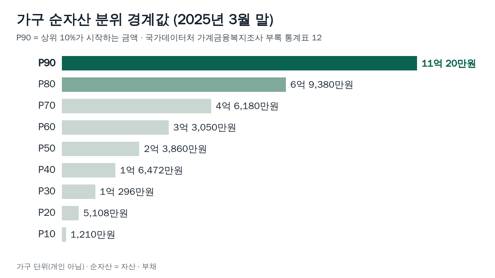
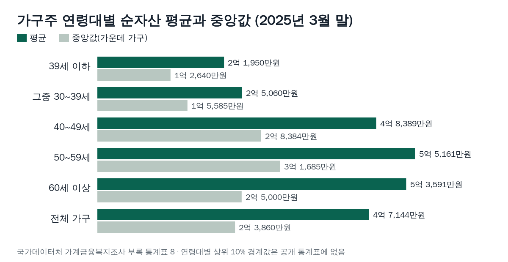

<!-- 제목: 순자산 상위 10%, 가구 기준 11억 20만원부터입니다 -->
<!-- 디스커버 제목: 우리나라 가구 순자산 상위 10%의 문턱은 11억 20만원이었습니다 -->
# 순자산 상위 10%, 가구 기준 11억 20만원부터입니다

가구 순자산 상위 10%는 11억 20만원부터입니다. 2025년 3월 말 기준 가계금융복지조사의 분위 경계값이며, 2026년 10월 3일 국가데이터처 원문 기준으로 옮겼습니다.

상위 20%는 6억 9,380만원부터이고, 한가운데 가구의 순자산(중앙값)은 2억 3,860만원입니다. 상위 5%·1%의 문턱 금액은 공개된 통계표에서 찾지 못했습니다. 그 부분은 원문에 있는 숫자로만 범위를 설명합니다.

[[목차]]

## 순자산은 무엇을 더하고 빼서 재나요
가계금융복지조사의 항목분류 체계는 순자산을 「자산 - 부채」 한 줄로 정합니다. 자산에는 예금·적금·주식·채권 같은 저축액과 전세보증금·월세보증금이 금융자산으로 들어가고, 집·토지·상가와 자동차 같은 것이 실물자산으로 들어갑니다. 부채에는 담보대출·신용대출·카드 관련 대출과 함께, 집주인이 세입자에게서 받은 임대보증금이 들어갑니다.

여기서 눈여겨볼 점이 둘 있습니다. 첫째, 세를 놓고 받은 보증금은 갚아야 할 돈이라 부채로 잡힙니다. 둘째, 세는 단위가 사람이 아니라 가구입니다. 부부와 자녀가 한 살림이면 세 사람의 자산과 부채를 합친 값 하나가 한 가구의 순자산입니다. 혼자 사는 사람이 이 표와 자기를 비교할 때는 이 차이를 염두에 둬야 합니다.

## 순자산 상위 10 프로는 얼마부터인가요
국가데이터처가 2025년 12월 4일 낸 [「2025년 가계금융복지조사 결과」 보도자료](https://mods.go.kr/board.es?mid=a10301040300&bid=215&act=view&list_no=439535)의 부록 통계표 12에 순자산 분위 경계값이 실려 있습니다. P90은 아래에서부터 90%째 가구의 금액, 곧 상위 10%가 시작하는 금액입니다. 같은 보도자료는 [정책브리핑에도 전재](https://www.korea.kr/briefing/pressReleaseView.do?newsId=156733178)되어 있고, 통계표는 거기서 [부록 통계표 문서 보기](https://www.korea.kr/common/docViewer.do?fileId=198356640&tblKey=GMN)로 바로 열립니다.

표: 가구 순자산 분위 경계값(2025년 3월 말 · 2026년 10월 3일 국가데이터처 원문 기준, 부록 통계표 12)
| 경계 | 뜻 | 순자산 경계값 |
|---|---|---|
| P90 | 이 금액부터 상위 10% | 11억 20만원 |
| P80 | 이 금액부터 상위 20% | 6억 9,380만원 |
| P70 | 이 금액부터 상위 30% | 4억 6,180만원 |
| P60 | 이 금액부터 상위 40% | 3억 3,050만원 |
| P50 | 이 금액부터 상위 50% | 2억 3,860만원 |
| P40 | 이 금액부터 상위 60% | 1억 6,472만원 |
| P30 | 이 금액부터 상위 70% | 1억 296만원 |
| P20 | 이 금액부터 상위 80% | 5,108만원 |
| P10 | 이 금액부터 상위 90% | 1,210만원 |

1년 전 같은 표의 P90은 10억 4,592만원이었습니다. 1년 사이 문턱이 5,428만원, 비율로 5.2% 올랐습니다. 반대로 하위 10% 경계인 P10은 1,334만원에서 1,210만원으로 9.3% 내려갔습니다. 위쪽 문턱은 오르고 아래쪽 문턱은 내려가, 같은 1년 동안 양 끝이 서로 멀어졌습니다.

P80과 P90 사이의 간격도 봐 둘 만합니다. 상위 20% 문턱 6억 9,380만원에서 상위 10% 문턱까지는 4억 640만원이 벌어집니다. 위로 올라갈수록 같은 10%를 건너는 데 드는 금액이 커지는 구조입니다.

## 순자산 상위 5프로, 상위 1프로 기준도 나와 있나요
2025년 보도자료와 부록 통계표가 공개한 경계값은 P10부터 P90까지 10% 간격 아홉 개입니다. P95(상위 5%)나 P99(상위 1%)에 해당하는 금액은 이 원문에서 확인되지 않았습니다. 그래서 「상위 1%는 몇십억원」 같은 숫자는 이 글에 적지 않습니다.

원문에서 그 위쪽을 짐작하게 해 주는 숫자는 두 가지입니다. 하나는 순자산 10억원 이상 가구가 전체의 11.8%라는 구간별 분포이고, 다른 하나는 순자산 상위 10% 가구가 전체 순자산의 46.1%를 가진다는 10분위 점유율입니다. 상위 20% 가구(순자산 5분위)의 평균 순자산은 15억 2,085만원입니다. 평균이라 위쪽 몇몇 가구가 크게 끌어올린 값이고, 상위 5% 문턱과는 다른 숫자입니다.

## 30대·40대·50대 순자산 상위 10%는 다른가요
연령대마다 상위 10% 문턱이 따로 있다면 가장 알고 싶은 숫자일 텐데, 부록 통계표에는 연령대별 경계값이 없습니다. 연령대별로 공개된 것은 가구주 나이로 나눈 평균과 중앙값입니다. 같은 기준으로 놓으면 아래와 같습니다.

표: 가구주 연령대별 순자산 평균과 중앙값(2025년 3월 말 · 2026년 10월 3일 국가데이터처 원문 기준, 부록 통계표 8)
| 가구주 연령 | 평균 | 중앙값 | 평균 ÷ 중앙값 |
|---|---|---|---|
| 39세 이하 | 2억 1,950만원 | 1억 2,640만원 | 1.74배 |
| 그중 30~39세 | 2억 5,060만원 | 1억 5,585만원 | 1.61배 |
| 40~49세 | 4억 8,389만원 | 2억 8,384만원 | 1.70배 |
| 50~59세 | 5억 5,161만원 | 3억 1,685만원 | 1.74배 |
| 60세 이상 | 5억 3,591만원 | 2억 5,000만원 | 2.14배 |
| 전체 가구 | 4억 7,144만원 | 2억 3,860만원 | 1.98배 |

가구주가 30대인 가구의 한가운데 값은 1억 5,585만원, 50대는 3억 1,685만원입니다. 전체 상위 10% 문턱 11억 20만원은 40대 가구 중앙값의 3.88배, 약 3.9배입니다. 다만 「40대 안에서 상위 10%」는 이 계산으로 알 수 없습니다. 연령대 안의 분포가 공개되지 않았기 때문입니다.

60세 이상에서 평균이 중앙값의 2.14배로 가장 크게 벌어집니다. 같은 나이대 안에서 가구마다 순자산 차이가 다른 연령대보다 크다는 뜻입니다.

## 내 순자산은 몇 분위인지 어떻게 계산하나요
순서는 세 단계입니다. 우리 집 자산을 모두 더하고(예금·주식·전세보증금·집 시세), 대출과 받은 임대보증금을 모두 더해 빼고, 그 값을 첫 번째 표의 경계값 사이에 놓습니다. 집값은 조사와 같은 방식으로 지금 팔면 받을 시장가격을 씁니다.

표: 가정한 가구 네 곳의 순자산과 원문 경계값으로 읽은 위치(직접 계산)
| 가정 | 순자산(자산 - 부채) | 원문 경계값으로 읽은 위치 | 상위 10% 문턱(11억 20만원)과의 차이 |
|---|---|---|---|
| 자산 3억 · 부채 1억 | 2억원 | P40~P50 사이 · 상위 50~60% | 9억 20만원 모자람 |
| 자산 5억 · 부채 1억 | 4억원 | P60~P70 사이 · 상위 30~40% | 7억 20만원 모자람 |
| 자산 10억 · 부채 3억 | 7억원 | P80~P90 사이 · 상위 10~20% | 4억 20만원 모자람 |
| 자산 15억 · 부채 3억 | 12억원 | P90 이상 · 상위 10% 안 | 9,980만원 넘음 |

예를 들어 시세 8억원 아파트에 살며 예금 2억원이 있고 주택담보대출이 3억원 남은 가구라면, 자산 10억원에서 부채 3억원을 뺀 7억원이 순자산입니다. P80 6억 9,380만원보다 많고 P90 11억 20만원보다 적으니 「상위 10~20%」 구간입니다. 이 표의 비교는 2025년 3월 말 숫자와 맞대는 것이라, 그 뒤 집값이 움직였다면 위치도 달라질 수 있습니다.

## 순자산 평균과 중앙값은 왜 두 배 가까이 차이 나나요
평균 순자산 4억 7,144만원은 자산 평균 5억 6,678만원에서 부채 평균 9,534만원을 뺀 값입니다. 중앙값 2억 3,860만원과의 차이는 2억 3,284만원, 배율로는 1.98배입니다. 순자산이 아주 큰 소수 가구가 평균을 위로 끌어올리기 때문입니다. 상위 10% 가구가 전체 순자산의 46.1%를 가진다는 점유율이 그 이유를 숫자로 보여 줍니다.

그래서 「평균만큼 있으면 중간」이라는 생각은 이 통계에서는 맞지 않습니다. 평균 4억 7,144만원은 P70 4억 6,180만원보다 조금 위에 있어, 평균만큼 가진 가구는 이미 상위 20~30% 구간에 듭니다. 상위 10% 문턱 11억 20만원은 중앙값의 4.61배입니다.

## 순자산 상위 가구의 자산은 무엇으로 채워져 있나요
상위 10%만 따로 떼어 낸 자산 구성표는 공개되지 않았고, 가장 가까운 것은 상위 20%(순자산 5분위) 가구의 평균입니다.

표: 순자산 상위 20%(5분위) 가구의 평균 자산·부채 구성(2025년 3월 말, 부록 통계표 2·4·5·7·8로 직접 계산)
| 항목 | 평균 금액 | 비중 |
|---|---|---|
| 자산 | 17억 4,590만원 | 100.0% (자산 기준) |
| 실물자산 | 14억 25만원 | 자산의 80.2% |
| 그중 부동산 | 13억 3,828만원 | 자산의 76.7% |
| 그중 거주주택 | 6억 8,677만원 | 자산의 39.3% |
| 그중 거주주택 이외 부동산 | 6억 5,152만원 | 자산의 37.3% |
| 금융자산 | 3억 4,565만원 | 자산의 19.8% |
| 부채 | 2억 2,505만원 | 100.0% (부채 기준) |
| 그중 임대보증금 | 9,932만원 | 부채의 44.1% |
| 순자산 | 15억 2,085만원 | 검산 15억 2,085만원 |

자산 10원 가운데 약 8원이 실물자산이고, 그 대부분이 부동산입니다. 사는 집과 그 밖의 부동산이 거의 비슷한 크기로 나뉘고, 부채의 44.1%는 세입자에게 받은 보증금입니다. 부채의 절반 가까이가 은행 대출이 아니라 「돌려줄 보증금」이라는 점이 상위 가구 부채의 특징입니다. 금융자산을 쌓는 쪽이 궁금한 분께는 세금을 돌려받는 한도를 정리한 [연금저축 900만원 채우면 최대 148만원 돌려받습니다](/18)가 이어서 볼 만합니다. 주식 계좌의 세금이 궁금하다면 [해외주식 250만원까지는 세금이 없습니다, 그 다음이 문제입니다](/19)가 같은 방식으로 원문 숫자를 계산합니다.

## 이 통계로 알 수 없는 것은 무엇인가요
가계금융복지조사는 국가데이터처가 금융감독원·한국은행과 함께 전국 약 2만 가구를 면접 등으로 조사한 표본조사입니다. 보도자료는 상대표준오차 1.0~25.0%를 고려해 해석하라고 적습니다. 자산과 부채는 3월 31일 하루를 기준으로 하고, 소득은 그 전해 1년을 기준으로 해서 같은 표 안에서도 시점이 다릅니다. 국민연금처럼 나중에 받을 연금 권리는 항목분류 체계의 자산 목록에 없습니다. 노후에 받을 연금까지 함께 가늠하려면 [국민연금 조기수령, 계산에 안 잡히는 변수가 하나 있습니다](/20)를 이어서 보시면 그 빈칸을 채울 수 있습니다.

원문 대조는 이렇게 했습니다. 2026년 10월 3일 국가데이터처 누리집에서 보도자료 화면과 부록 통계표 엑셀, 보도자료 한글 파일을 내려받아 열었고, 경계값 아홉 개와 연령대별 평균·중앙값을 정책브리핑의 통계표 문서 보기 화면과 한 번 더 맞췄습니다. 비중과 차이는 원문 숫자로 직접 나누고 뺐고, 표 4의 자산에서 부채를 뺀 값이 원문 순자산과 같은지 검산했습니다. 국가통계포털(KOSIS)의 해당 통계표는 화면이 스크립트로 그려져 숫자를 글자로 읽지 못했습니다.

이 글은 기준일의 공개 원문을 정리한 일반 정보이며, 개인의 사정에 따라 결과가 달라질 수 있습니다.

[[저자 박스]]

[집필 메모]
- 더한 것 ③: 순자산 상위 10% 문턱(P90) 11억 20만원은 보도자료 본문이 아니라 부록 통계표 12에만 실린 경계값이고, 같은 조사에서 세입자에게 받은 임대보증금은 부채로 잡혀 상위 20% 가구 부채 2억 2,505만원의 44.1%(9,932만원)를 차지한다 (h2 「순자산 상위 10 프로는 얼마부터인가요」·「순자산 상위 가구의 자산은 무엇으로 채워져 있나요」 절)
- 못 연 원문: KOSIS 통계표(statHtml) — 스크립트 화면이라 숫자를 글자로 읽지 못함, 통계표 ID 확인 못 함. 통계청 옛 누리집 kostat.go.kr — 연결 끊김(10/3, 2회). 기관 이름이 「국가데이터처」(mods.go.kr)로 바뀌어 그쪽 보도자료를 씀. 보도자료 PDF는 글자 없는 그림 PDF라 글자 대조 불가(hwpx로 읽음).
- 뺀 숫자: 상위 5%(P95)·상위 1%(P99) 문턱, 연령대별 상위 10% 문턱 — 원문에 없음.
- 수치대장 원문URL: 경계값·연령대별·5분위 구성은 정책브리핑 문서 보기 결과 쪽(xhtml, 글자로 열림). 46.1%·11.8%·2만 가구·상대표준오차는 보도자료 PDF(그림 PDF라 대조 「확인 못 함」 예상, hwpx 본문 1쪽·5~6쪽과 부록1에서 읽음).
- 제목 3안: ① 순자산 상위 10%, 가구 기준 11억 20만원부터입니다(채택) ② 순자산 상위 10% 기준 2025, 11억 20만원과 연령대별 중앙값 ③ 순자산 상위 10 프로 얼마부터? 가구 경계값 11억 20만원. 자기검토 — 검색한 사람이 바로 금액을 보고 누를 수 있는 ①.
- 설계도와 달라진 점: h2 「확인 과정」은 마지막 절 둘째 문단으로 넣고 소제목은 「이 통계로 알 수 없는 것은 무엇인가요」. 상위 10%만의 자산 구성표는 원문에 없어 상위 20%(5분위)로 대신하고 본문에 밝힘.
