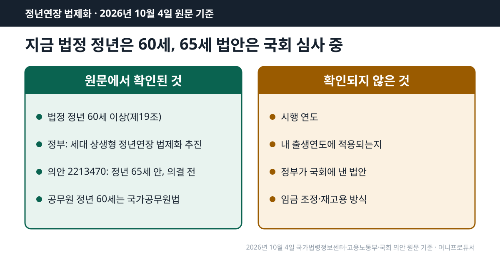
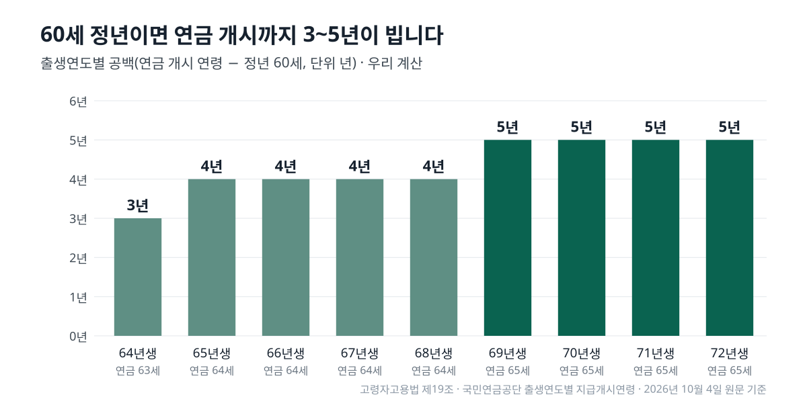

<!-- 제목: 정년연장 법제화, 2026년 10월에도 법정 정년은 60세 -->
<!-- 디스커버 제목: 정년연장 정부안 원문, 65세도 시행 연도도 적혀 있지 않습니다 -->
# 정년연장 법제화, 2026년 10월에도 법정 정년은 60세

2026년 10월 4일 국가법령정보센터 원문 기준, 법정 정년은 고령자고용법 제19조의 60세 이상 그대로이고 정년을 65세로 올리는 개정안은 아직 국회를 통과하지 않았습니다.

정부는 2026년 8월 4일 대통령 업무보고에서 「세대 상생형 정년연장 법제화」를 추진한다고 밝혔지만, 보도자료와 발표 자료 어디에도 목표 나이와 시행 연도는 적혀 있지 않습니다. 시행 시기를 숫자로 적어 둔 원문은 의원이 낸 법안의 부칙뿐입니다.

그래서 이 글은 확인된 것과 확인되지 않은 것을 먼저 나누고, 지금 법 기준으로 출생연도별 정년 도달 해와 연금 개시 해 사이가 몇 년 비는지 계산해 보였습니다. 법안이 그대로 통과된다면 그 간격이 어떻게 바뀌는지도 가정 계산으로 붙였습니다.

[[목차]]

## 정년연장 법제화 진행상황, 지금 법은 몇 세인가요
[고령자고용법 제19조](https://www.law.go.kr/법령/고용상연령차별금지및고령자고용촉진에관한법률/제19조) 제1항은 사업주가 근로자의 정년을 60세 이상으로 정하도록 하고, 제2항은 회사가 그보다 낮게 정해도 60세로 정한 것으로 봅니다. 2026년 10월 4일에 연 현행본도 2022년 6월 10일 시행된 법률 제18921호 그대로입니다.

60세는 「최저선」입니다. 취업규칙이나 단체협약으로 62세, 65세를 정한 회사는 지금도 그 나이까지 일할 수 있지만, 법이 모든 회사에 그보다 높은 나이를 요구하지는 않습니다. 「정년 65세가 됐다」는 말은 2026년 10월 4일 법령 원문으로는 맞지 않습니다.

## 정년연장 정부안에는 무엇이 적혀 있나요
[고용노동부 2026년 8월 4일 보도자료](https://www.moel.go.kr/news/enews/report/enewsView.do?news_seq=19740)는 하반기 업무추진방향을 담았고, 중장년 단락에 사회적 논의를 기반으로 세대 상생형 정년연장 법제화를 추진한다는 한 문장이 있습니다. 같은 단락의 숫자는 재취업지원서비스 의무 사업장을 1,000인 이상에서 2027년 500인, 2029년 300인 이상으로 넓힌다는 것뿐입니다. 함께 올라온 발표 자료의 중장년 쪽 칸도 「사회적 논의 기반 법제화」와 「세대간 공존을 위한 지원방안 마련」 두 줄입니다.

그보다 앞선 [2025년 12월 11일 2026년 업무보고 보도자료](https://www.moel.go.kr/news/enews/report/enewsView.do?news_seq=18725)는 60대에 대해 청년 일자리 지원을 포함한 단계적 세대상생 정년연장을 추진한다고 적었습니다. 같은 날 [정책브리핑 질의응답](https://korea.kr/briefing/policyBriefingView.do?newsId=156734720)에서 차관은 연내 처리 방침을 말하기는 어렵고 노사가 참여한 사회적 대화를 지켜봐야 한다는 취지로 답했습니다. 정리하면 정부 원문에 있는 것은 「단계적」, 「세대 상생」, 「법제화 추진」이라는 방향이고, 몇 세로 언제부터라는 정부안 숫자는 아직 없습니다.

## 국회에 낸 정년연장 법안은 무엇을 바꾸나요
가장 직접적인 안은 [의안 2213470](https://likms.assembly.go.kr/bill/bi/billDetailPage.do?billId=PRC_W2V5V0T9U2C4A1B0Z5A3Y2Z8O6O0N3)입니다. 2025년 10월 2일 의원 13명이 냈고, 제19조의 「60세」를 「65세」로 바꿉니다. [입법예고 화면의 제안이유](https://pal.assembly.go.kr/napal/lgsltpa/lgsltpaDone/view.do?lgsltPaId=PRC_W2V5V0T9U2C4A1B0Z5A3Y2Z8O6O0N3)는 연금 수급 개시 연령이 2033년 기준 65세인데 60세에 퇴직하면 그 사이 소득이 끊긴다는 점을 이유로 듭니다. 2026년 10월 4일 의안정보시스템에서 이 법안의 의결일자와 의결결과 칸은 비어 있었습니다.

제안이유 화면에는 없지만 의안 원문 부칙에는 단계가 있습니다. 부칙 제1조는 공포 후 6개월이 지난 날부터 시행한다고 하고, 제2조는 개정 조문의 「65세」를 시행일부터 2027년까지는 63세, 2028년부터 2032년까지는 64세, 2033년부터는 65세로 읽도록 했습니다. 이 단계는 국민연금 지급개시연령이 64세에서 65세로 넘어가는 흐름과 거의 겹칩니다.

다른 길을 고른 법안도 있습니다. 2025년 12월 17일 의원 11명이 낸 의안 2215313은 사업주가 연금 수급 개시 연령까지 정년을 늘리거나, 정년이 된 사람을 그 나이까지 다시 고용하거나, 정년을 없애는 것 가운데 하나를 고르게 하고, 부칙에서 공포 후 1년 뒤 시행으로 정했습니다. 두 안 모두 국회 심사 단계이고, 언론에 보도된 다른 연도별 단계표는 정부·국회 원문에서 찾지 못해 이 글에 싣지 않았습니다.

## 정년연장 시행시기는 확정됐나요
확정되지 않았습니다. 시행 연도를 정하려면 법이 국회를 통과해 공포돼야 하는데, 2026년 10월 4일 기준으로 그 단계에 간 고령자고용법 정년 개정안은 없습니다. 국회 입법예고 목록에서 이 법의 개정안을 찾아보면 모두 의원 발의였고, 정부가 낸 법안은 확인되지 않았습니다.

표: 정년연장, 원문에서 확인된 것과 확인되지 않은 것(2026년 10월 4일)
| 항목 | 지금 상태 | 확인한 원문 |
|---|---|---|
| 법정 정년 | 60세 이상, 60세 미만으로 정하면 60세로 봄(현행 법률 제18921호) | 고령자고용법 제19조 |
| 정부 방향 | 「세대 상생형 정년연장 법제화」 추진, 목표 나이·시행 연도 없음 | 고용노동부 2026. 8. 4. 보도자료 |
| 국회 법안 | 의안 2213470: 정년 65세, 부칙에 63세·64세·65세 단계, 의결 전 | 국회 의안정보시스템·입법예고 |
| 정부가 낸 법안 | 확인되지 않음 | 국회 입법예고 목록 |
| 시행 연도 | 정해지지 않음(법 통과 전) | 확인된 원문 없음 |
| 내 출생연도 적용 | 정해지지 않음 | 확인된 원문 없음 |
| 임금 조정·재고용 | 현행 조문 그대로(임금체계 개편 조치·재고용 노력) | 고령자고용법 제19조의2·제21조 |
| 공무원 | 60세, 다른 법(국가공무원법)이 정함 | 국가공무원법 제74조 |

임금을 어떻게 맞출지도 아직 논의 단계입니다. 지금 법 제19조의2는 정년을 늘리는 사업장의 노사가 임금체계 개편 등 필요한 조치를 하도록 하는 정도이고, 새 방식은 원문에 없습니다.

## 정년연장 몇 년생부터 해당되나요, 68년생·69년생은 지금 법으로 언제인가요
몇 년생부터라는 기준은 2026년 10월 4일 정부·국회 원문 기준으로 어디에도 없습니다. 지금 확인할 수 있는 것은 현행 법으로 60세가 되는 해입니다. 68년생은 2028년, 69년생은 2029년에 60세가 됩니다. 실제 퇴직 날짜는 회사 취업규칙이 정하는데, 생일이 되는 날로 정한 곳도 있고 그해 말일로 정한 곳도 있습니다.

표: 출생연도별 지금 법 정년(60세)과 연금 개시 연령 사이 공백(우리 계산)
| 출생연도 | 60세 되는 해 | 연금 개시 연령 | 연금 개시 해 | 공백 |
|---|---|---|---|---|
| 1964년생 | 2024년 | 63세 | 2027년 | 3년 |
| 1965년생 | 2025년 | 64세 | 2029년 | 4년 |
| 1966년생 | 2026년 | 64세 | 2030년 | 4년 |
| 1967년생 | 2027년 | 64세 | 2031년 | 4년 |
| 1968년생 | 2028년 | 64세 | 2032년 | 4년 |
| 1969년생 | 2029년 | 65세 | 2034년 | 5년 |
| 1970년생 | 2030년 | 65세 | 2035년 | 5년 |
| 1971년생 | 2031년 | 65세 | 2036년 | 5년 |
| 1972년생 | 2032년 | 65세 | 2037년 | 5년 |

연금 개시 연령은 [국민연금공단 노령연금 안내](https://www.nps.or.kr/pnsinfo/ntpsklg/getOHAF0056M0.do?menuId=MN24001118)의 출생연도별 지급개시연령 표(1965~68년생 64세, 1969년생 이후 65세)를 썼고, 노령연금은 [국민연금법 제61조](https://www.law.go.kr/법령/국민연금법/제61조)대로 가입기간 10년 이상이 전제입니다. 공백은 연금 개시 연령에서 정년 60을 뺀 나이 차입니다. 1969년생이라면 60세에 회사를 나온 뒤 5년, 달로 치면 60개월을 연금 없이 지나야 한다는 뜻입니다.

## 정년과 연금 개시 사이 공백은 출생연도별로 몇 년인가요
아래 표는 정년을 61세에서 65세로 가정했을 때 공백이 얼마나 줄어드는지 본 것입니다. 정년 60세 말고는 모두 가정이며, 65세 칸은 의안 2213470의 목표 나이일 뿐 시행 여부와 시기는 정해지지 않았습니다.

표: 정년이 몇 세라면 공백이 몇 년인가(가정 계산)
| 출생연도 | 정년 60세 | 정년 61세 | 정년 62세 | 정년 63세 | 정년 64세 | 정년 65세 |
|---|---|---|---|---|---|---|
| 1965년생 | 4년 | 3년 | 2년 | 1년 | 0년 | 0년 |
| 1968년생 | 4년 | 3년 | 2년 | 1년 | 0년 | 0년 |
| 1969년생 | 5년 | 4년 | 3년 | 2년 | 1년 | 0년 |
| 1972년생 | 5년 | 4년 | 3년 | 2년 | 1년 | 0년 |

의안 2213470 부칙의 연도별 나이를 그대로 넣으면 결과가 달라집니다. 60세가 되는 해부터 한 해씩 보면서 「그해 나이가 그해 의안 정년 이상」이 되는 첫 해를 정년 해로 셌습니다. 그 사람이 60세가 되기 전에 법이 시행된다는 가정이 붙습니다.

표: 의안 2213470 부칙대로 시행된다면 출생연도별 정년(가정 계산)
| 출생연도 | 지금 법 정년 해 | 의안대로라면 정년 해 | 그때 나이 | 연금 개시 해 | 공백 |
|---|---|---|---|---|---|
| 1968년생 | 2028년 | 2032년 | 64세 | 2032년 | 0년 |
| 1969년생 | 2029년 | 2034년 | 65세 | 2034년 | 0년 |
| 1970년생 | 2030년 | 2035년 | 65세 | 2035년 | 0년 |
| 1971년생 | 2031년 | 2036년 | 65세 | 2036년 | 0년 |
| 1972년생 | 2032년 | 2037년 | 65세 | 2037년 | 0년 |

이 안대로라면 68년생부터는 정년 해와 연금 개시 해가 같아집니다. 67년생 이전은 60세가 되는 해가 2027년 이전이어서, 법이 언제 공포되느냐에 따라 적용 여부가 갈립니다. 공백을 연금을 앞당겨 받아 메울지 따지는 독자라면 감액과 손익을 다룬 [국민연금 조기수령 글](/20)이 다음 순서입니다.

## 정년 뒤 같은 회사에 재고용되면 퇴직금 근속은 이어지나요
자동으로 이어진다고 볼 수 없습니다. [고령자고용법 제21조](https://www.law.go.kr/법령/고용상연령차별금지및고령자고용촉진에관한법률/제21조) 제1항은 정년이 된 사람이 다시 일하기를 원하면 맞는 직종에 재고용하도록 「노력」하라는 의무만 두었습니다. 제2항은 고령자인 정년퇴직자를 재고용할 때 당사자끼리 합의하면 퇴직금과 연차휴가 일수를 셀 때 앞선 근무 기간을 빼고, 임금도 종전과 다르게 정할 수 있게 했습니다.

예를 들어 30년 일한 회사에서 60세에 정년퇴직하고 같은 회사에 계약직으로 다시 들어간다면, 재고용 계약서에 근속 기간을 어떻게 셀지 적힌 문장이 퇴직금 계산의 출발점을 정합니다. 앞의 의안 2215313도 이 제2항을 고치는 안이라, 국회 논의는 재고용 조건까지 걸쳐 있습니다.

## 공무원 정년연장도 같은 법으로 바뀌나요
아닙니다. 국가공무원의 정년은 [국가공무원법 제74조](https://www.law.go.kr/법령/국가공무원법/제74조)가 따로 정합니다. 제1항은 다른 법률에 특별한 규정이 없으면 60세로 하고, 제4항은 정년이 되는 날이 1~6월이면 6월 30일, 7~12월이면 12월 31일에 당연퇴직하게 합니다. 고령자고용법 제19조가 65세로 바뀌어도 이 조문을 함께 고치지 않으면 공무원 정년은 60세 그대로입니다.

1969년 3월생 공무원이라면 2029년 6월 30일에 퇴직하고, 같은 해 10월생이라면 2029년 12월 31일입니다. 출생 달에 따라 퇴직 날짜가 반년까지 갈립니다.

## 어디까지 원문으로 확인했나
법정 정년, 재고용, 공무원 정년, 노령연금 원칙은 국가법령정보센터의 조문 본문을 2026년 10월 4일에 열어 옮겼습니다. 정부 방향은 고용노동부 보도자료 두 건과 8월 발표 자료, 정책브리핑 질의응답 원문을 봤고, 국회 법안은 의안정보시스템과 입법예고 화면, 의안 원문 PDF의 부칙을 직접 대조했습니다. 네 표의 숫자는 같은 공식을 넣은 계산 스크립트로 다시 계산했습니다.

공백 기간을 스스로 준비하는 쪽으로 생각이 넘어간다면 세액공제 한도를 정리한 [연금저축 세액공제 글](/18)이 이어 볼 만한 내용입니다.

이 글은 기준일의 공개 원문을 정리한 일반 정보이며, 개인의 사정에 따라 결과가 달라질 수 있습니다.

[[저자 박스]]

[집필 메모]
- 더한 것 ③: 고령자고용법 제21조②에 따라 정년퇴직자를 재고용할 때 당사자 합의로 퇴직금·연차 계산의 종전 근로기간을 빼고 임금도 달리 정할 수 있다(h2 「정년 뒤 같은 회사에 재고용되면 퇴직금 근속은 이어지나요」 절). 보조: 의안 2213470 원문 부칙 제2조의 63·64·65세 연도별 단계(제안이유 화면에는 없음, h2 「국회에 낸 정년연장 법안은 무엇을 바꾸나요」·표 4), 공무원 정년은 국가공무원법 제74조로 따로 정함.
- 설계도와 달라진 점: 설계도는 「의안 2213470 시행일 단계 일정은 제안이유에 없음」이라 했으나 의안 원문 PDF 부칙에 단계(시행일~2027년 63세, 2028~2032년 64세, 2033년~ 65세)와 시행일(공포 후 6개월)이 있어 「법안 내용(국회 심사 중)」으로 쓰고 가정 계산 표 4를 더했다. 의안 2215313(2025-12-17, 연금 개시 연령까지 정년 연장·재고용·폐지 중 선택, 공포 후 1년)을 원문 PDF로 확인해 한 단락 더했다.
- 디스커버판 제목 조건 확인: 8/4 보도자료 본문과 첨부 발표 자료(PPT PDF 6쪽 「세대 상생 정년연장」 칸)에 65세·시행 연도 없음 → 설계 안 유지.
- 못 연 원문: 고용노동부 첨부 「260804_고용노동부 업무보고」 본문(hwpx·pdf, file_seq 추정 주소가 오류 화면) — PPT PDF와 보도자료 본문으로 대신. 법제처 정부 입법예고 검색(opinion.lawmaking.go.kr)은 결과를 읽지 못함 — 「정부가 낸 법안 확인되지 않음」은 국회 입법예고 목록(고령자고용법 개정안 의원 발의만) 기준. moel.go.kr·pal.assembly.go.kr·likms는 curl 연결 끊김이 잦았고 재시도·WebFetch로 열림.
- 뺀 숫자: 언론 보도 단계표(연도별 61~65세)는 원문 미확인이라 싣지 않음.
- 도구: calc_check가 국회 의안 원문 PDF(likms FileGate, Content-Type application/octet-stream)를 PDF로 읽지 않고 글자로 읽어 수치대장 줄10(64세, 부칙 제2조 2호)을 「원문에 없음」으로 낸다. pdftotext로 연 원문 3쪽에 「2028년부터 2032년까지는 64세」가 글자로 있다(법령 아님 · 원고 숫자는 맞음).
- 자료집에 더한 줄: 원문 13줄 · 계산 함수 1줄.
