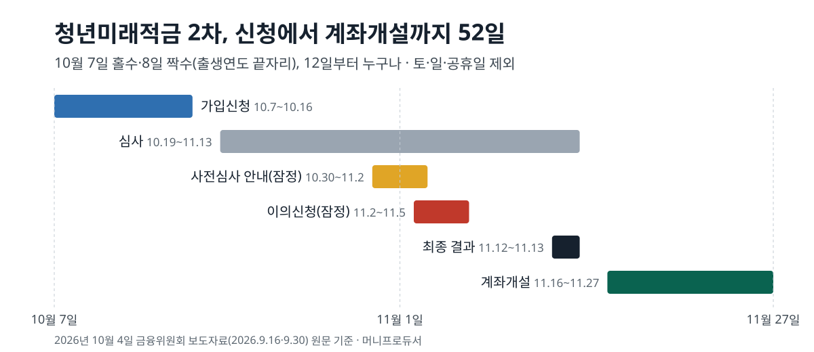
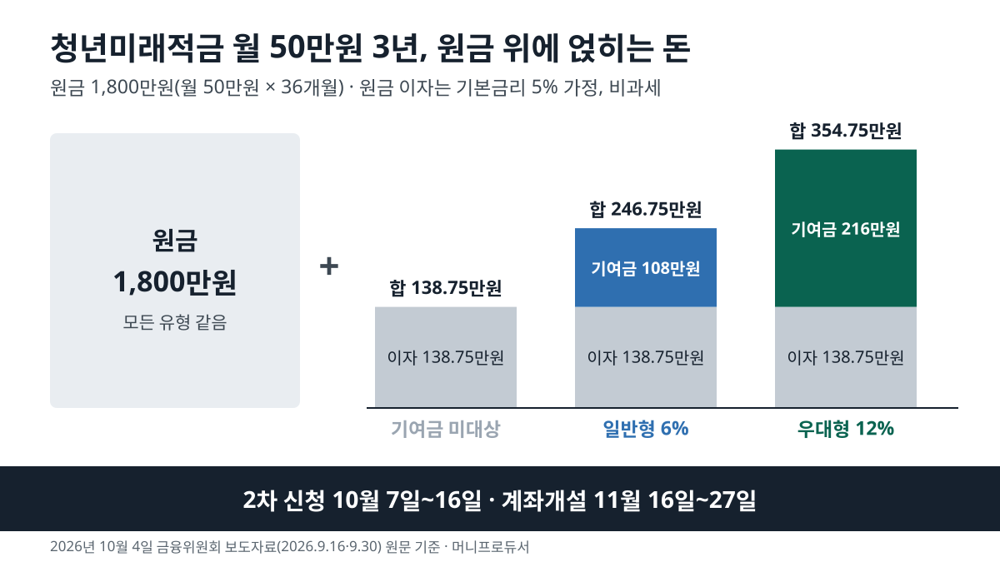

<!-- 제목: 청년미래적금 2차 10월 7일 신청, 기여금 6%·12% -->
<!-- 디스커버 제목: 청년도약계좌 가입자도 이번엔 옮길 수 있습니다, 청년미래적금 2차 10월 7일 -->
# 청년미래적금 2차 10월 7일 신청, 기여금 6%·12%

청년미래적금 2차 가입신청은 10월 7일부터 16일까지(토·일·공휴일 제외)이고, 만 19~34세이면서 총급여 7,500만원 이하·가구 중위소득 200% 이하인 청년이 대상입니다. 정부는 매달 넣은 돈(최대 50만원)에 6%(일반형) 또는 12%(우대형)를 3년 동안 얹어 줍니다. 2026년 10월 4일 금융위원회 보도자료 원문 기준입니다.

조건이 하나 붙습니다. 총급여가 6천만원을 넘고 7,500만원 이하이면 가입은 되지만 기여금은 없고 이자 비과세만 받습니다. 12%도 모두에게 붙지 않습니다. 중소기업에 다니거나 새로 들어간 청년, 연매출 1억원 이하 소상공인 가운데 소득 기준을 채운 사람이 받습니다. 월 50만원을 3년 넣으면 원금 1,800만원에 일반형은 108만원, 우대형은 216만원이 더해집니다. 한 달로 나누면 3만원과 6만원 꼴입니다.

[[목차]]

## 청년미래적금 2차 신청기간은 언제인가요
[금융위원회 9월 30일 보도자료](https://www.fsc.go.kr/no010101/87820)에 적힌 2차 일정은 신청, 심사, 계좌개설 세 단계입니다. 신청은 14개 취급기관(농협·신한·우리·하나·기업·국민·수협·iM·부산·광주·전북·경남·카카오뱅크·우정사업본부)의 모바일 앱에서만 받습니다. 첫 이틀은 출생연도 끝자리로 나눠 7일은 홀수, 8일은 짝수가 신청하고, 12일부터는 출생연도와 상관없이 신청합니다.

원문은 이 상품이 선착순이 아니라고 적습니다. 기간 안에만 신청하면 순서와 관계없이 심사를 받습니다. 예외처럼 보이는 곳이 하나 있습니다. 카카오뱅크는 2차에서 최대 10만좌까지 신청을 받고, 홀짝제 이틀은 하루 5만좌 범위로 받습니다. 다른 기관은 계좌 수 한도를 두지 않을 예정입니다.

표: 청년미래적금 2차 신청부터 계좌개설까지 일정
| 단계 | 날짜 | 대상 | 할 일 |
|---|---|---|---|
| 가입신청(홀수) | 10월 7일(수) | 출생연도 끝자리 홀수 | 취급기관 앱에서 신청, 유형 직접 선택 |
| 가입신청(짝수) | 10월 8일(목) | 출생연도 끝자리 짝수 | 같음 |
| 가입신청(전체) | 10월 12일(월)~16일(금) | 출생연도 상관없음 | 같음, 선착순 아님 |
| 가입·소득 심사 | 10월 19일(월)~11월 13일(금) | 신청자 전원 | 가구원 정보제공 동의, 요청 시 서류 |
| 사전심사 결과 안내 | 10월 30일~11월 2일(잠정) | 신청자 | 선택한 유형과 결과 비교 |
| 이의신청 | 11월 2일~5일(잠정) | 결과가 다른 신청자 | 소명 자료 제출 |
| 최종 결과 안내 | 11월 12일~13일 | 신청자 | 개별 통보 |
| 계좌개설 | 11월 16일(월)~27일(금) | 가입 가능 안내를 받은 사람 | 기간 안에 개설, 이후 납입 시작 |

심사를 통과해도 11월 27일까지 앱에서 계좌를 열지 않으면 가입이 끝나지 않습니다. 원문은 이 기간이 지나면 개설이 안 된다고 못 박고 있습니다. 계좌를 연 뒤에는 토·일요일에도 바로 넣을 수 있습니다.

## 청년미래적금 가입 조건은 어디까지인가요
나이는 이번 기간 기준 1991년 11월 17일생부터 2007년 11월 27일생까지입니다. 계좌개설 기간에 만 19~34세인지를 보기 때문에 날짜가 이렇게 잡혔습니다. 군 복무 기간은 최대 6년까지 나이에서 뺍니다. 원문 예시대로라면 지금 35세여도 2년 복무했다면 33세로 심사합니다([금융위원회 9월 16일 보도자료](https://www.fsc.go.kr/no010101/87726) 「가입대상」).

소득은 개인과 가구 두 기준을 함께 채워야 합니다. 개인 소득은 2025년 국세청 확정 소득으로 봅니다. 총급여는 1년 근로소득에서 비과세 수당을 뺀 금액이고, 근로소득 말고 사업소득 같은 다른 소득이 있으면 종합소득금액(종합과세되는 소득을 모두 합친 금액) 6,300만원 이하 기준을 씁니다. 이 두 숫자는 [조세특례제한법 제91조의25](https://www.law.go.kr/법령/조세특례제한법/제91조의25) 제1항에 그대로 있습니다. 가구 중위소득은 전국 가구를 소득 순으로 세웠을 때 가운데 가구의 소득이고, 200%는 그 두 배까지라는 뜻입니다. 가구원은 주민등록표 등본에 함께 오른 배우자·부모·자녀·미성년 형제자매입니다.

표: 청년미래적금 유형별 소득 기준과 정부 기여금 비율(2026년 10월 4일 기준)
| 유형 | 개인 소득(2025년 기준) | 가구 중위소득(맞벌이 2인 가구) | 기여금 비율 |
|---|---|---|---|
| 기여금 미대상(이자 비과세만) | 총급여 6,000만원 초과 7,500만원 이하(종합소득 4,800만원 초과 6,300만원 이하) | 200% 이하(250% 이하) | 없음 |
| 일반형 · 일반소득자 | 총급여 6,000만원 이하(종합소득 4,800만원 이하) | 200% 이하(250% 이하) | 6% |
| 일반형 · 소상공인 | 연매출 3억원 이하 | 200% 이하(250% 이하) | 6% |
| 우대형 · 중소기업 신규 취업 | 총급여 6,000만원 이하(종합소득 4,800만원 이하) | 200% 이하(250% 이하) | 12% |
| 우대형 · 중소기업 재직 | 총급여 3,600만원 이하(종합소득 2,600만원 이하) | 150% 이하(200% 이하) | 12% |
| 우대형 · 소상공인 | 연매출 1억원 이하 | 150% 이하(200% 이하) | 12% |

총급여 5천만원인 직장인이라면 일반형 6% 줄에, 7천만원이라면 기여금 미대상 줄에 들어갑니다. 맞벌이 2인 가구는 본인과 배우자 둘만 등본에 있고 둘 다 국세청 소득이 확인되는 경우를 말하며, 가구 기준이 250%로 넓어집니다. 직전 3개년 가운데 한 번이라도 금융소득 종합과세 대상이었다면 가입할 수 없습니다. 반대로 육아휴직급여나 병 급여 같은 비과세 소득만 있어도 가입할 수 있습니다. 가구 소득으로 심사받는 다른 정부 지원이 궁금하다면 [근로장려금 신청 시기](/8) 글이 같은 구조의 기준을 다룹니다.

## 청년미래적금 우대형은 누가 되나요
우대형 12%로 가는 길은 세 갈래입니다. 중소기업에 다니는 청년은 총급여 3,600만원 이하와 가구 150% 이하를 함께 채워야 합니다. 중소기업에 새로 취업한 청년은 표에서 일반소득자와 같은 6천만원 칸을 씁니다. 소상공인은 연매출 1억원 이하에 가구 150% 이하입니다.

2차부터는 신청할 때 본인이 유형을 고릅니다. 앱에서 일반소득자, 중소기업 재직자, 소상공인 가운데 하나를 선택하고, 심사가 일반형과 우대형을 가릅니다. 소상공인으로 신청하려면 신청 전에 소상공인확인서를 받아 둬야 합니다. 발급에 평균 7일쯤 걸리고, 유효기간은 1년이며, 사업장이 둘 이상이면 모두 받아야 합니다. 이의신청 마감(11월 5일, 잠정)까지 확인서가 없으면 매출액이 아니라 종합소득 기준으로 심사합니다.

우대형으로 들어간 뒤에도 조건이 이어진다는 점은 잘 다뤄지지 않습니다. [9월 30일 보도자료의 중소기업 재직자 절](https://www.fsc.go.kr/no010101/87820)은 가입 때부터 만기 한 달 전까지 모두 합쳐 29개월 이상 중소기업에 다녀야 한다고 적습니다. 그 사이 이직은 2번까지 인정합니다. 채우지 못하면 만기 때 일반형으로 바뀌고 기여금 같은 혜택이 조정될 수 있습니다. 가입부터 만기 한 달 전까지는 35개월이므로, 중소기업 밖에 있을 수 있는 기간은 단순 계산으로 최대 6개월입니다.

## 청년미래적금 만기에 받는 돈은 얼마인가요
금리는 3년 고정으로 기본 5%에 기관별 우대 최대 2~3%가 붙습니다. 우대 조건은 기관마다 달라서 이 글의 계산은 기본금리 5%만 넣었습니다. 이자는 비과세라 세금이 0원입니다.

표: 월 납입액별 3년 원금과 정부 기여금(원금 이자는 기본금리 5% 가정)
| 월 납입액 | 3년 원금 | 일반형 기여금(6%) | 우대형 기여금(12%) | 원금 이자(5%, 비과세) | [국회 확정 전] 우대형 15% | [국회 확정 전] 지방 중소기업 25% |
|---|---|---|---|---|---|---|
| 100,000원 | 3,600,000원 | 216,000원 | 432,000원 | 277,500원 | 540,000원 | 900,000원 |
| 200,000원 | 7,200,000원 | 432,000원 | 864,000원 | 555,000원 | 1,080,000원 | 1,800,000원 |
| 300,000원 | 10,800,000원 | 648,000원 | 1,296,000원 | 832,500원 | 1,620,000원 | 2,700,000원 |
| 500,000원 | 18,000,000원 | 1,080,000원 | 2,160,000원 | 1,387,500원 | 2,700,000원 | 4,500,000원 |

기여금은 3년 원금에 비율을 곱했습니다. 원금 이자는 매달 같은 날 넣고 만기까지 둔다고 보고 월 납입액 × 금리 × 55.5로 셌습니다. 첫 달 돈은 36개월, 마지막 달 돈은 1개월 이자가 붙으니 평균하면 원금이 18.5개월 머무는 셈이고, 1년 비율로 바꾼 숫자가 55.5입니다. 월 50만원 일반형이라면 3년 동안 원금 이자 약 139만원과 기여금 108만원이 붙습니다. 오른쪽 두 칸은 아래 예산안 절의 정부안 비율을 넣어 본 값이며 확정된 숫자가 아닙니다.

표: 월 50만원 3년 기준 유형별 만기 금액과 과세 적금 환산 금리(기본금리 5%, 기여금 이자 제외)
| 경우 | 기여금 비율 | 정부 기여금 | 원금 이자 | 원금 포함 합계 | 과세 적금 환산 금리 |
|---|---|---|---|---|---|
| 기여금 미대상 | 0% | 0원 | 1,387,500원 | 19,387,500원 | 5.91% |
| 일반형 | 6% | 1,080,000원 | 1,387,500원 | 20,467,500원 | 10.51% |
| 우대형 | 12% | 2,160,000원 | 1,387,500원 | 21,547,500원 | 15.11% |
| 일반형, 6개월 납입 뒤 해지하고 재가입 | 5% | 900,000원 | 1,387,500원 | 20,287,500원 | 9.74% |
| 우대형, 6개월 납입 뒤 해지하고 재가입 | 10% | 1,800,000원 | 1,387,500원 | 21,187,500원 | 13.58% |
| 일반형, 12개월 납입 뒤 해지하고 재가입 | 4% | 720,000원 | 1,387,500원 | 20,107,500원 | 8.98% |

과세 적금 환산 금리는 기여금과 이자를 이자소득세 15.4%를 내는 보통 적금 이자로 바꾸면 몇 %짜리와 같은지를 보인 칸입니다. 보도자료는 기여금에 붙는 이자까지 넣어 일반형 최대 13.2~14.4%, 우대형 18.2~19.4%라고 적었습니다. 위 표는 기여금 이자를 빼고 우대금리도 0으로 두었기 때문에 그보다 낮습니다.

계산 방법이 원문과 같은지는 보도자료 예시로 먼저 맞춰 봤습니다. 금리 7% 일반형 예시의 기여금 108만원과 이자 202만원을 더하면 310만원이고, 이를 0.846으로 나누면 세전 약 366만원, 이것을 월 50만원 × 55.5인 2,775만원으로 나누면 13.2%가 나와 원문 숫자와 같습니다. 같은 7% 우대형 예시의 이자 211만원 가운데 원금 몫은 1,942,500원이고 나머지 167,500원이 기여금 쪽 이자로 보이지만, 기여금 이자를 어떻게 셈하는지는 원문에 적혀 있지 않아 표에 넣지 않았습니다. 일정·조건·비율은 금융위원회 보도자료 세 건과 법령 조문을 10월 4일에 직접 열어 옮겼습니다.

## 청년미래적금 갈아타기는 어떻게 하나요
청년도약계좌와 청년미래적금은 함께 가입할 수 없고, 도약계좌가 만기된 뒤에도 미래적금에는 들어갈 수 없습니다. 2차 모집은 도약계좌 가입자에게 옮겨 올 기회를 다시 줍니다. 순서는 세 단계입니다. 먼저 미래적금 신청과 심사를 마치고 가입 가능 안내를 받습니다. 다음으로 미래적금 계좌를 엽니다. 마지막으로 도약계좌 은행 앱에서 「청년미래적금 가입 목적」 특별중도해지를 신청합니다. 특별중도해지는 만기 전에 해지해도 그때까지 받은 정부 기여금과 이자 비과세를 그대로 두는 해지입니다.

계좌개설 기간 안에 세 번째 단계를 마치지 않으면 미래적금에는 돈을 넣을 수 없습니다. 이 경우 도약계좌는 그대로 남고, 납입이 막힌 미래적금 계좌는 해지해야 합니다. 갈아탄 경우 미래적금 납입은 특별중도해지가 끝난 다음 영업일 9시부터 됩니다.

두 상품의 틀은 꽤 다릅니다. 9월 16일 보도자료의 비교표 기준으로 미래적금은 월 50만원·3년·최대 원금 1,800만원에 기여금 6% 또는 12%이고, 도약계좌는 월 70만원·5년·최대 원금 4,200만원에 소득 구간별 기여금 3~6%입니다. 과세 적금으로 바꾼 최대 수익률은 미래적금 일반형 약 14.4%, 우대형 약 19.4%, 도약계좌 약 9.2%로 적혀 있습니다. 다만 이 숫자는 끝까지 넣었을 때의 값이라, 도약계좌에 이미 몇 년을 넣은 사람에게는 남은 기간과 본인 소득 구간이 함께 따질 거리입니다.

미래적금을 깼다가 다시 들어오는 길도 있습니다. 해지하고 2개월이 지나면 재신청할 수 있지만, 기여금 비율에 (36개월 − 기존 가입기간) ÷ 36개월을 곱해 깎습니다. 납입을 멈춘 기간도 가입기간으로 칩니다. 6개월 넣고 깬 뒤 다시 들어오면 일반형 6%가 5%로, 우대형 12%가 10%로 줄어듭니다. 위 두 번째 계산표의 아래 세 줄이 그 금액입니다.

## 청년미래적금 신청 방법과 결과 안내는 어떻게 되나요
신청은 취급기관 앱 비대면으로만 합니다. 심사는 기관 간 전산 연계로 서류 없이 진행하지만, 필요하면 추가 서류를 요청합니다. 육아휴직급여·군 장병 급여 증빙, 가구원 확인용 가족관계증명서, 중소기업확인서가 예로 나옵니다. 중소기업확인서는 회사가 발급하고 일주일 넘게 걸릴 수 있습니다.

1차 결과를 보면 어디서 막혔는지가 드러납니다. [8월 11일 보도참고자료](https://www.fsc.go.kr/no010101/87496)에 따르면 최초 모집에 234.3만명이 신청해 154.7만명이 심사를 통과했고 138.5만명이 최종 가입했습니다. 통과하지 못한 79.6만명 가운데 40.9만명, 약 51.4%는 소득 기준이 아니라 가구원이 소득정보 확인에 동의하지 않았거나 가구원 확인 서류를 내지 않은 경우였습니다. 개인소득 미충족은 21.1만명, 가구소득 초과는 16.5만명이었습니다. 그래서 9월 16일 보도자료는 2차에서 서민금융진흥원이 보낸 가구원 동의 링크를 가구원에게 전달하고 동의를 마치도록 절차마다 다시 안내하겠다고 밝혔습니다.

결과는 두 번 옵니다. 10월 30일~11월 2일(잠정) 사전심사 결과로 내가 고른 유형과 심사 결과를 먼저 비교할 수 있고, 다르면 11월 2일~5일(잠정)에 이의신청을 합니다. 최종 결과는 11월 12일~13일 개별 안내입니다. 기초군사훈련 중인 장병도 훈련소 안에서 스마트폰으로 신청과 계좌개설을 할 수 있고, 장병내일준비적금과 함께 가입할 수 있습니다. 장병은 일반형으로만 들어갑니다.

## 2027년 예산안이 통과되면 청년미래적금은 무엇이 달라지나요
여기부터는 확정 전 내용입니다. 국회에 제출된 2027년 정부 예산안에는 가입대상을 모든 청년으로 넓히고 우대형 기여금을 12%에서 15%로, 지방 중소기업에 다니면 25%로 올리는 내용이 들어 있습니다. 예산안이 국회 심의를 거쳐 확정되면 기존 가입자에게도 오른 우대형 기여금을 소급해 줄 예정이라고 보도자료는 적습니다. 대상 확대는 국회 승인 뒤 2027년 모집부터이고, 3차 모집은 조세특례제한법령 개정 같은 정비를 거쳐 진행할 예정입니다. 토스뱅크는 3차부터 참여할 예정입니다.

지금 확정된 것은 2차 일정과 6%·12% 비율, 그리고 2028년 12월 31일까지 가입하면 이자에 소득세를 매기지 않는다는 법 조문입니다. 같은 조 제3항은 3년이 되기 전에 해지하면 비과세 받은 세액을 추징한다고 정합니다. 그래서 금액을 가르는 것은 몇 %를 받느냐보다 3년 동안 넣기를 이어 갈 수 있느냐에 가깝습니다. 국회 문턱을 넘어야 확정되는 다른 청년 세제 혜택은 [생산적금융 ISA 글](/16)에서 같은 방식으로 나눠 두었습니다. 적금 다음으로 세금을 돌려받는 저축을 찾는다면 [연금저축 세액공제 글](/18)이 이어집니다.

이 글은 기준일의 공개 원문을 정리한 일반 정보이며, 개인의 사정에 따라 결과가 달라질 수 있습니다.

[[저자 박스]]

[집필 메모]
- 더한 것 ③: 우대형 중소기업 재직자는 가입부터 만기 한 달 전까지 합쳐 29개월 이상 재직(이직 2회 허용)해야 하고 못 채우면 만기 때 일반형으로 바뀔 수 있다 — 35개월 중 29개월이라 중소기업 밖 기간은 최대 6개월(금융위 87820 「4. (2) 중소기업 재직자」, h2 「청년미래적금 우대형은 누가 되나요」 절). 보조: 중도해지 후 재가입 시 기여금 비율 × (36 − 기존 가입기간)/36(87820 5. 주석, h2 「갈아타기」 절·표 4) · 1차 미통과 79.6만명 중 40.9만명(51.4%)이 가구원 동의·서류 미비(87496, h2 「신청 방법과 결과 안내」 절).
- 못 연 원문: 서민금융진흥원 청년미래적금 웹페이지(fill4young.kinfa.or.kr) — 10/4 인증서 검증 실패(CERTIFICATE_VERIFY_FAILED), 우회하지 않음. 은행연합회 소비자포털은 첫 화면만 열렸고 청년미래적금 금리 비교 화면은 열지 않았다 — 기관별 우대금리 숫자는 쓰지 않고 기본 5%만 넣었다. 금융위 87726은 첫 시도 연결 끊김(reset), 몇 초 뒤 다시 열어 200.
- 뺀 숫자: 기여금에 붙는 이자(원문에 계산 방식 없음). 87820 예시 역산값 167,500원은 「원문에 계산 방식 없음」으로 본문에만 밝히고 표에는 넣지 않았다.
- 설계도와 달라진 점: 중소기업 신규 취업자 우대형의 소득 칸은 보도자료 표 HTML의 rowspan을 보고 일반소득자와 같은 「총급여 6천만원 이하 · 가구 200% 이하」로 읽었다(설계도 표에는 신규 줄 없음). 청년도약계좌 비교는 표 대신 문단으로(표 4개 한도). 같은 묶음 편(상속세 공제)은 이어 줄 문장이 억지라 `[[같은 묶음]]` 줄을 두지 않았다. 라이브 링크 3개(/8·/16·/18).
- 그림: matplotlib 없음 → 표준 라이브러리로 SVG 2장(draw.py). 대표 1,200×675.
