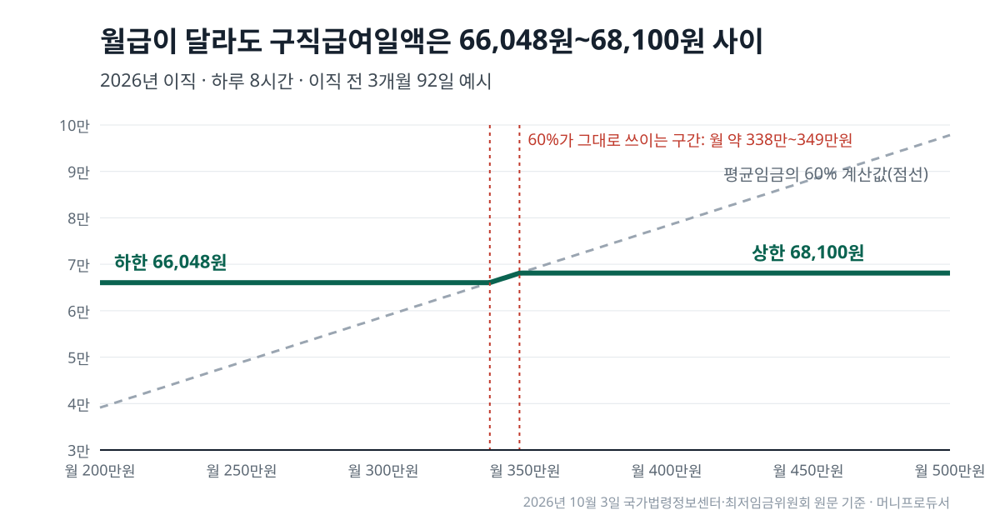
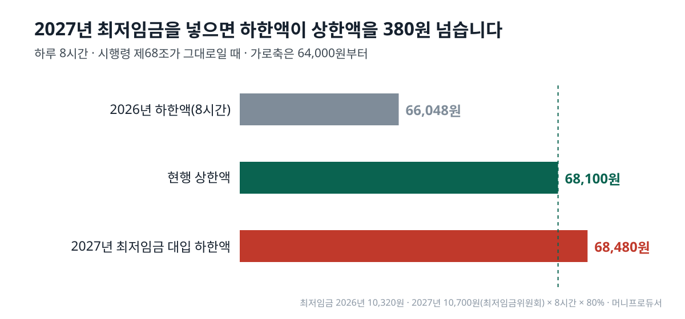

<!-- 제목: 구직급여 상한액 2026, 하루 68,100원까지 -->
<!-- 디스커버 제목: 월급 300만원과 500만원, 실업급여 하루치 차이가 2,052원뿐인 이유 -->
# 구직급여 상한액 2026, 하루 68,100원까지

2026년 1월 1일 이후 이직했다면 구직급여 상한액은 하루 68,100원, 하한액은 하루 8시간 근로 기준 66,048원입니다(고용보험법·같은 법 시행령, 2026년 10월 3일 법령 원문 기준).

30일로 환산하면 상한은 204만 3,000원, 하한은 198만 1,440원입니다. 두 금액의 차이는 하루 2,052원이라서, 하루 8시간 일하던 사람은 이직 전 월급이 200만원이든 500만원이든 구직급여일액이 이 좁은 폭 안에서 정해집니다. 아래에서 월급별로 직접 계산해 보입니다.

[[목차]]

## 구직급여 상한액은 2026년에 얼마인가요
구직급여일액(하루치 실업급여)은 「기초일액」의 60%입니다. 기초일액은 이직 전 평균임금, 곧 이직 전 3개월 동안 받은 임금 총액을 그 기간 날수로 나눈 하루 임금입니다([근로기준법 제2조](https://www.law.go.kr/법령/근로기준법/제2조) 제1항 제6호). [고용보험법 제46조](https://www.law.go.kr/법령/고용보험법/제46조)가 「100분의 60」을 정하고, [고용보험법 시행령 제68조](https://www.law.go.kr/법령/고용보험법시행령/제68조)가 기초일액이 11만3,500원을 넘으면 11만3,500원으로 본다고 적습니다. 그래서 상한은 113,500원 × 60% = 68,100원입니다.

표: 2026년 구직급여 상한액과 하한액(2026년 10월 3일 법령·최저임금위원회 원문 기준)
| 구분 | 하루(구직급여일액) | 30일로 환산 | 계산 |
|---|---|---|---|
| 상한액 | 68,100원 | 2,043,000원 | 기초일액 상한 113,500원 × 60% |
| 하한액(하루 8시간) | 66,048원 | 1,981,440원 | 최저임금 10,320원 × 8시간 × 80% |
| 차이 | 2,052원 | 61,560원 | 상한액 − 하한액 |

30일 환산은 생활비와 견주어 보려고 곱한 값입니다. 실제로는 실업인정을 받은 날수만큼 나뉘어 들어오므로 한 번에 들어오는 금액은 이와 다를 수 있습니다.

## 구직급여 상한액 인상은 언제부터 적용되나요
시행령 제68조의 113,500원에는 「2025. 12. 23.」 개정 표시가 붙어 있고, 같은 개정 시행령(대통령령 제35934호) 부칙 제1조는 시행일을 2026년 1월 1일로 정합니다. 부칙 제4조는 「이 영 시행 전에 이직한 사람」에게는 종전 규정을 적용한다고 적습니다. 기준은 신청일이 아니라 **이직일**입니다. 2025년 12월 31일에 회사를 나왔다면 2026년에 신청해도 종전 상한을 따릅니다.

같은 개정으로 예술인과 노무제공자 구직급여의 상한도 6만8,100원으로 함께 적혔습니다(시행령 제104조의8 제4항 등). 직장인 쪽과 금액이 같습니다.

## 구직급여 하한액은 어떻게 정해지나요
하한은 최저임금에 묶여 있습니다. [고용보험법 제45조](https://www.law.go.kr/법령/고용보험법/제45조) 제4항은 이직 전 하루 소정근로시간(근로계약으로 정한 하루 일하는 시간)에 이직일 당시 최저임금 시간급을 곱한 금액을 「최저기초일액」이라 부르고, 기초일액이 이보다 낮으면 이 금액을 기초일액으로 씁니다. 이때는 60%가 아니라 80%를 곱합니다(제46조 제1항 제2호). 하루 8시간이면 10,320원 × 8시간 = 82,560원, 여기에 80%를 곱한 66,048원이 하한입니다.

하한은 소정근로시간에 따라 내려갑니다. 하루 6시간 계약이었다면 49,536원, 4시간이었다면 33,024원입니다. 상한은 근로시간과 관계없이 68,100원 하나입니다. 최저임금 시간급은 [최저임금위원회 연도별 최저임금 결정현황](https://www.minimumwage.go.kr/minWage/policy/decisionMain.do)에 적힌 숫자를 썼습니다.

## 내 월급이면 구직급여 하루 얼마인가요
월급이 매달 같고 이직 전 3개월이 7·8·9월처럼 92일이라고 가정해 계산했습니다. 기초일액 = 월급 × 3 ÷ 92이고, 원 미만은 버렸습니다. 월급 밖의 임금이 더해지거나, 평균임금이 통상임금보다 적어 통상임금을 기초일액으로 쓰는 경우(제45조 제2항)에는 결과가 달라집니다.

표: 이직 전 월급별 구직급여일액 계산 예시(2026년 이직, 하루 8시간, 3개월 92일 가정)
| 이직 전 월급 | 기초일액 | 60% 계산값 | 실제 일액 | 30일 환산 | 어느 쪽 |
|---|---|---|---|---|---|
| 200만원 | 65,217원 | 39,130원 | 66,048원 | 1,981,440원 | 하한(기초일액이 최저기초일액보다 낮음) |
| 300만원 | 97,826원 | 58,695원 | 66,048원 | 1,981,440원 | 하한(60%가 하한보다 낮음) |
| 340만원 | 110,869원 | 66,521원 | 66,521원 | 1,995,630원 | 60% 그대로 |
| 400만원 | 130,434원 | 78,260원 | 68,100원 | 2,043,000원 | 상한(기초일액 113,500원으로 자름) |
| 500만원 | 163,043원 | 97,825원 | 68,100원 | 2,043,000원 | 상한(기초일액 113,500원으로 자름) |

200만원과 300만원은 같은 66,048원이 되지만 가는 길이 다릅니다. 200만원은 기초일액 65,217원이 최저기초일액 82,560원보다 낮아 제45조 제4항으로 올라가고, 300만원은 기초일액은 넘지만 60%인 58,695원이 하한보다 낮아 제46조 제2항으로 올라갑니다.

60% 계산값이 하한을 넘으려면 기초일액이 110,080원 이상이어야 하고, 92일 기준 월급으로는 3,375,787원입니다. 상한에 닿는 월급은 3,480,667원입니다. 하루 8시간 근로자라면 평균임금의 60%가 그대로 일액이 되는 구간은 월급 약 338만원에서 약 349만원 사이, 폭 104,880원뿐이고 그 아래는 하한, 그 위는 상한입니다.

## 받는 날수까지 곱하면 모두 얼마인가요
받는 날수(소정급여일수)는 이직 당시 회사에서 고용보험에 든 기간(피보험기간)과 이직일 나이로 정해집니다([고용보험법 제50조](https://www.law.go.kr/법령/고용보험법/제50조)와 별표 1). 장애인은 50세 이상과 같은 날수를 받습니다. 아래 총액은 상한액 68,100원을 날수만큼 받았을 때의 값입니다.

표: 소정급여일수별 구직급여 총액 계산(상한액 68,100원 기준, 고용보험법 별표 1)
| 피보험기간 | 50세 미만 | 상한액 총액 | 50세 이상·장애인 | 상한액 총액 |
|---|---|---|---|---|
| 1년 미만 | 120일 | 8,172,000원 | 120일 | 8,172,000원 |
| 1년 이상 3년 미만 | 150일 | 10,215,000원 | 180일 | 12,258,000원 |
| 3년 이상 5년 미만 | 180일 | 12,258,000원 | 210일 | 14,301,000원 |
| 5년 이상 10년 미만 | 210일 | 14,301,000원 | 240일 | 16,344,000원 |
| 10년 이상 | 240일 | 16,344,000원 | 270일 | 18,387,000원 |

하한액 66,048원을 받는 사람은 같은 날수에 하한액을 곱합니다. 120일이면 7,925,760원, 270일이면 17,832,960원입니다. 가장 긴 270일에서도 상한과 하한의 총액 차이는 55만 4,040원입니다.

## 2027년에는 하한액이 상한액보다 높아지나요
지금 시행령 그대로라면 그렇게 계산됩니다. 최저임금위원회 결정현황에 따르면 2027년 최저임금은 시간급 10,700원(2026년 8월 5일 결정 고시)입니다. 2027년 1월 1일 이후 이직한 하루 8시간 근로자의 최저기초일액은 85,600원, 하한액은 그 80%인 68,480원으로, 상한액 68,100원보다 380원 높습니다.

표: 하한액과 상한액 비교(소정근로시간·이직 연도별 계산, 2026년 10월 3일 원문 기준)
| 경우 | 최저임금 시간급 | 최저기초일액 | 하한액(80%) | 상한액과 차이 |
|---|---|---|---|---|
| 2026년 이직 · 하루 4시간 | 10,320원 | 41,280원 | 33,024원 | -35,076원 |
| 2026년 이직 · 하루 6시간 | 10,320원 | 61,920원 | 49,536원 | -18,564원 |
| 2026년 이직 · 하루 8시간 | 10,320원 | 82,560원 | 66,048원 | -2,052원 |
| 2027년 이직 · 하루 8시간 | 10,700원 | 85,600원 | 68,480원 | +380원 |

제46조 제2항은 60%로 계산한 일액이 하한보다 낮으면 하한을 준다고 적습니다. 현행 조문만 놓고 읽으면 이 경우 하루 8시간 근로자는 월급과 관계없이 하한 68,480원(30일 환산 2,054,400원)을 받는 셈입니다. 기준일에 법령 사이트에 올라 있는 시행령은 2026년 9월 18일 시행본이고, 제68조의 113,500원을 바꾸는 공포된 개정은 아직 없습니다.

다만 정부는 이 역전을 막는 개편 방향을 이미 내놓았습니다. [고용노동부 2026년 9월 1일 보도자료 「고용보험 제도개편 방안」](https://www.moel.go.kr/news/enews/report/enewsView.do?news_seq=19866)은 정액인 상한액을 하한액에 연동하고, 연동비율을 2026년 상·하한액 격차 3.1%를 고려해 103%로 정한다고 적습니다. 이 방식대로라면 2027년 상한액은 68,480원 × 103% = 70,534원(원 미만 버림)으로, 현행 상한보다 2,434원 높아집니다. 같은 발표에는 구직급여를 주 7일이 아니라 무급휴일을 뺀 주 6일 기준으로 지급하되 총 지급액과 지급일수(120~270일)는 그대로 둔다는 내용도 있습니다. 보도자료는 연내 법률·하위법령 개정을 목표로 한다고 적고 있어, 기준일 현재는 **확정되지 않은 정부안**입니다. 2027년 이직자의 실제 상한은 개정 시행령이 공포된 뒤의 숫자로 정해집니다.

## 이 금액들은 어느 원문에서 셌나요
기준일인 2026년 10월 3일, 법령 사이트에서 고용보험법 제45조·제46조·제50조와 별표 1(PDF), 시행령 제68조와 2025년 12월 23일 개정 부칙, 근로기준법 제2조를 조문 본문으로 열어 숫자를 옮겼고, 최저임금은 최저임금위원회 결정현황 표에서 2026년·2027년 줄을 확인했습니다. 표의 모든 금액은 이 숫자들로 같은 날 다시 계산했고, 원 미만은 버렸습니다. 수급 요건이나 신청 절차는 이 글에서 다루지 않았습니다.

일자리를 잃은 뒤의 가계 계산은 한 가지 지원으로 끝나지 않습니다. 근로소득이 줄어든 해라면 [근로장려금 신청 일정을 정리한 글](/8)에서 같은 해 소득으로 받을 수 있는 지원금의 남은 신청 시기를 이어서 볼 수 있습니다. 구직급여가 끝난 뒤 노후 소득까지 가늠하는 경우라면 [국민연금을 앞당겨 받는 경우를 계산한 글](/20)에서 조기수령 때 줄어드는 연금액을 같은 방식으로 볼 수 있습니다.

이 글은 기준일의 공개 원문을 정리한 일반 정보이며, 개인의 사정에 따라 결과가 달라질 수 있습니다.

[[같은 묶음: B1005-1/1 · 받을 수 있는지부터 따져 보려면 실업급여 조건 글을 먼저 봅니다]]

[[저자 박스]]

[집필 메모]
- 더한 것 ③: 2027년 최저임금 10,700원(최저임금위원회 결정현황, 2026-08-05 고시)을 넣으면 하루 8시간 근로자의 하한액이 68,480원으로 현행 상한액 68,100원(시행령 제68조 113,500원 × 60%)보다 380원 높아진다 — 시행령이 그대로면 2027년 이직자는 월급과 관계없이 하한을 받게 된다 (h2 「2027년에는 하한액이 상한액보다 높아지나요」 절, 최저임금위원회·시행령 제68조 링크)
- 함께 더한 계산 사실: 2026년 하루 8시간 근로자는 월급 약 338만~349만원(92일 기준 3,375,787~3,480,667원) 구간에서만 평균임금 60%가 그대로 일액이 된다.
- 못 연 원문: 법령 별표서식 주소(law.go.kr/법령별표서식/…)는 본문 5자 JS 화면이라 못 읽음 → 별표 1은 hwp·PDF 파일(flDownload)로 읽음. 고용24(ei.go.kr) 구직급여 안내 주소는 고용24 첫 화면으로 넘어가 못 읽음. 고용노동부 정책 안내(moel.go.kr) 본문 짧음(JS). 시행령 제개정이유 화면은 연결 끊김으로 못 열었다 — 종전 상한액(인상 전 금액)은 원문으로 확인하지 못해 뺐다.
- 뺀 숫자: 종전 상한액(2025년 이직자) — 원문 미확인. 실업인정 주기·대기기간 — 같은 묶음 1편(조건) 몫이라 넣지 않음.
- 설계도와 달라진 점: 그림은 matplotlib이 없어 표준 라이브러리 SVG(draw.py)로 그림. 고용보험법 조문 본문 주소(lsiSeq=284449)의 머리글은 「시행 2028. 1. 1.」 개정본 화면이지만 제45조·제46조·제50조 문구의 개정 표시는 2021년까지이고, 법 전문(2026. 9. 18. 시행본)과 문구가 같다.
- 심사 지목 1(치명) → 표2 500만원 행 60% 계산값 97,826원을 97,825원으로 고침. calc.py daily_from_monthly가 기초일액을 원 미만 버린 뒤 60%를 곱하도록 바꿈(다른 행 재검산 결과 변화 없음), 수치대장에 97,825 줄 더함.
- 심사 지목 2 → 「2027년에는 하한액이 상한액보다 높아지나요」 절 맺음을 고용노동부 2026-09-01 보도자료(news_seq=19866, 10/3 직접 열어 확인)와 함께 읽히게 고침: 상한액 하한액 103% 연동 개편안(확정 전 정부안) · 개편안 대입 2027 상한 70,534원 · 주 6일 지급(총액·120~270일 유지) · 연내 개정 목표. calc.py에 LINK_RATE와 출력 3줄, 수치대장 5줄 더함.
