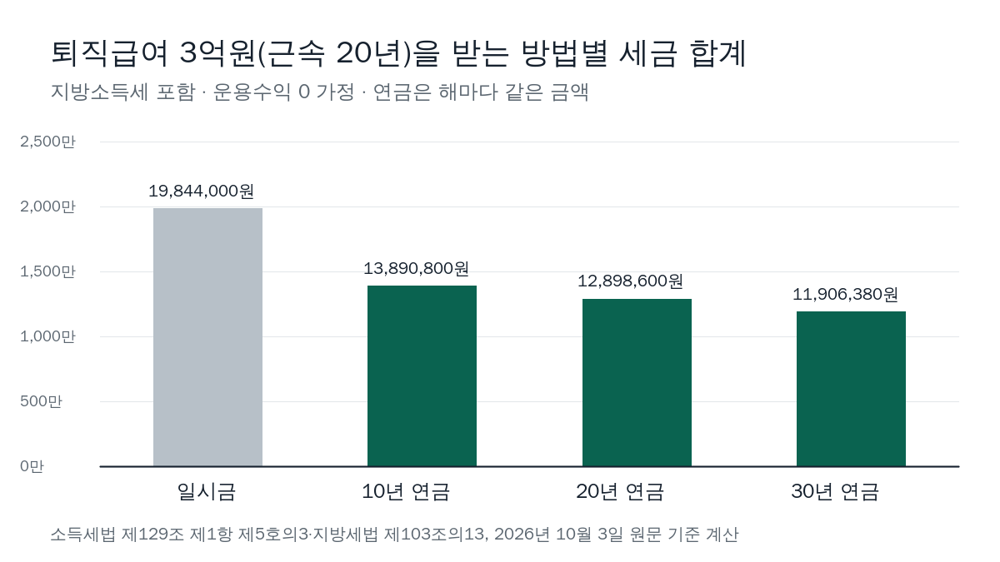
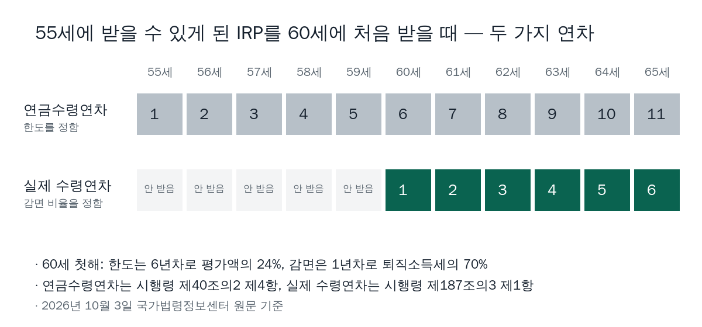

<!-- 제목: 퇴직연금 수령 방법, 연금수령 시 세금 30~50% 감면 -->
<!-- 디스커버 제목: 퇴직급여 3억원, 일시금이면 세금 약 1,984만원 · 10년 연금이면 약 1,389만원 -->
# 퇴직연금 수령 방법, 연금수령 시 세금 30~50% 감면

퇴직연금은 55세 이후 IRP 같은 연금계좌에서 일시금이나 연금으로 받습니다. 연금으로 받으면 퇴직소득세의 70%만 내고, 실제로 받은 지 11년째부터 60%, 21년째부터 50%로 줄어듭니다(2026년 10월 3일 소득세법·국세청 안내 원문 기준).

근속 20년에 퇴직급여 3억원이라면 한 번에 받을 때 세금은 지방소득세까지 1,984만 4,000원, 10년에 나눠 받으면 1,389만 800원입니다. 아래에서 받는 길, 나이 조건, 세율이 갈리는 지점을 조문 순서대로 풀었습니다.

[[목차]]

## 퇴직연금 수령 방법은 일시금과 연금 두 가지인가요
받는 그릇이 먼저 정해져 있습니다. [근로자퇴직급여 보장법 제9조](https://www.law.go.kr/법령/근로자퇴직급여보장법/제9조) 제2항은 퇴직금을 근로자가 지정한 개인형퇴직연금(IRP) 계정으로 옮겨 지급하도록 적고, 지정하지 않으면 근로자 이름의 IRP 계정으로 옮깁니다(같은 조 제3항). 확정급여형(DB) 퇴직연금도 [같은 법 제17조](https://www.law.go.kr/법령/근로자퇴직급여보장법/제17조) 제4항이 같은 방법을 정합니다. 다만 55세 이후에 퇴직해 받는 경우처럼 시행령이 정한 사유에는 이 의무가 없습니다.

IRP는 퇴직급여를 받아 두는 개인 명의 연금계좌입니다. 여기에 들어온 퇴직급여는 한 번에 꺼내는 일시금, 해마다 나눠 받는 연금, 일부만 일시금으로 꺼내고 나머지를 연금으로 받는 길 셋 중 하나로 꺼냅니다.

IRP를 거치지 않고 DB형 제도 안에서 연금으로 받는 길도 법에 있습니다. 제17조 제1항은 55세 이상이면서 가입기간이 10년 이상인 가입자에게 연금을 줄 수 있고, 그 지급기간은 5년 이상이어야 한다고 적습니다. 요건을 못 채우거나 일시금을 원하면 일시금입니다.

## 퇴직연금을 IRP로 옮기면 세금은 언제 내나요
옮기는 순간에는 내지 않습니다. [소득세법 제146조](https://www.law.go.kr/법령/소득세법/제146조) 제2항은 퇴직일에 연금계좌에 있거나 연금계좌로 지급되는 퇴직소득, 그리고 받은 날부터 60일 안에 연금계좌에 넣은 퇴직소득에 대해 「연금외수령하기 전까지」 원천징수하지 않는다고 정합니다. 이것을 과세이연이라고 부릅니다. 회사가 이미 세금을 떼고 줬더라도 60일 안에 IRP에 넣으면 그 세금의 환급을 신청할 수 있습니다.

세금은 꺼낼 때 내고, 꺼내는 방식에 따라 갈립니다. 연금 요건을 지켜 꺼내면 「연금수령」, 그 밖의 인출은 「연금외수령」이고, 둘의 세율이 다릅니다.

## 퇴직연금 수령 나이와 조건은 어떻게 되나요
[소득세법 시행령 제40조의2](https://www.law.go.kr/법령/소득세법시행령/제40조의2) 제3항이 연금수령의 요건 세 가지를 둡니다. 가입자가 55세 이후 연금계좌를 맡은 금융회사에 연금수령 개시를 신청한 뒤 인출할 것, 가입일부터 5년이 지난 뒤 인출할 것, 해마다 정해지는 연금수령한도 안에서 인출할 것입니다.

계좌에 퇴직소득(이연퇴직소득)이 있으면 두 번째 5년 요건은 따지지 않습니다. 퇴직하면서 새로 만든 IRP라도 55세가 넘었다면 바로 연금수령을 시작할 수 있다는 뜻입니다.

한도를 넘겨 꺼낸 금액은 같은 조 제5항에 따라 연금외수령으로 봅니다. 국세청 [연금소득 원천징수 방법](https://www.nts.go.kr/nts/cm/cntnts/cntntsView.do?mi=6452&cntntsId=7888) 안내에 따르면 퇴직급여 부분을 연금외수령하면 감면 없는 퇴직소득세가 그대로 붙습니다. 의료비나 시행령이 정한 부득이한 사유로 꺼낸 돈은 정해진 기간 안에 증빙을 내면 연금수령으로 봅니다.

## 퇴직연금 일시금 수령 시 세금은 얼마인가요
일시금이면 퇴직소득세를 한 번에 냅니다. 계산은 근속연수공제를 빼고, 1년치로 바꾼 환산급여에서 다시 공제를 뺀 뒤 기본세율을 곱하고, 근속연수만큼 되돌리는 순서입니다. 단계별 풀이는 같은 묶음의 다음 글에 두고 여기서는 결과만 놓았습니다. 지방소득세는 [지방세법 제103조의13](https://www.law.go.kr/법령/지방세법/제103조의13)에 따라 원천징수하는 소득세의 10%가 더 붙습니다.

표: 퇴직급여를 한 번에 받을 때의 퇴직소득세(근속 20년 가정 · 2026년 10월 3일 원문 기준 계산)
| 퇴직급여 | 근속연수공제 | 환산급여 | 과세표준 | 퇴직소득세 | 지방소득세 포함 | 받은 돈 대비 |
|---|---|---|---|---|---|---|
| 1억원 | 4,000만원 | 36,000,000원 | 11,200,000원 | 1,120,000원 | 1,232,000원 | 1.23% |
| 3억원 | 4,000만원 | 156,000,000원 | 69,100,000원 | 18,040,000원 | 19,844,000원 | 6.61% |
| 5억원 | 4,000만원 | 276,000,000원 | 135,100,000원 | 53,075,000원 | 58,382,500원 | 11.68% |

「받은 돈 대비」 칸은 실효세율, 즉 실제로 낸 세금을 받은 돈으로 나눈 비율입니다. 같은 20년 근속이라도 1억원은 1.23%, 5억원은 11.68%로, 금액이 커질수록 빠르게 오릅니다.

이 표는 국세청 [퇴직소득세 계산방법 및 계산사례](https://www.nts.go.kr/nts/cm/cntnts/cntntsView.do?mi=6444&cntntsId=7880) 쪽의 근속연수공제표·환산급여공제표·기본세율표로 계산했습니다. 소득세법 제48조와 제55조의 공제표·세율표는 조문 본문에 그림으로만 실려 있어, 같은 숫자가 글자로 적힌 국세청 쪽을 계산 근거로 썼습니다. 그 쪽 계산 사례(근속 20년, 1억원, 산출세액 112만원)와 결과가 같은지 검산했습니다. 제55조는 2022년 12월 31일 개정이 마지막이라 2026년에도 같은 세율표가 쓰입니다.

## 퇴직연금 연금수령 시 세금은 얼마나 줄어드나요
[소득세법 제129조](https://www.law.go.kr/법령/소득세법/제129조) 제1항 제5호의3이 비율을 정합니다. 퇴직소득을 연금으로 받으면 연금외수령 원천징수세율에 연금 실제 수령연차 10년 이하는 70%, 10년 초과 20년 이하는 60%, 20년 초과는 50%를 곱합니다. 이 세 구간 구분은 2026년 1월 1일 이후 연금수령분부터 적용된다고 국세청 안내가 적습니다.

연금 한 번에 붙는 세금은 「그해 받은 연금 × 퇴직소득세 ÷ 퇴직급여 × 70%」입니다. 운용수익이 없다고 두고, 같은 금액을 해마다 나눠 받는다고 계산하면 아래와 같습니다.

표: 같은 퇴직급여를 일시금과 연금으로 받을 때 세금 합계(지방소득세 포함, 운용수익 0 · 계산 예시)
| 퇴직급여 | 일시금 | 10년 연금 | 20년 연금 | 30년 연금 | 10년 연금이 덜 내는 세금 |
|---|---|---|---|---|---|
| 1억원 | 1,232,000원 | 862,400원 | 800,800원 | 739,200원 | 369,600원 |
| 3억원 | 19,844,000원 | 13,890,800원 | 12,898,600원 | 11,906,400원 | 5,953,200원 |
| 5억원 | 58,382,500원 | 40,867,750원 | 37,948,625원 | 35,029,500원 | 17,514,750원 |

표의 세액은 해마다 나눠 받는 금액에 비율을 곱해 합친 뒤, 합계에서 원 미만을 한 번만 버렸습니다.

일시금 세금을 100으로 놓으면 10년 연금은 70, 20년 연금은 65, 30년 연금은 60입니다. 3억원을 10년에 나눠 받는다면 해마다 3,000만원, 한 달로 250만원이 들어오고, 세금은 해마다 138만 9,080원, 한 달로 약 11만 6,000원입니다.

이 감면은 퇴직급여 부분에만 붙고, 운용수익에는 아래 다른 세율이 붙습니다. 연금소득을 받는 나이를 미루는 선택이 어떤 숫자로 이어지는지는 [국민연금 조기수령에서 빠지는 변수](/20)에서 국민연금 쪽으로 따져 두었습니다. 퇴직연금과 함께 노후 소득의 시점을 정하는 다른 축이라 이어서 볼 만합니다.

## 퇴직연금 연금수령한도는 어떻게 계산하나요
시행령 제40조의2 제3항 제3호의 계산식은 연금계좌 평가액을 「11 − 연금수령연차」로 나눈 값에 배율을 곱하는 꼴입니다. 이 식은 조문 본문에 글자가 아니라 수식 그림으로 실려 있어, 아래 표는 그 수식을 그대로 옮겨 계산했습니다. 한도는 해마다 1월 1일(첫해는 개시 신청일) 평가액으로 다시 정하고, 같은 조 제4항에 따라 연금수령연차가 11년 이상이 되면 한도가 없어집니다.

표: 연금수령한도 — 첫해와 한도가 사라지는 해(계좌 평가액 기준 · 계산 예시)
| 계좌 평가액 | 첫해 한도(기산 1년차) | 첫해 한도(기산 6년차) | 한도가 없어지는 해 |
|---|---|---|---|
| 1억원 | 1,200만원 | 2,400만원 | 1년차 계좌 11년째 · 6년차 계좌 6년째 |
| 3억원 | 3,600만원 | 7,200만원 | 1년차 계좌 11년째 · 6년차 계좌 6년째 |
| 5억원 | 6,000만원 | 1억 2,000만원 | 1년차 계좌 11년째 · 6년차 계좌 6년째 |

첫해 한도는 평가액의 12%입니다. 10년에 똑같이 나눠 받으면 첫해 인출은 10%라 한도 안에 들어옵니다. 기산연차가 6년차인 계좌는 첫해 한도가 24%로 두 배입니다. 제4항은 2013년 3월 1일 전에 가입한 연금계좌, 그리고 그 전에 DB형에 가입한 사람이 퇴직하면서 퇴직소득 전액을 새 연금계좌로 옮긴 경우를 6년차로 셉니다.

## 퇴직연금 수령 기간을 미루면 연차는 어떻게 세나요
연차가 두 가지라는 점이 숫자를 가릅니다. 한도를 정하는 「연금수령연차」는 시행령 제40조의2 제4항에 따라 최초로 연금수령할 수 있는 날이 든 해부터 셉니다. 받지 않고 지나간 해도 쌓입니다.

감면 비율 70%·60%·50%를 정하는 「연금 실제 수령연차」는 다릅니다. [소득세법 시행령 제187조의3](https://www.law.go.kr/법령/소득세법시행령/제187조의3) 제1항은 최초로 연금을 받은 해를 기산연차로 하고, 그 뒤 연금을 받은 해를 누적해 셉니다. 계좌가 둘 이상이면 계좌별로 셉니다.

55세에 받을 수 있게 된 IRP를 5년 묵혀 60세에 처음 받는다면, 한도 계산에서는 6년차라 첫해 한도가 평가액의 24%입니다. 감면 쪽은 1년차여서 70%가 적용되고, 60%로 바뀌는 것은 실제로 받은 해가 10년을 넘은 뒤입니다.

## 운용수익과 세액공제 받은 납입금에는 어떤 세율이 붙나요
퇴직급여는 위의 감면 비율을 따르고, 운용수익과 세액공제를 받은 납입금은 제129조 제1항 제5호의2의 나이별 세율을 따릅니다.

표: 계좌 안 돈의 갈래별 세율(소득세 기준, 지방소득세는 그 10%가 더 붙음)
| 계좌 안 돈 | 연금으로 받을 때 | 한도 초과·55세 전 등 연금 밖으로 꺼낼 때 |
|---|---|---|
| 퇴직급여(이연퇴직소득), 실제 수령 1~10년차 | 퇴직소득세의 70% | 퇴직소득세 100% |
| 퇴직급여, 실제 수령 11~20년차 | 퇴직소득세의 60% | 퇴직소득세 100% |
| 퇴직급여, 실제 수령 21년차부터 | 퇴직소득세의 50% | 퇴직소득세 100% |
| 운용수익·세액공제 받은 납입금 | 70세 미만 5% · 70세 이상 80세 미만 4% · 80세 이상 3% | 기타소득 15% |

지방소득세를 더하면 5%는 5.5%, 4%는 4.4%, 3%는 3.3%입니다. 국세청 안내에 따르면 사망할 때까지 받는 종신계약 연금은 2026년 1월 1일 이후 수령분부터 3%입니다.

국세청 안내는 연금계좌에 넣은 퇴직소득을 연금으로 받는 소득을 금액과 상관없이 분리과세한다고 적습니다. 운용수익과 세액공제분의 연금은 한 해 1,500만원 이하면 분리과세를 고를 수 있고, 넘으면 종합과세하거나 15% 분리과세를 고릅니다. 세액공제를 받은 납입금이 연금 단계에서 어떤 세율을 만나는지는 [연금저축 900만원 세액공제 계산](/18)에서 넣을 때의 계산과 함께 볼 수 있습니다.

이 글은 기준일의 공개 원문을 정리한 일반 정보이며, 개인의 사정에 따라 결과가 달라질 수 있습니다.

[[같은 묶음: B1005-2/2 · 퇴직소득세를 근속연수공제부터 단계별로 계산하는 순서는 이 글에서 풉니다]]

[[저자 박스]]

[집필 메모]
- 더한 것 ③: 감면 비율(70%·60%·50%)을 정하는 「연금 실제 수령연차」는 처음 연금을 받은 해부터 받은 해만 세고 계좌별로 센다(소득세법 시행령 제187조의3 제1항). 한도를 정하는 「연금수령연차」는 처음 받을 수 있게 된 해부터 받지 않은 해까지 센다(같은 영 제40조의2 제4항). 55세에 요건을 갖춘 IRP를 60세에 처음 받으면 한도는 6년차(평가액의 24%), 감면은 1년차(70%)다 (h2 「퇴직연금 수령 기간을 미루면 연차는 어떻게 세나요」 절)
- 법령 현행: 소득세법 [시행 2026. 1. 1.] 법률 제21221호(lsiSeq=280405) · 소득세법 시행령 [시행 2026. 10. 1.] 대통령령 제36737호(lsiSeq=290841) · 근로자퇴직급여 보장법 [시행 2026. 7. 1.] 법률 제21475호(lsiSeq=284455) · 지방세법 [시행 2026. 1. 1.] 법률 제21308호(lsiSeq=282559).
- 못 연 원문: 없음. 다만 제48조 공제표·제55조 세율표·시행령 제40조의2 연금수령한도 계산식은 조문 본문에 그림(수식)으로 실려 글자 대조가 안 된다 — 공제표·세율표 숫자는 국세청 퇴직소득세 계산 쪽(글자 표)으로 수치대장에 적었고, 한도 계산식의 배율 120/100은 조문 본문 HTML의 수식 그림 대체 글자(LaTeX)로만 확인돼 글자 대조가 안 되므로 본문에 숫자로 쓰지 않고 calc.py 머리 주석과 계산 결과(첫해 12%·6년차 24%)로만 실었다.
- 뺀 숫자: 근로자퇴직급여 보장법 시행령의 IRP 이전 예외 사유 목록(시행령 조문을 열지 않음 — 「55세 이후 퇴직 등」으로만 썼다), DC형 중도인출 사유, 의료목적 인출 증빙 기한(국세청 6개월)은 본문에서 「정해진 기간」으로만 썼다.
- 설계도와 달라진 점: 표를 4개로 썼다(일시금 세금 · 방식별 세금 · 한도 · 갈래별 세율). 설계도의 「연금소득세 5.5%·4.4%·3.3%」는 국세청 표의 소득세 5%·4%·3%에 지방세법 제103조의13의 지방소득세(소득세의 10%)를 얹은 값으로 계산해 적었다. 근속연수는 20년 하나로 고정했다(국세청 계산 사례와 같은 조건이라 검산이 된다).
