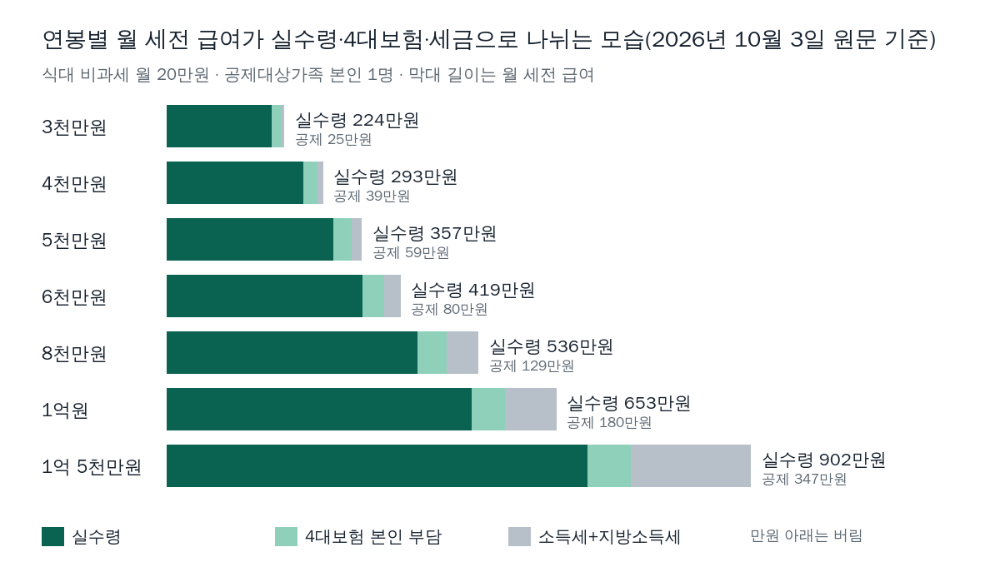
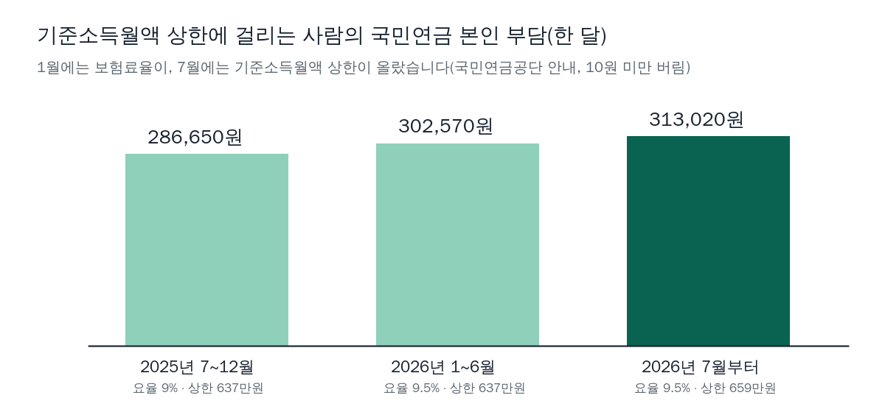

<!-- 제목: 연봉 실수령액 2026, 연봉 5천만원이면 월 357만원 -->
<!-- 디스커버 제목: 연봉 5천만원 월급에서 매달 빠지는 59만원, 여섯 항목으로 나눠 본 2026년 실수령액 -->
# 연봉 실수령액 2026, 연봉 5천만원이면 월 357만원

연봉 5,000만원(식대 비과세 월 20만원, 본인 1명)이면 한 달 실수령액은 3,571,586원, 약 357만원입니다(2026년 10월 3일 국민연금공단 안내·소득세법 시행령 별표 2 원문 기준).

월급에서 빠지는 돈은 국민연금·건강보험·장기요양보험·고용보험·소득세·지방소득세 여섯 가지이고, 연봉 5,000만원이면 합계 595,080원입니다. 아래 첫 표에서 연봉 2,500만원부터 1억 5,000만원까지 내 구간을 찾을 수 있고, 표에 없는 금액은 계산기 칸에 넣으면 같은 식으로 계산됩니다.

[[목차]]

## 연봉 실수령액 표 2026, 연봉별로 한 달에 얼마인가요

표의 전제는 세 가지입니다. 연봉(퇴직금 제외)을 12개월에 똑같이 나눠 받고, 그 안에 식대 20만원이 비과세로 들어 있으며, 공제대상가족은 본인 1명입니다. 「4대보험 본인 부담」은 회사가 따로 내는 몫을 빼고 근로자 몫만 더한 값입니다.

표: 연봉별 월 실수령액(2026년 10월 3일 원문 기준, 식대 비과세 월 20만원·공제대상가족 1명·자녀 0명)
| 연봉 | 월 세전 | 4대보험 본인 부담 | 소득세+지방소득세 | 월 실수령 |
|---|---|---|---|---|
| 2,500만원 | 2,083,333원 | 182,970원 | 18,440원 | 1,881,923원 |
| 3,000만원 | 2,500,000원 | 223,490원 | 32,070원 | 2,244,440원 |
| 3,500만원 | 2,916,666원 | 263,940원 | 54,010원 | 2,598,716원 |
| 4,000만원 | 3,333,333원 | 304,440원 | 93,080원 | 2,935,813원 |
| 4,500만원 | 3,750,000원 | 344,950원 | 145,320원 | 3,259,730원 |
| 5,000만원 | 4,166,666원 | 385,400원 | 209,680원 | 3,571,586원 |
| 6,000만원 | 5,000,000원 | 466,430원 | 338,160원 | 4,195,410원 |
| 7,000만원 | 5,833,333원 | 547,370원 | 464,660원 | 4,821,303원 |
| 8,000만원 | 6,666,666원 | 628,330원 | 671,250원 | 5,367,086원 |
| 9,000만원 | 7,500,000원 | 675,630원 | 880,810원 | 5,943,560원 |
| 1억원 | 8,333,333원 | 717,020원 | 1,085,390원 | 6,530,923원 |
| 1억 2,000만원 | 10,000,000원 | 799,820원 | 1,586,820원 | 7,613,360원 |
| 1억 5,000만원 | 12,500,000원 | 924,000원 | 2,553,430원 | 9,022,570원 |

연봉 1억원이면 한 달 6,530,923원, 1년으로 약 7,837만원이 남습니다. 연봉이 두 배가 되어도 실수령액이 두 배가 되지 않는 것은 소득세가 급여가 높은 구간일수록 더 높은 세율로 계산되기 때문입니다. 반대로 국민연금은 상한이 있어 일정 금액에서 더 늘지 않습니다.

## 연봉 실수령액 계산기에는 무엇을 넣으면 되나요

넣는 값은 네 가지입니다. 연봉(1년 세전 총액), 한 달 비과세 금액(식대 등), 공제대상가족 수, 그중 8세 이상 20세 이하 자녀 수입니다. 공제대상가족은 간이세액표에서 세금을 덜 떼는 기준이 되는 사람 수로, 본인과 배우자도 각각 1명으로 셉니다. 계산기는 위 표와 같은 식을 쓰고, 가족 수는 1명부터 11명까지 받습니다.

## 연봉 5천 실수령액은 어떤 순서로 계산되나요

먼저 연봉을 12로 나눠 월 세전 급여를 구하고, 식대 같은 비과세 금액을 빼서 보험료와 세금을 매기는 과세 월급여를 만듭니다. 4대보험은 이 과세 월급여에 요율을 곱하고, 소득세는 간이세액표에서 과세 월급여가 든 줄과 가족 수 칸을 찾아 읽습니다. 간이세액표는 회사가 매달 월급에서 미리 떼는 소득세를 급여 구간과 가족 수별로 정해 둔 표로, [소득세법 시행령 제194조](https://www.law.go.kr/법령/소득세법시행령/제194조)가 별표 2 해당 칸의 세액을 기준으로 떼도록 정합니다.

표: 연봉 5,000만원 직접 계산(식대 월 20만원·본인 1명, 10원 미만 버림)
| 단계 | 계산 | 금액 |
|---|---|---|
| 월 세전 | 50,000,000원 ÷ 12 | 4,166,666원 |
| 과세 월급여 | 4,166,666원 − 200,000원 | 3,966,666원 |
| 국민연금 | 3,966,000원 × 4.75% | 188,380원 |
| 건강보험 | 3,966,666원 × 3.595% | 142,600원 |
| 장기요양보험 | 142,600원 × 9,448/71,900 | 18,730원 |
| 고용보험 | 3,966,666원 × 0.9% | 35,690원 |
| 소득세 | 간이세액표 3,960천원 이상 3,980천원 미만, 가족 1명 칸 | 190,620원 |
| 지방소득세 | 190,620원 × 10% | 19,060원 |
| 공제 합계 | 여섯 항목 더하기 | 595,080원 |
| 월 실수령 | 4,166,666원 − 595,080원 | 3,571,586원 |

항목마다 10원 미만은 버렸습니다. [국고금 관리법 제47조](https://www.law.go.kr/법령/국고금관리법/제47조)가 국고금의 10원 미만 끝수를 계산하지 않도록 정한 방식을 이 계산 전체에 똑같이 적용한 것이라, 회사 급여 명세서와 10원 단위에서 차이가 날 수 있습니다.

## 4대보험 공제율은 2026년에 얼마인가요

표: 월급에서 빠지는 여섯 가지와 2026년 본인 부담 비율
| 항목 | 본인 부담(2026년 10월) | 근거 |
|---|---|---|
| 국민연금 | 기준소득월액의 4.75%(보험료율 9.5%의 절반), 기준소득월액 41만~659만원 | 국민연금공단 보험료 안내 |
| 건강보험 | 과세 월급여의 3.595%(보험료율 7.19%의 절반) | 국민건강보험법 시행령 제44조, 법 제76조 |
| 장기요양보험 | 건강보험료 × 9,448/71,900(약 13.14%) | 노인장기요양보험법 제9조, 시행령 제4조 |
| 고용보험 | 과세 월급여의 0.9%(실업급여 보험료율 1.8%의 절반) | 고용산재보험료징수법 제13조, 시행령 제12조 |
| 소득세 | 근로소득 간이세액표 해당 칸 | 소득세법 시행령 제194조·별표 2 |
| 지방소득세 | 소득세의 10% | 지방세법 제103조의13 |

국민연금은 2025년까지 보험료율 9%였고, 2026년부터 해마다 0.5%포인트씩 올라 2033년에 13%가 됩니다([국민연금공단 연금보험료 안내](https://www.nps.or.kr/pnsinfo/ntpsklg/getOHAF0038M0.do?menuId=MN24001113)). 기준소득월액은 보험료를 매기는 기준이 되는 월 소득으로, 천원 미만을 버리고 2026년 7월부터 2027년 6월까지는 41만~659만원 안으로 맞춥니다. 건강보험료율은 [국민건강보험법 시행령 제44조](https://www.law.go.kr/법령/국민건강보험법시행령/제44조)의 1만분의 719이고, 장기요양보험료율은 [노인장기요양보험법 시행령 제4조](https://www.law.go.kr/법령/노인장기요양보험법시행령/제4조)의 100만분의 9,448입니다. 장기요양보험료는 건강보험료에 두 요율의 비율을 곱해 정합니다. 고용보험은 [고용산재보험료징수법 시행령 제12조](https://www.law.go.kr/법령/고용보험및산업재해보상보험의보험료징수등에관한법률시행령/제12조)의 실업급여 보험료율 1천분의 18 가운데 절반을 근로자가 냅니다.

식대 20만원을 받는 경우 연봉 8,148만원부터는 기준소득월액이 상한에 걸리고, 이 구간의 국민연금은 올해 두 번 올랐습니다. 2025년 하반기 286,650원이던 본인 몫이 1월에 요율이 올라 302,570원이 되었고, 7월에 상한이 637만원에서 659만원으로 바뀌어 313,020원이 되었습니다. 7월 한 번에 10,450원이 늘어난 셈입니다.

[[같은 묶음: B1006-2/2 · 회사가 내는 몫까지 4대보험료를 항목별로 나눠 보려면 4대보험 계산 글을 봅니다]]

## 간이세액표는 가족 수와 자녀 수를 어떻게 반영하나요

같은 연봉 5,000만원이라도 공제대상가족 수와 8세 이상 20세 이하 자녀 수에 따라 매달 떼는 소득세가 달라집니다.

표: 연봉 5,000만원에서 공제대상가족·자녀 수에 따른 차이(식대 월 20만원)
| 공제대상가족 | 소득세 | 지방소득세 | 월 실수령 |
|---|---|---|---|
| 본인 1명 | 190,620원 | 19,060원 | 3,571,586원 |
| 본인·배우자 2명 | 162,640원 | 16,260원 | 3,602,366원 |
| 3명(8~20세 자녀 1명 포함) | 83,870원 | 8,380원 | 3,689,016원 |
| 4명(8~20세 자녀 2명 포함) | 42,420원 | 4,240원 | 3,734,606원 |

자녀 몫은 간이세액표 칸의 세액에서 한 번 더 뺍니다. 2026년 2월 27일 개정된 소득세법 시행령 별표 2는 8세 이상 20세 이하 자녀가 1명이면 20,830원, 2명이면 45,830원을 빼고, 3명부터는 1명당 33,330원을 더 빼도록 적었습니다. 그런데 2026년 10월 3일 열어 본 [국세청 근로소득 원천징수 안내](https://www.nts.go.kr/nts/cm/cntnts/cntntsView.do?mi=6583&cntntsId=7862)의 사례 설명에는 1명 12,500원, 2명 29,160원이 그대로 적혀 있습니다. 자녀 1명 기준으로 한 달 8,330원, 1년 99,960원 차이라, 안내 쪽 숫자로 계산하면 매달 떼는 세금이 별표 2로 계산한 값보다 많게 나옵니다. 이 쪽의 표와 계산기는 별표 2의 금액을 썼습니다.

근로자는 간이세액표 세액의 80%나 120%로 떼 달라고 회사에 신청할 수도 있습니다(시행령 제194조 제1항 단서). 연봉 5,000만원·본인 1명이면 매달 소득세 190,620원이 80%로는 152,490원, 120%로는 228,740원이 됩니다. 떼는 비율만 바뀔 뿐 1년 세금은 연말정산에서 다시 정해집니다.

## 식대 비과세 20만원은 실수령액을 얼마나 바꾸나요

[소득세법 제12조](https://www.law.go.kr/법령/소득세법/제12조) 제3호 러목은 식사를 따로 제공받지 않는 근로자가 받는 월 20만원 이하 식사대를 비과세로 둡니다. 비과세 근로소득은 보험료를 매기는 소득에서도 빠집니다([국민연금법 제3조](https://www.law.go.kr/법령/국민연금법/제3조) 제1항 제3호, 국민건강보험법 시행령 제33조). 그래서 식대가 비과세로 잡히면 4대보험과 소득세가 함께 줄어듭니다.

연봉 5,000만원 안에 식대 20만원이 들어 있으면 월 실수령액은 3,571,586원이고, 같은 연봉에 비과세가 0원이면 3,522,776원입니다. 한 달 48,810원, 1년 585,720원 차이입니다. 연봉 총액이 같아도 급여 명세서의 비과세 항목 구성에 따라 실수령액이 달라지는 이유가 여기에 있습니다.

## 연봉 1억 실수령액은 왜 월 653만원 안팎인가요

연봉 1억원(식대 20만원, 본인 1명)이면 월 세전 8,333,333원에서 1,802,410원이 빠져 6,530,923원이 남습니다. 빠지는 돈 가운데 소득세가 986,720원으로 가장 큽니다. 국민연금은 기준소득월액 상한 659만원에 걸려 313,020원에서 멈추므로, 연봉이 더 올라도 국민연금은 그대로이고 소득세와 건강보험료·고용보험료가 늘어납니다.

과세 월급여가 1,000만원을 넘으면 간이세액표 칸 대신 별표 2의 계산식을 씁니다. 1,400만원까지는 1,000만원 줄의 세액에, 1,000만원을 넘는 금액의 98%에 35%를 곱한 금액과 25,000원을 더합니다. 연봉 1억 5,000만원에 공제대상가족 3명(8세 이상 20세 이하 자녀 1명 포함)이라면 과세 월급여 12,300,000원에 소득세 1,993,910원, 월 실수령액 9,382,700원입니다.

## 실수령액이 이 표와 달라지는 경우는 언제인가요

국민연금 기준소득월액은 매달 월급이 아니라 전년도 소득으로 정해 그해 7월부터 1년 동안 씁니다(국민연금공단 안내). 연봉이 오른 해에는 국민연금이 다음 해 7월에야 따라 오를 수 있습니다. 상여금을 따로 받는 달에는 상여를 포함한 방식으로 소득세를 다시 계산하므로 그달 공제가 커집니다. 매달 떼는 소득세는 미리 떼는 금액이라, 1년 세금은 연말정산에서 다시 정해집니다. 연금계좌에 넣은 돈이 있다면 [연금저축 세액공제 정리](/18)에서 연말정산 때 돌려받는 금액을 이어서 계산할 수 있습니다. 매달 내는 국민연금이 나중에 어떤 연금으로 돌아오는지는 [국민연금 조기수령 정리](/20)가 받는 시점별로 다룹니다.

이 쪽의 숫자는 2026년 10월 3일 직접 열어 본 원문 기준입니다. 국민연금 요율과 기준소득월액 상·하한은 국민연금공단 보험료 안내에서, 건강보험·장기요양·고용보험 요율은 각 시행령 조문에서 읽었습니다. 간이세액표는 국가법령정보센터의 소득세법 시행령 별표 2 PDF(개정 2026. 2. 27.)를 글자로 풀어 646줄을 모두 계산 스크립트에 넣었고, 국세청 안내 사례의 월급여 350만원 줄(가족 4명 49,340원)과 같은 값이 나오는지 대조했습니다.

이 글은 기준일의 공개 원문을 정리한 일반 정보이며, 개인의 사정에 따라 결과가 달라질 수 있습니다.

[[저자 박스]]

[집필 메모]
- 더한 것 ③: 소득세법 시행령 별표 2(개정 2026. 2. 27.)의 8~20세 자녀 공제는 1명 20,830원·2명 45,830원·3명부터 1명당 33,330원인데, 국세청 근로소득 원천징수 안내 쪽(2026-10-03 열람) 사례에는 아직 12,500원·29,160원이 적혀 있다 — 자녀 1명 한 달 8,330원 차이 (h2 「간이세액표는 가족 수와 자녀 수를 어떻게 반영하나요」 절, 국세청 안내 딥링크를 문장 바로 옆에)
- 못 연 원문: 홈택스 근로소득 간이세액표 조회 화면(웹스퀘어 스크립트 화면이라 글자 없음 — 별표 2 PDF로 대신함). 국민건강보험공단 누리집 보험료율 안내는 열지 않고 시행령 조문으로 갈음. 법령 사이트는 연결 끊김이 여러 번 있었고(별표 본문 POST·byl.js), 간격을 두고 다시 열어 모두 읽음
- 뺀 숫자: 건강보험료 보수월액 상·하한(이 표의 연봉 범위에서는 걸리지 않음, 원문 확인 안 함), 회사 부담분(같은 묶음 2편 몫)
- 간이세액표 대조 한계: 별표 2의 646줄(월 77만~1,000만원)과 1,000만원 초과 계산식을 그대로 넣었으므로 근사가 아니다. 다만 연봉 ÷ 12를 과세 월급여로 보는 가정(상여·성과급 없음), 4대보험 끝수를 항목마다 10원 미만 버림으로 통일한 점, 국민연금 기준소득월액을 이번 달 과세 월급여로 놓은 점(실제는 전년도 소득 기준)에서 회사 명세서와 차이가 날 수 있다
- 설계도와 달라진 점: 라이브 글 링크를 /18·/19 대신 /18·/20으로 골랐다(실수령 독자의 다음 질문이 국민연금 쪽에 더 가깝다). 별표 2를 글자로 읽을 수 있어 계산식 근사 대신 표 조회로 썼다
- 자료집에 더한 줄: 원문 15줄 + 계산 함수 1줄(take_home) — 별표 2 PDF, 국민연금공단 보험료 안내, 건보 시행령 제44조·제33조, 건보법 제76조, 장기요양 시행령 제4조·법 제9조, 고용 시행령 제12조·법 제13조·제2조, 소득세법 제12조, 국고금 관리법 제47조, 국세청 근로소득 간이세액표 안내, 국민연금법 제3조·제88조
- 계산기 쪽 산출: 발행.html은 조립.py가 도구/계산기/틀.html의 감싸는 div·style·입력칸·스크립트 틀에 원고.md 본문(본사 convert_text로 문단·표 꼴만 빌림)과 calc.py --js 상수를 채워 만든다. 사장 단계 8 변환기는 돌리지 않는다. 표 숫자는 calc.py 출력, 표 밖 숫자는 수치대장 54줄(원문 29줄 모두 「있음」, 계산 25줄)
- 시험: calc.py TESTS 10개 외에 무작위·경계 입력 3,011개로 calc.py compute와 HTML calcCompute를 node로 맞대어 불일치 0
