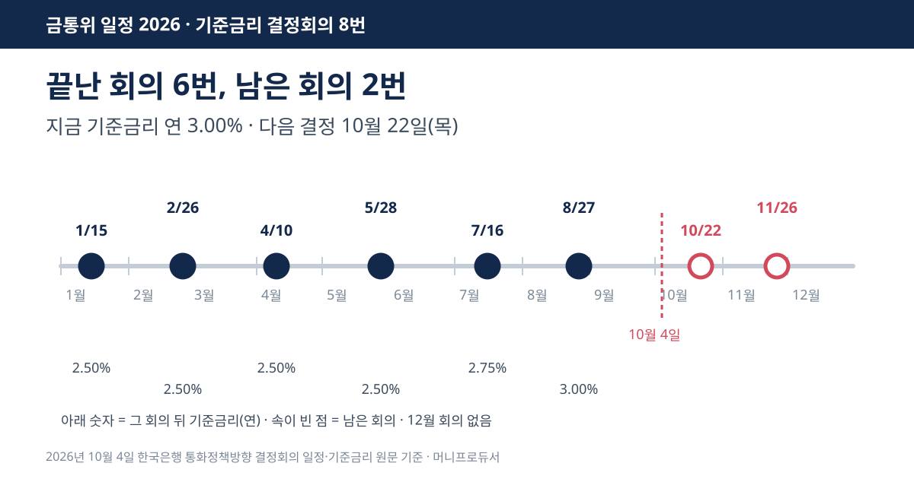
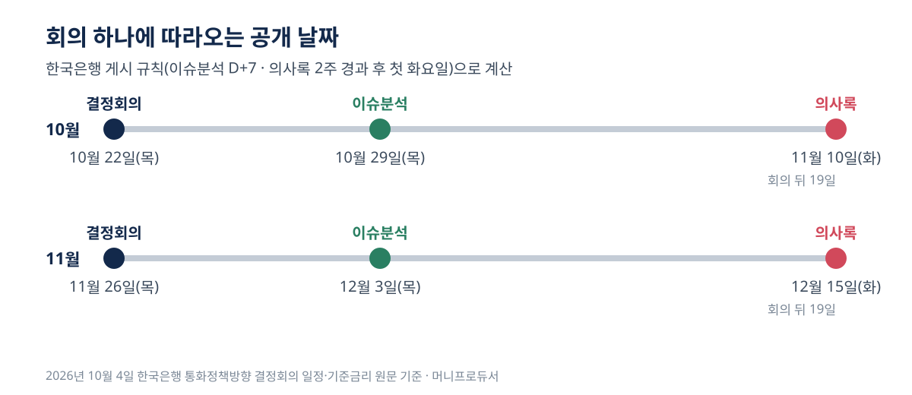

<!-- 제목: 금통위 일정 2026, 남은 결정은 10월 22일·11월 26일 두 번 -->
<!-- 디스커버 제목: 올해 기준금리 결정 남은 두 번, 의사록이 나오는 날까지 계산했습니다 -->
<!-- 게시일: 2026-10-08 -->
# 금통위 일정 2026, 남은 결정은 10월 22일·11월 26일 두 번

2026년 기준금리 결정회의 8번 중 6번이 끝났고, 남은 날은 10월 22일(목)과 11월 26일(목)입니다. 지금 기준금리는 연 3.00%입니다(2026년 10월 4일 한국은행 원문 기준).

12월에는 결정회의가 없습니다. 11월 26일이 올해 마지막 결정이고, 그다음 결정은 2027년 회의에서 나옵니다. 10월 4일에 한국은행 일정 화면에서 2027년을 골라 보면 회의 날짜가 아직 한 줄도 올라와 있지 않습니다.

이 글은 한국은행이 올려 둔 일정·기준금리 목록·게시 규칙만 가지고 세 가지를 정리했습니다. 올해 여덟 번의 날짜와 결과, 남은 두 회의 뒤에 의사록이 공개되는 날, 그리고 금리가 0.25%p 움직일 때 대출 이자와 예금 이자가 1년에 얼마씩 달라지는지입니다. 금리가 어느 쪽으로 갈지는 다루지 않습니다.

[[목차]]

## 금통위 일정 2026, 여덟 번은 언제였나요
[한국은행 통화정책방향 결정회의 일정](https://www.bok.or.kr/portal/singl/crncyPolicyDrcMtg/listYear.do?mtgSe=A&menuNo=200755&pYear=2026) 화면의 2026년 칸에는 날짜가 여덟 개 있습니다. 회의마다 결과를 붙이려면 [한국은행 기준금리 추이](https://www.bok.or.kr/portal/singl/baseRate/list.do?dataSeCd=01&menuNo=200643) 목록을 같이 봐야 합니다. 이 목록은 금리가 바뀐 날만 적기 때문에, 목록에 날짜가 없는 회의는 기준금리를 그대로 둔 회의입니다.

표: 2026년 기준금리 결정회의 8번과 결과(일정 화면과 변경 목록을 맞대어 정리)
| 차례 | 회의일 | 결과(회의 뒤 기준금리) |
|---|---|---|
| 1 | 1월 15일(목) | 연 2.50% (변경 없음) |
| 2 | 2월 26일(목) | 연 2.50% (변경 없음) |
| 3 | 4월 10일(금) | 연 2.50% (변경 없음) |
| 4 | 5월 28일(목) | 연 2.50% (변경 없음) |
| 5 | 7월 16일(목) | 연 2.75% (+0.25%p) |
| 6 | 8월 27일(목) | 연 3.00% (+0.25%p) |
| 7 | 10월 22일(목) | 남은 회의 |
| 8 | 11월 26일(목) | 남은 회의 |

여덟 번 가운데 목요일이 아닌 날은 4월 10일 금요일 하나입니다. 날짜를 「매달 넷째 목요일」 식으로 짐작하면 틀리는 이유가 여기 있습니다. 1월·2월·4월·5월은 2025년 5월 29일에 정한 연 2.50%를 그대로 두었고, 7월과 8월에 0.25%p씩 두 번 올라 지금의 연 3.00%가 됐습니다.

## 금통위 결과는 몇 시에 나오나요
한국은행의 [통화정책의 실제운영](https://www.bok.or.kr/portal/main/contents.do?menuNo=200293) 설명에는 「본회의는 통상 오전 9시에 열리며」 이 자리에서 기준금리가 결정되고 통화정책방향 의결문이 작성된다고 적혀 있습니다. 본회의 직후에는 총재가 결정 배경을 설명하는 기자간담회가 열립니다.

정리하면 10월 22일과 11월 26일 모두 오전 9시에 회의가 시작되고, 결정과 의결문 발표, 기자간담회가 같은 날 오전에 이어집니다. 의결문이 몇 시 몇 분에 올라오는지는 한국은행 설명 원문에 분 단위로 적혀 있지 않았습니다. 회의 전날에는 한국은행 각 부서가 위원들에게 국내외 금융·경제 상황을 보고하는 「동향보고회의」가 따로 열립니다.

## 금통위는 한 해에 몇 번 열리나요
기준금리를 정하는 회의는 연 8회입니다. 같은 설명 원문은 「기준금리는 연 8회 금융통화위원회 '본회의'에서 결정된다」고 적고, 회의 날짜는 한 해 단위로 미리 정한다고 밝힙니다.

헷갈리는 지점이 하나 있습니다. [금융통화위원회 소개](https://www.bok.or.kr/portal/main/contents.do?menuNo=201696) 화면에는 정기회의가 「통상 매월 둘째주, 넷째주 목요일」에 열린다고 되어 있습니다. 금통위 회의는 한 달에 두 번꼴로 열리지만, 그중 기준금리를 정하는 회의가 여덟 번이라는 뜻입니다. 일정 화면에 붙은 의사록 파일 이름이 이를 보여 줍니다. 1월 회의는 「제1차」, 2월은 「제4차」, 8월은 「제16차」 금통위 의사록입니다. 차수는 금리 회의만이 아니라 금통위 전체 회의의 순번입니다.

## 금통위 의사록은 언제 공개되나요
일정 화면 아래 각주에 규칙이 있습니다. 「금융·경제 이슈는 통화정책방향 결정회의 D+7일, 의사록은 회의일로부터 2주 경과 후 첫 화요일에 게시」. 날짜를 직접 세어 보면 아래와 같습니다. 10월 22일 회의의 의사록은 2주가 지난 11월 5일 다음에 처음 오는 화요일, 11월 10일입니다.

표: 회의 뒤 이슈분석·의사록 게시 예정일(한국은행 게시 규칙으로 직접 계산)
| 회의일 | 이슈분석 게시(D+7) | 의사록 게시(2주 뒤 첫 화요일) |
|---|---|---|
| 7월 16일(목) | 7월 23일(목) | 8월 4일(화) |
| 8월 27일(목) | 9월 3일(목) | 9월 15일(화) |
| 10월 22일(목) | 10월 29일(목) | 11월 10일(화) |
| 11월 26일(목) | 12월 3일(목) | 12월 15일(화) |

목요일 회의라면 의사록은 늘 회의 뒤 19일째 화요일에 나옵니다. 11월 26일 회의의 의사록이 12월 15일에 나오면, 그 해 금리 결정을 두고 위원들이 나눈 말은 연말을 2주쯤 남기고 모두 공개되는 셈입니다. 위 날짜는 게시 규칙을 그대로 따라 센 값이고, 실제 게시일은 한국은행 화면에서 그날 확인됩니다.

## 금통위 금리 0.25%p 바뀌면 대출 이자는 얼마나 달라지나요
대출 금리가 기준금리 변동 폭만큼 그대로 움직이고 1년 동안 원금이 그대로라고 가정하면, 1억원 변동금리 대출의 이자는 0.25%p에 1년 25만원, 한 달로 약 2만원 달라집니다. 7월 이후 두 번 오른 0.50%p를 같은 방식으로 대면 1년 50만원, 한 달 약 4만원입니다.

표: 금리가 0.25%p·0.50%p 달라질 때 1년 이자 차이(가정 계산, 원 미만 버림)
| 원금 | 0.25%p 차이(연) | 한 달로 | 0.50%p 차이(연) | 한 달로 |
|---|---|---|---|---|
| 대출 1억원 | 250,000원 | 약 20,833원 | 500,000원 | 약 41,666원 |
| 대출 2억원 | 500,000원 | 약 41,666원 | 1,000,000원 | 약 83,333원 |
| 대출 3억원 | 750,000원 | 약 62,500원 | 1,500,000원 | 약 125,000원 |
| 예금 1,000만원 | 25,000원 | 약 2,083원 | 50,000원 | 약 4,166원 |
| 예금 3,000만원 | 75,000원 | 약 6,250원 | 150,000원 | 약 12,500원 |

실제 계산서와는 차이가 납니다. 변동금리 대출은 계약서에 적힌 기준 지표와 가산금리로 이자가 정해지고, 그 지표가 바뀌는 시점과 폭이 기준금리와 꼭 같지는 않습니다. 원금을 나눠 갚는 대출이라면 남은 원금이 줄어드는 만큼 차이도 작아집니다. 고정금리 기간이 남은 대출은 그 기간 동안 영향이 없습니다. 예금 칸은 세금을 떼기 전 이자이고, 이미 가입한 정기예금은 만기까지 약정 금리가 유지되는 상품이 보통입니다.

2억원 변동금리 대출이 있는 가구라면, 위 가정에서 0.25%p는 한 달 약 4만원의 차이입니다. 3억원이면 한 달 약 6만원입니다. 금리가 움직일 때 환율과 물가 쪽에서 오는 영향은 [환율이 올랐다는 뉴스, 이미 당신 지갑에서 새고 있습니다](/24)에서 생활비 항목별로 정리해 두었습니다.

## 금통위 임시회의도 열 수 있나요
열 수 있습니다. [통화정책의 실제운영](https://www.bok.or.kr/portal/main/contents.do?menuNo=200293) 설명은 경제 여건이 갑자기 바뀌어 대응이 필요하면 임시회의를 열 수 있다고 적고 있고, 금융통화위원회 소개 화면은 의장이 필요하다고 인정하거나 위원 2인 이상이 요구할 때 임시회의를 연다고 밝힙니다. 안건은 위원 5인 이상이 출석하고 출석위원 과반수가 찬성해야 의결됩니다. 그래서 위 여덟 날짜는 「미리 정한 회의」이고, 그 밖의 날에 결정이 나올 가능성이 원문상 닫혀 있지는 않습니다.

## 기준금리는 무엇을 보고 정하나요
한국은행의 [물가안정목표제](https://www.bok.or.kr/portal/main/contents.do?menuNo=200291) 화면에 적힌 목표는 소비자물가 상승률(전년동기대비) 2%입니다. 금리를 정할 때는 국내 물가, 경기, 금융·외환시장 상황, 세계경제 흐름을 함께 본다고 설명합니다. 다른 나라 중앙은행의 회의도 시장이 같이 지켜보는 날인데, 일본은행 회의가 원화와 엔화 사이에 어떤 식으로 얽히는지는 [엔화가 강해졌는데 왜 원/엔은 그대로일까요](/17)에 적어 두었습니다.

## 이 글의 날짜는 어디서 어떻게 셌나
2026년 10월 4일에 한국은행 누리집의 통화정책방향 결정회의 일정 화면(2026년 칸), 기준금리 추이 목록, 통화정책의 실제운영·금융통화위원회 소개·물가안정목표제 화면을 직접 열어 날짜와 문구를 옮겼습니다. 의사록 게시일과 이자 차이는 이 원문 숫자로 직접 계산했습니다. 8월 회의의 보도자료 PDF는 내려받는 중 연결이 끊겨 열지 못했고, 그래서 결정 이유는 이 글에 옮기지 않았습니다.

이 글은 기준일의 공개 원문을 정리한 일반 정보이며, 개인의 사정에 따라 결과가 달라질 수 있습니다.

[[저자 박스]]

[집필 메모]
- 더한 것 ③: 한국은행 일정 화면 각주의 게시 규칙(D+7·2주 경과 후 첫 화요일)으로 계산하면 10월 22일 회의 의사록은 11월 10일(화), 11월 26일 회의 의사록은 12월 15일(화)에 게시된다. 의사록 차수(제1·4·16차)는 금리 회의가 아니라 금통위 전체 회의 순번이다(h2 「금통위 의사록은 언제 공개되나요」·「금통위는 한 해에 몇 번 열리나요」 절).
- 설계도와 달라진 점: 없음. 남은 회의 2번(10/22·11/26), 총 8회를 원문에서 확인해 제목 초안의 「남은 두 번」을 그대로 두고 날짜를 넣었다. 기준금리는 연 3.00%(2026-08-27 변경).
- 못 연 원문: 8월 국문보도자료(2608) PDF — file-cdn.bok.or.kr 연결 끊김 2회. 우회하지 않음.
- 뺀 숫자: 의결문 발표 시각(분 단위)은 원문에 없어 쓰지 않음. 2027년 회의 날짜는 10/4 기준 일정 화면에 없음.
- 그림: matplotlib 없음 → 표준 라이브러리로 SVG(draw.py, 01_대표 1,200×630).
- 자료집에 더한 줄: 원문 4줄 · 계산 함수 1줄.
