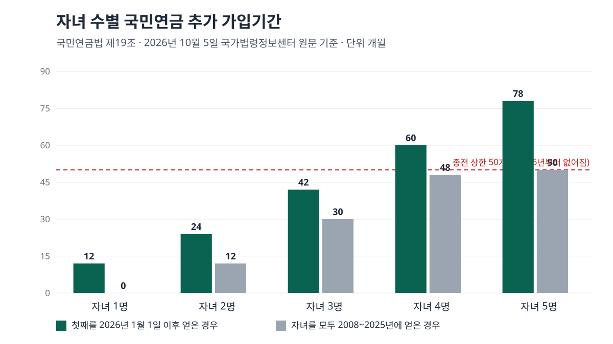
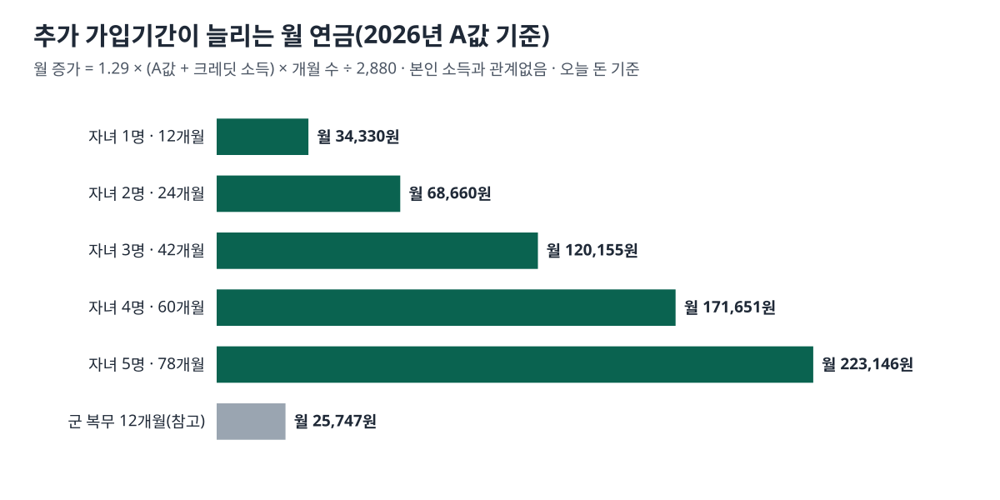

<!-- 제목: 출산크레딧, 첫째부터 12개월씩 늘어나는 국민연금 가입기간 -->
<!-- 디스커버 제목: 2026년에 바뀐 출산크레딧, 자녀 한 명이 국민연금을 한 달 3만4천원 늘리는 계산 -->
<!-- 게시일: 2026-10-08 -->
# 출산크레딧, 첫째부터 12개월씩 늘어나는 국민연금 가입기간

첫째 자녀를 2026년 1월 1일 이후에 얻었다면 자녀 한 명마다 12개월, 셋째부터는 한 명마다 18개월이 국민연금 가입기간에 더해지고, 예전의 50개월 상한은 없습니다(2026년 10월 5일 열어 본 국민연금법 제19조, 2026년 1월 1일 시행판 원문 기준).

이 기간은 보험료를 내지 않고 얹히는 가입기간입니다. 같은 조 제3항은 여기에 드는 돈을 국가가 전부 또는 일부 부담한다고 적고 있습니다. 2026년 A값(전체 가입자 평균소득)으로 직접 계산해 보면 12개월이 늘 때 노령연금은 한 달에 약 3만4천원, 1년에 약 41만원 늘어납니다.

다만 자녀를 언제 얻었는지에 따라 개월 수가 세 갈래로 나뉩니다. 2025년 이전에 첫째를 얻은 가정은 여전히 둘째부터 인정되고, 모든 자녀가 2025년 이전이면 50개월 상한도 남아 있습니다. 아래에서 자녀 수별 개월 수, 늘어나는 연금액, 부부 사이 배분과 신청 시점을 원문 순서대로 정리했습니다.

[[목차]]

## 출산크레딧은 자녀 몇 명부터, 몇 개월이 인정되나요
[국민연금법 제19조](https://www.law.go.kr/법령/국민연금법/제19조) 제1항은 두 줄로 되어 있습니다. 자녀가 2명 이하면 자녀 1명마다 12개월을 더하고, 3명 이상이면 첫째와 둘째 몫 24개월에 셋째부터 1명마다 18개월을 더합니다. 이 조항은 2025년 4월 2일 개정돼 2026년 1월 1일부터 시행됐고, 개정 법률 부칙 제3조 제1항은 「이 법 시행 이후 첫째 자녀를 얻은 사람부터」 적용한다고 정합니다.

그래서 같은 셋째라도 첫째를 언제 얻었는지에 따라 인정 개월 수가 달라집니다. 2025년 이전 규정은 첫째에게는 아무것도 주지 않고 둘째부터 셈했으며, 모두 합쳐 50개월을 넘지 못하게 했습니다. [국민연금공단 연금개혁 안내](https://www.nps.or.kr/pnsinfo/ntpsklg/getOHAF0104M0.do?menuId=MN25059919)의 「출산크레딧은 어떻게 확대되나요」 문답이 두 규정을 나란히 비교해 둡니다.

표: 자녀를 얻은 시기별 추가 가입기간(국민연금법 제19조·2025년 개정 부칙 제3조, 공단 안내로 맞춤)
| 자녀 수 | 첫째를 2026년 이후 얻은 경우 | 모두 2008~2025년에 얻은 경우 | 첫째는 2025년 이전, 그 뒤 자녀는 2026년 이후 |
|---|---|---|---|
| 1명 | 12개월 | 0개월 | 해당 없음 |
| 2명 | 24개월 | 12개월 | 12개월 |
| 3명 | 42개월 | 30개월 | 30개월 |
| 4명 | 60개월 | 48개월 | 48개월 |
| 5명 | 78개월 | 50개월 | 66개월 |

다섯 명 줄의 맨 오른쪽 66개월은 넷째나 다섯째를 2026년 이후 얻은 경우의 계산입니다. 공단 안내는 이 경우 「추가산입되는 가입기간에 대한 상한 제한은 없습니다」라고 적고 있습니다.

## 2025년 이전에 낳은 자녀는 어떻게 계산하나요
갈래는 셋입니다.

- 자녀를 모두 2008년 1월 1일부터 2025년 12월 31일 사이에 얻었다면 예전 규정 그대로입니다. 둘째 12개월, 셋째부터 1명마다 18개월, 합계 50개월까지입니다.
- 첫째를 그 기간에 얻고 둘째나 셋째를 2026년 이후 얻었다면, 개월 수는 예전 방식(첫째 0개월)으로 세되 50개월 상한을 적용하지 않습니다. 부칙 제3조 제2항의 내용입니다.
- 2026년 1월 1일 전에 이미 노령연금 수급권을 얻은 사람은 이후에 자녀가 생겨도 예전 규정이 그대로 적용됩니다(같은 항 단서).

2008년 이전에 얻은 자녀는 이 제도의 출발점 앞에 있습니다. 2007년 7월 23일 개정 법률(제8541호) 부칙 제19조는 2008년 이후 얻은 자녀가 있을 때만 크레딧을 주고, 2007년 이전 자녀가 1명이면 그 자녀를 자녀 수에 합쳐 세며, 2명 이상이면 2008년 이후 자녀 1명마다 18개월(50개월 한도)을 더하게 합니다. 2007년 이전 자녀만 있는 가정은 출산크레딧이 없습니다.

## 출산크레딧으로 국민연금은 한 달에 얼마나 늘어나나요
늘어나는 금액은 [국민연금법 제51조](https://www.law.go.kr/법령/국민연금법/제51조)의 기본연금액 공식에서 나옵니다. 기본연금액은 A값(연금 받기 전 3년 동안 전체 가입자 평균소득)과 B값(본인의 가입기간 평균소득)을 더한 금액에 1천분의 1천290을 곱해 20년 가입을 기준으로 정하고, 20년을 넘는 1년마다 1천분의 50을 더합니다. 같은 조 제1항 제2호 다목은 출산으로 더한 기간의 소득을 A값 그대로 쳐 줍니다.

[국민연금공단 노령연금 안내](https://www.nps.or.kr/pnsinfo/ntpsklg/getOHAF0056M0.do?menuId=MN24001118)가 밝힌 2026년 A값은 3,193,511원입니다. 이 숫자를 넣어 정리하면 출산크레딧 1개월은 월 연금을 약 2,861원 늘립니다. 아래 표는 그 값에 개월 수를 곱한 것입니다.

표: 첫째를 2026년 이후 얻은 경우 늘어나는 월 연금 직접 계산(2026년 A값·오늘 돈 기준, 25년 수령은 가정)
| 자녀 수(2026년 이후 첫째) | 추가 가입기간 | 월 연금 증가 | 1년 | 25년 받으면 |
|---|---|---|---|---|
| 1명 | 12개월 | 34,330원 | 411,960원 | 약 1,029.9만원 |
| 2명 | 24개월 | 68,660원 | 823,920원 | 약 2,059.8만원 |
| 3명 | 42개월 | 120,155원 | 1,441,860원 | 약 3,604.7만원 |
| 4명 | 60개월 | 171,651원 | 2,059,812원 | 약 5,149.5만원 |
| 5명 | 78개월 | 223,146원 | 2,677,752원 | 약 6,694.4만원 |
| 1명(부모가 반씩) | 6개월씩 | 각 17,165원 | 각 205,980원 | 각 약 515.0만원 |
| (참고) 군 복무 12개월 | 12개월 | 25,747원 | 308,964원 | 약 772.4만원 |

자녀 둘을 둔 부모라면 한 사람에게 몰았을 때 한 달 약 6만9천원입니다. 실제로 받을 금액은 연금을 받기 시작하는 해의 A값으로 다시 계산되므로, 표는 「지금 물가로 따지면 이 정도」라는 크기로 읽으면 됩니다. 부양가족연금액, 해마다의 물가 조정, 같은 법 제53조의 최고한도는 넣지 않았습니다.

## 소득이 많은 사람일수록 출산크레딧으로 더 늘어나나요
늘지 않습니다. 본인 소득과 관계없이 같은 금액이 늘어납니다. 크레딧 기간은 A값 소득으로 끼워 넣어지므로 B값이 조금 움직이지만, 가입기간이 늘어나는 효과와 합치면 B값과 가입기간은 식에서 지워지고 A값만 남습니다. 공식으로 쓰면 「월 증가 = 1.29 × 2 × A값 × 개월 수 ÷ 2,880」입니다.

표: 본인 평균소득별 출산크레딧 12개월 전후 월 연금 직접 계산(가입 20년, 2026년 A값)
| 본인 평균소득(B) · 가입 20년 | 크레딧 전 월 연금 | 크레딧 후 월 연금 | 차이 |
|---|---|---|---|
| 200만원 | 558,302원 | 592,632원 | 34,330원 |
| 300만원 | 665,802원 | 700,132원 | 34,330원 |
| 400만원 | 773,302원 | 807,632원 | 34,330원 |

소득이 적었던 사람에게는 같은 3만4천원이 연금에서 차지하는 비중이 더 큽니다. 위 계산식이 맞는지는 공단 안내의 「노령연금 예상연금월액표」로 맞춰 봤습니다. B값 100만원을 넣으면 20년 가입 450,800원, 30년 가입 676,200원이 나오는데, 같은 식에 넣으면 10원 미만을 버린 값이 두 칸 모두 일치합니다.

## 부부가 둘 다 국민연금 가입자면 누구에게 들어가나요
제19조 제2항은 부모가 모두 가입자이거나 가입자였던 경우 둘이 합의해 한 사람에게 넣게 하고, 합의하지 않으면 반씩 나눠 각자에게 넣습니다. 자녀 1명 12개월을 반으로 나누면 6개월씩이고, 위 표대로 각자 한 달 약 1만7천원입니다.

이 글의 계산 가정 안에서는 어느 쪽에 몰아도 늘어나는 금액의 합이 같습니다. 앞 절에서 본 대로 증가액이 본인 소득과 무관하기 때문입니다. 차이가 생기는 곳은 가입기간 자체입니다. [국민연금법 제61조](https://www.law.go.kr/법령/국민연금법/제61조)는 노령연금을 받으려면 가입기간 10년 이상이 필요하다고 정하는데, 제19조 제1항 괄호는 크레딧을 더해 이 기준을 채우는 경우도 대상에 넣습니다. 한 사람이 10년에 몇 달 모자라는 상황이라면 그쪽에 넣었을 때 연금 자체가 생깁니다.

인정되는 자녀의 범위는 [국민연금법 시행령 제25조](https://www.law.go.kr/법령/국민연금법시행령/제25조)가 정합니다. 친생자·인지된 출생자·양자·친양자와 「국내입양에 관한 특별법」·「국제입양에 관한 법률」에 따라 입양된 자녀가 들어가고, 산입할 때 이미 사망한 자녀도 포함됩니다. 반대로 부모가 노령연금 수급권을 얻을 때 자녀가 다른 사람의 양자가 됐거나 파양된 상태라면 넣을 수 없고, 한 사람이 이미 산입한 자녀를 다른 사람이 또 산입할 수는 없습니다.

## 출산크레딧은 언제, 어떻게 신청하나요
출산 때 따로 하는 신청은 없습니다. 제19조 제1항은 「노령연금수급권을 취득한 때」 가입기간을 더한다고 정하고 있어서, 크레딧이 실제로 붙는 시점은 노령연금을 청구할 때입니다.

공단 노령연금 안내의 구비서류 표는 「출산에 대한 가입기간 추가 산입 대상 자녀가 있는 경우」 가족관계증명서 상세증명서(주민등록번호 포함)를 내도록 적고 있습니다. 청구는 가까운 공단 지사 방문, 우편·팩스, 공단 누리집이나 정부24 인터넷 청구, 모바일 앱 「내 곁에 국민연금」으로 할 수 있다고 같은 화면이 안내합니다. 부부가 모두 가입자인데 합의가 없으면 제19조 제2항에 따라 반씩 나뉩니다.

가입기간이 확정된 뒤에는 언제부터 받을지가 남습니다. 정해진 나이보다 일찍 받을 때 깎이는 비율과 함께 따져 볼 변수는 [국민연금 조기수령을 다룬 글](/20)에 정리해 두었습니다.

## 군복무크레딧과 함께 받을 수 있나요, 합산 한도가 있나요
함께 받을 수 있습니다. [국민연금법 제18조](https://www.law.go.kr/법령/국민연금법/제18조)는 현역병·전환복무·상근예비역·사회복무요원으로 복무한 기간을 12개월까지 가입기간에 더하고(복무 6개월 미만이면 제외), 개정 부칙 제2조는 2026년 이후 복무를 마친 사람부터 이 12개월을 적용합니다. 그 전에 마친 사람은 공단 안내대로 예전 6개월 규정을 따릅니다.

2026년 10월 5일에 연 제18조와 제19조 어디에도 두 크레딧을 합친 상한은 적혀 있지 않습니다. 차이는 소득을 쳐 주는 방식입니다. 제51조 제1항 제2호 나목은 군 복무 기간의 소득을 A값의 2분의 1로 보기 때문에, 같은 12개월이어도 월 증가가 25,747원으로 출산크레딧(34,330원)보다 작습니다.

크레딧은 하나가 더 있습니다. 구직급여를 받는 동안 보험료의 일부를 내면 그 기간을 가입기간으로 넣는 실업크레딧(제19조의2)입니다. 구직급여 하루 금액이 평균임금의 몇 %에서 잘리는지는 [구직급여 상한액 계산 글](/33)에서 월급별로 계산했습니다.

[[같은 묶음: B1008-2/1 · 출산크레딧으로도 채우지 못한 빈 기간이 있다면 추납으로 보험료를 나중에 낼 수 있는지 이어서 볼 수 있습니다]]

[[같은 묶음: B1008-2/2 · 소득이 없어 가입 의무가 없는 배우자가 스스로 가입하는 조건과 보험료는 임의가입 편에 있습니다]]

## 이 계산은 어떤 원문을 열어 맞춰 봤나요
국가법령정보센터에서 기준일(2026년 10월 5일)에 국민연금법 제18조·제19조·제51조·제61조(법률 제21203호, 2026년 1월 1일 시행판)와 2025년 4월 2일 개정 법률(제20903호) 부칙 제1조~제3조, 2007년 개정 법률 부칙 제19조, 국민연금법 시행령 제25조(2025년 7월 1일 시행판)를 조문 본문으로 열었습니다. 같은 날 국민연금공단 누리집의 연금개혁 문답과 노령연금 안내(2026년 A값·예상연금월액표·구비서류)를 열어 개월 수와 A값을 맞췄습니다.

계산은 A값 3,193,511원과 제51조의 1천분의 1천290을 그대로 쓰고, 그 비율을 전체 가입기간에 적용한다는 가정을 뒀습니다. 공단 예상연금월액표 두 칸으로 식을 검산한 결과도 위에 적었습니다.

이 글은 기준일의 공개 원문을 정리한 일반 정보이며, 개인의 사정에 따라 결과가 달라질 수 있습니다.

[[저자 박스]]

[집필 메모]
- 더한 것 ③: 출산크레딧이 늘리는 월 연금은 본인 소득(B값)·가입기간과 관계없이 「1.29 × 2 × A값 × 개월 수 ÷ 2,880」으로 같다 — 2026년 A값 기준 12개월당 월 34,330원(B 200·300·400만원 모두 동일, 공단 예상연금월액표로 식 검산) (h2 「소득이 많은 사람일수록 출산크레딧으로 더 늘어나나요」 절)
- 설계도와 달라진 점: 설계도의 「12개월·18개월·50개월 한도」는 2026. 1. 1. 시행 개정(법률 제20903호)으로 바뀌었다 — 첫째부터 12개월, 50개월 상한 폐지. 제목을 현행 기준으로 바꿈(「자녀 수별로 늘어나는」 → 「첫째부터 12개월씩 늘어나는」). 「2008년 이후 출산」은 종전 규정 갈래로만 다룸.
- 설계도의 「군복무크레딧과 합산 한도」: 현행 제18조·제19조 본문에 합산 상한 문구가 없다. 「적혀 있지 않습니다」로만 썼다(단정하지 않음).
- 못 연 원문: 국민연금법 제18조 조문 본문 주소 — curl 연결 끊김 2회, WebFetch로 열림. 국민연금법 시행령 전문(lsInfoR) 1회 「기본정보 조회 실패」, efYd 붙여 열림. 시행령은 2025. 7. 1. 시행판(대통령령 제35602호)이 열렸고 2026년 판이 있는지는 확인하지 못했다(제25조 내용에는 숫자 없음).
- 뺀 숫자: 없음. 크레딧 기간에 적용하는 비례상수(1.29를 전 기간에 적용)는 원문에서 확인되지 않아 가정으로 밝혔다.
- 계산 가정: 2026년 A값·오늘 돈 기준, 25년 수령, 부양가족연금액·물가 조정·제53조 최고한도 제외.
- 자기 검사: calc.py 종료 0 · 변환 종료 0 · calc_check 종료 0(법령 「확인 못 함」 0, 확인 못 함 12 = 모두 계산 줄) · gate_search 치명 0·경고 2(기준일 문구 1회, 본문 4,440자) · gate_frame 0 · overlap21 겹침 0(첫 판의 기준일 문구·라이브 글 제목 앵커 4곳 겹침을 고쳐 다시 돌림).
- 그림은 표준 라이브러리 SVG 2장(draw.py, 숫자는 calc.py 함수에서). 대표 그림 폭 1,200px.
- 자료집에 더한 줄: 원문 6줄 · 계산 함수 1줄.
