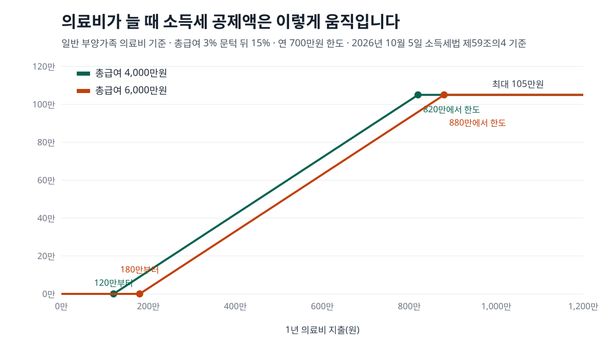
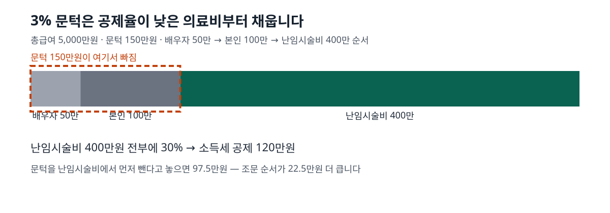

<!-- 제목: 연말정산 의료비 공제, 총급여 3% 넘은 금액의 15% -->
<!-- 디스커버 제목: 총급여 4천만원에 의료비 300만원이면 연말정산에서 27만원이 빠지는 계산 -->
<!-- 게시일: 2026-10-09 -->
# 연말정산 의료비 공제, 총급여 3% 넘은 금액의 15%

연말정산 의료비 공제는 1년 의료비 가운데 총급여의 3%를 넘는 금액에 15%를 곱해 소득세에서 뺍니다. 총급여 4천만원인 근로자가 300만원을 냈다면 27만원, 지방소득세까지 합치면 297,000원입니다(2026년 10월 5일 소득세법 제59조의4 원문 기준).

연 700만원 한도는 본인과 6세 이하·65세 이상·장애인 가족을 뺀 「일반 부양가족」 의료비에만 붙습니다. 미숙아·선천성이상아 의료비는 20%, 난임시술비는 30%로 공제율이 올라갑니다. 아래에 총급여와 의료비를 넣어 직접 계산한 표, 3% 문턱이 빠지는 순서, 간소화 자료에 잡히지 않는 항목의 서류를 조문 순서대로 정리했습니다.

[[목차]]

## 연말정산 의료비 공제는 얼마나 돌려받나요
계산은 한 줄로 줄어듭니다. **(1년 의료비 − 총급여 × 3%) × 15% = 소득세 공제액**입니다. 총급여는 연봉에서 비과세 소득을 뺀 근로소득이고, 3%에 못 미치는 의료비는 공제액이 0원입니다. 근거는 [소득세법 제59조의4](https://www.law.go.kr/법령/소득세법/제59조의4) 제2항 제1호의 「총급여액에 100분의 3을 곱하여 계산한 금액을 초과하는 금액」입니다.

표: 총급여·의료비별 공제액 직접 계산(실손보험금 없음, 산출세액이 공제액보다 큰 경우)
| 총급여 | 1년 의료비 | 3% 문턱 | 공제 대상 | 소득세 공제(15%) | 지방소득세 포함 |
|---|---|---|---|---|---|
| 4,000만원 | 300만원 | 120만원 | 180만원 | 270,000원 | 297,000원 |
| 4,000만원 | 500만원 | 120만원 | 380만원 | 570,000원 | 627,000원 |
| 6,000만원 | 300만원 | 180만원 | 120만원 | 180,000원 | 198,000원 |
| 6,000만원 | 500만원 | 180만원 | 320만원 | 480,000원 | 528,000원 |

같은 300만원을 써도 총급여가 6천만원이면 문턱이 180만원으로 올라가서 공제액이 18만원으로 줄어듭니다. 한 달로 나눠 보면 총급여 4천만원·의료비 300만원은 약 2.5만원, 6천만원·300만원은 약 1.6만원이 세금에서 덜 나가는 셈입니다.

「지방소득세 포함」 칸은 근로소득에서 떼는 개인지방소득세가 원천징수 소득세의 100분의 10이라서([지방세법 제103조의13](https://www.law.go.kr/법령/지방세법/제103조의13) 제1항) 소득세가 줄어든 만큼의 10%가 함께 줄어드는 것을 더한 값입니다. 다만 의료비·보험료·교육비 세액공제와 월세 세액공제를 합친 금액이 근로소득 산출세액보다 크면, 넘는 부분은 없는 것으로 봅니다([소득세법 제61조](https://www.law.go.kr/법령/소득세법/제61조) 제1항). 내야 할 세금이 원래 적은 사람은 표의 금액보다 덜 돌아올 수 있다는 뜻입니다.

## 의료비 공제 대상과 공제율은 누구 의료비냐에 따라 어떻게 달라지나요
대상은 근로자가 기본공제대상자를 위해 직접 낸 의료비이고, 이때 기본공제대상자는 나이와 소득 제한을 받지 않습니다. 소득이 있어 기본공제에서 빠지는 배우자나 부모라도 근로자가 낸 병원비는 넣을 수 있다는 뜻입니다. 공제율과 한도는 누구의 의료비냐로 갈립니다.

표: 의료비 구분별 공제율과 한도(2026년 10월 5일 현행 조문)
| 누구의 의료비 | 공제율 | 한도 |
|---|---|---|
| 아래 칸에 들지 않는 기본공제대상자(예: 12월 31일 현재 64세 이하 배우자, 1월 1일 현재 7세 이상 자녀) | 15% | 연 700만원 |
| 근로자 본인, 1월 1일 현재 6세 이하, 12월 31일 현재 65세 이상, 장애인, 중증·희귀난치성질환자, 결핵환자 | 15% | 없음 |
| 미숙아·선천성이상아 | 20% | 없음 |
| 난임시술비(관련 처방 약값 포함) | 30% | 없음 |
| 안경·콘택트렌즈(위 구분 안에서) | 그 사람의 공제율 | 1명당 연 50만원 |
| 산후조리원(위 구분 안에서) | 그 사람의 공제율 | 출산 1회당 200만원 |

나이 기준일이 둘인 점이 눈에 띕니다. 6세 이하는 과세기간 개시일(1월 1일) 현재, 65세 이상은 과세기간 종료일(12월 31일) 현재로 셉니다. 중증질환자·희귀난치성질환자의 범위는 [소득세법 시행령 제118조의5](https://www.law.go.kr/법령/소득세법시행령/제118조의5) 제4항이 국민건강보험법 시행령 별표 2의 요양급여 대상 가운데 재정경제부령으로 정한 사람으로 넘겨 두었고, 이 항은 2025년 12월 30일에 고쳐졌습니다.

## 700만원 한도는 의료비가 얼마일 때 걸리나요
한도는 3% 문턱을 뺀 「공제 대상 금액」에 걸립니다. 그래서 일반 부양가족 의료비가 한도에 닿는 지출은 총급여의 3%에 700만원을 더한 금액이고, 그때 소득세 공제는 105만원에서 멈춥니다.

표: 총급여별 공제가 시작되는 의료비와 연 700만원 한도에 닿는 의료비
| 총급여 | 이 금액을 넘어야 공제 시작 | 한 달 평균으로 보면 | 일반 부양가족 의료비가 한도에 닿는 지출 |
|---|---|---|---|
| 3,000만원 | 90만원 | 7.5만원 | 790만원 |
| 4,000만원 | 120만원 | 10만원 | 820만원 |
| 5,000만원 | 150만원 | 12.5만원 | 850만원 |
| 6,000만원 | 180만원 | 15만원 | 880만원 |
| 8,000만원 | 240만원 | 20만원 | 940만원 |
| 1억원 | 300만원 | 25만원 | 1,000만원 |

본인이나 65세 이상 부모처럼 한도가 없는 사람의 의료비가 섞이면 결과가 달라집니다. 총급여 6천만원인 근로자가 배우자 의료비 1,000만원과 70세 부모 의료비 300만원을 냈다고 놓아 보겠습니다. 문턱 180만원은 배우자 몫에서 빠지고, 남은 820만원 가운데 700만원만 대상이 되어 120만원은 잘립니다. 부모 몫 300만원은 한도 없이 전부 들어가서 소득세 공제는 150만원, 지방소득세까지 165만원입니다.

## 3% 문턱은 어느 의료비에서 먼저 빠지나요
조문 순서대로 빠집니다. 제1호(일반 부양가족)에서 먼저 빼고, 모자라면 제2호(본인·65세 이상 등), 그다음 제3호(미숙아·선천성이상아), 마지막으로 제4호(난임시술비)에서 뺍니다. 각 호의 단서가 「앞 호의 의료비가 3%에 미달하면 그 미달 금액을 뺀다」고 적어 두었기 때문입니다. 공제율이 낮은 의료비가 문턱을 먼저 채우므로, 공제율 30%인 난임시술비는 최대한 남게 됩니다.

표: 총급여 5,000만원, 3% 문턱 150만원이 빠지는 순서(법 조문 순서)
| 구분 | 지출 | 문턱에서 빠진 금액 | 공제 대상 | 공제액 |
|---|---|---|---|---|
| 배우자(일반) | 50만원 | 50만원 | 0원 | 0원 |
| 본인 | 100만원 | 100만원 | 0원 | 0원 |
| 난임시술비 | 400만원 | 0원 | 400만원 | 1,200,000원 |
| 합계 | 550만원 | 150만원 | - | 1,200,000원 |

문턱을 난임시술비에서 먼저 뺀다고 잘못 놓으면 공제액이 975,000원으로 나와 조문대로 계산한 값보다 225,000원 적습니다. 지방소득세까지 넣으면 조문대로 계산한 금액은 132만원입니다.

위 표와 그림의 숫자를 어떻게 맞췄는지도 적어 둡니다. 10월 5일에 소득세법 제59조의4·제61조, 시행령 제113조·제118조의5·제216조의3, 시행규칙 제58조를 법령 사이트에서 조문 하나씩 열어 공제율·한도·순서 문구를 받아 적었고, 그 문구를 파이썬 함수로 바꿔 예시 금액을 넣고 돌린 출력이 이 글의 표입니다. 공제가 안 되는 비용 목록은 같은 날 국세청 원천세 안내의 [특별세액공제 화면](https://www.nts.go.kr/nts/cm/cntnts/cntntsView.do?mi=6595&cntntsId=7874)에서 옮겼습니다.

## 안경·콘택트렌즈·산후조리원은 얼마까지 들어가나요
시행령 제118조의5 제1항이 의료비의 범위를 호별로 적어 두었습니다. 병원 진료비와 처방 약값 말고도 다음이 들어갑니다.

- 시력보정용 안경·콘택트렌즈: 1명당 연 50만원까지(나이·소득 제한 없음)
- 산후조리원 비용: 출산 1회당 200만원까지. 현행 조문에는 총급여 조건이 없습니다
- 보청기 구입비, 장애인 보장구, 의사 처방에 따라 사거나 빌린 의료기기
- 노인장기요양보험 장기요양급여와 장애인 활동지원급여 가운데 실제로 낸 본인부담금

반대로 미용·성형수술 비용과 건강증진용 의약품 구입비는 같은 조 제2항이 빼 두었습니다. 안경 50만원과 산후조리원 200만원은 공제율이 아니라 「의료비에 넣는 금액」의 상한이라서, 그 금액도 3% 문턱 계산에 함께 들어갑니다.

## 실손보험금을 받은 의료비도 공제되나요
받은 실손의료보험금만큼은 빠집니다. 시행령 제118조의5 제1항 괄호가 보험회사 등에서 받은 실손의료보험금을 의료비에서 제외하고, 국세청 안내는 여기에 국민건강보험공단의 본인부담금상한제 사후환급금, 외국 의료기관에 낸 비용, 간병인에게 준 비용을 더해 공제되지 않는 비용으로 적어 두었습니다.

총급여 4천만원인 근로자가 의료비 300만원을 내고 실손보험금 100만원을 받았다면, 계산에 넣는 의료비는 200만원입니다. 문턱 120만원을 빼면 공제 대상이 80만원이라 소득세 공제는 12만원, 지방소득세까지 132,000원입니다. 보험회사·공제회·우정사업본부는 실손보험금 지급 자료를 국세청에 내는 곳으로 [시행령 제216조의3](https://www.law.go.kr/법령/소득세법시행령/제216조의3) 제7항에 들어 있습니다.

## 간소화 자료에 안 뜨는 의료비는 어떻게 증빙하나요
먼저 왜 안 뜨는지부터 보면, 시행령 제216조의3 제1항 제3호 단서가 안경·콘택트렌즈 구입비와 보청기 구입비를 간소화 자료 제출 대상 의료비에서 빼 두었습니다. 이 두 가지는 제출 대상 목록 밖이라 간소화 화면에 없을 수 있고, 그때는 종이 영수증으로 냅니다.

[소득세법 시행규칙 제58조](https://www.law.go.kr/법령/소득세법시행규칙/제58조) 제1항 제2호가 정한 서류는 의료비지급명세서 한 장에 아래 영수증을 붙이는 방식입니다.

- 병원·약국: 진료비 계산서·영수증, 진료비(약제비) 납입확인서, 또는 국민건강보험공단 이사장이 발행하는 의료비부담명세서
- 안경·콘택트렌즈: 사용자 성명과 시력교정용임을 안경사가 확인한 영수증
- 보청기·장애인 보장구: 사용자 성명을 판매자가 확인한 영수증
- 의료기기: 의사·치과의사·한의사의 처방전과 의료기기명이 적힌 영수증
- 산후조리원: 사용자 성명을 산후조리원이 확인한 영수증
- 미숙아·선천성이상아, 난임시술: 진단서 또는 증명서와 위 영수증 가운데 해당하는 것

내는 곳은 회사이고, 기한은 다음 해 2월분 급여를 받는 날입니다. 해 중간에 퇴사했다면 퇴직한 달 급여를 받는 날이 기한입니다([시행령 제113조](https://www.law.go.kr/법령/소득세법시행령/제113조) 제1항 제1호). 이때 공제 대상은 국세청 안내대로 근로를 제공한 기간에 낸 의료비만입니다. 퇴사 뒤 실업급여 금액이 궁금하다면 [구직급여 상한액 계산 글](/33)에 평균임금 60%가 어디서 잘리는지 계산해 두었습니다.

2월 정산에서 빠뜨렸다면 다음 해 5월 1일부터 31일까지 종합소득 확정신고([소득세법 제70조](https://www.law.go.kr/법령/소득세법/제70조))로 넣을 수 있고, 그 기간도 지났다면 연말정산 세액 납부기한이 지난 뒤 5년 안에 경정청구를 할 수 있습니다([국세기본법 제45조의2](https://www.law.go.kr/법령/국세기본법/제45조의2) 제5항). 의료비처럼 1년 지출로 세금을 줄이는 다른 항목으로는 연금저축 납입액이 있으며, 그 공제율과 한도는 [연금저축 세액공제 계산 글](/18)에 정리해 두었습니다.

이 글은 기준일의 공개 원문을 정리한 일반 정보이며, 개인의 사정에 따라 결과가 달라질 수 있습니다.

[[저자 박스]]

[집필 메모]
- 더한 것 ③: 안경·콘택트렌즈·보청기 구입비는 소득세법 시행령 제216조의3 제1항 제3호 단서로 간소화 자료 제출 대상 의료비에서 빠져 있어 간소화 화면에 없을 수 있다(h2 「간소화 자료에 안 뜨는 의료비는 어떻게 증빙하나요」 절). 함께: 3% 문턱이 제1호→제4호 순서로 빠져 난임시술비가 최대한 30%로 남는 계산(총급여 5천만원 예시 120만원 대 잘못 놓은 순서 97.5만원).
- 못 연 원문: 없음(법령 사이트 첫 시도 연결 끊김 2회 — curl 1회·시행령 제216조의3 1회 — 재시도로 열림).
- 뺀 숫자: 표준세액공제 13만원과의 비교는 건강보험료 특별소득공제와의 관계를 원문에서 확정하지 못해 넣지 않음. 간소화 서비스 개통일은 원문을 열지 않아 쓰지 않음.
- 설계도와 달라진 점: 제목 「연말정산 의료비 공제, 총급여 3% 초과분 계산」 → 「연말정산 의료비 공제, 총급여 3% 넘은 금액의 15%」(답 단서를 공제율로). 시행규칙 제58조와 시행령 제216조의3·제113조를 더 열었다. 산후조리원 조문에 총급여 조건이 없음을 현행 시행령에서 확인.
- 소득세법 본문 화면에 「시행예정법령」 표시가 있다(현행 2026. 1. 1. 시행판 기준으로 씀). 시행예정판의 제59조의4 내용은 열지 않았다.
- 라이브 글 링크: /33(퇴사자 다음 질문)·/18(같은 연말정산 세액공제). 같은 묶음 편 없음.
- 자기 검사: calc.py 종료 0 · 변환 종료 0 · calc_check 종료 0(법령 「확인 못 함」 0 · 원문 있음 16 · 확인 못 함 26 = 전부 「계산」 줄) · gate_search 치명 0·경고 1(기준일 문구 1회) · overlap21 겹침 0(1차에 확인 과정 단락이 월세공제·퇴직소득세 대기 글과 24자 겹쳐 문장을 바꿈).
- gate_frame(사장 단계)은 원장 줄44 가제 「연말정산 의료비 공제, 총급여 3% 초과분 계산」과 쌍둥이로 잡힘 — 원장 줄에 작업폴더가 아직 없어 자기 줄을 못 거른 것으로 보임(같은 편).
- 그림: matplotlib 없음 → draw.py(표준 라이브러리)로 SVG 2장(01_대표 1,200×675, 02_순서 1,200×420), 숫자는 calc.py 함수에서 가져옴.
- 자료집 세금연금.md에 원문 6줄 + 계산 함수 1줄 더함.
