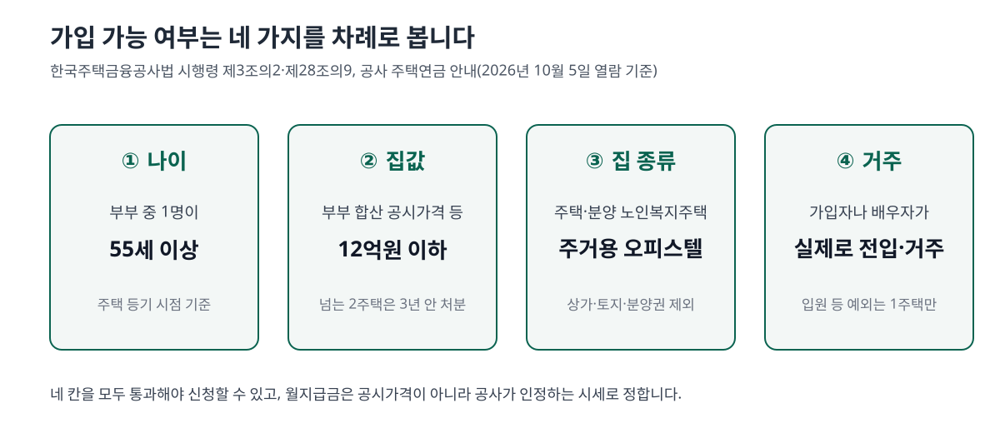
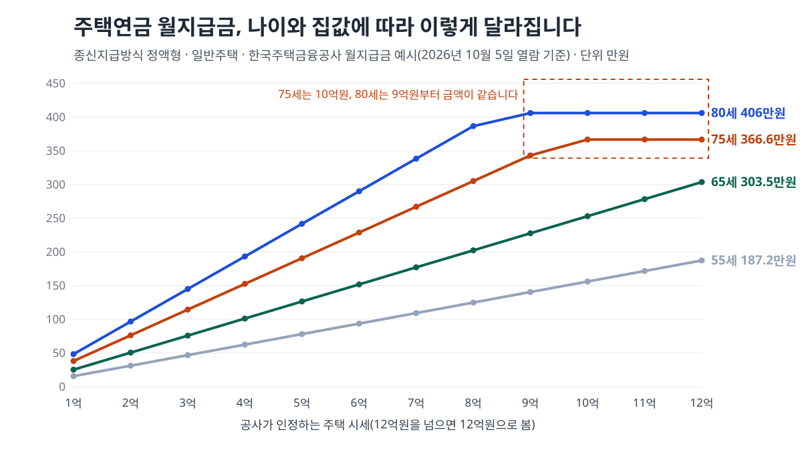

<!-- 제목: 주택연금 가입조건, 55세·공시가격 12억원과 월지급금 -->
<!-- 디스커버 제목: 부부 중 한 명 55세, 공시가격 12억원 이하면 주택연금 가입 — 시세 15억 집도 12억으로 계산되는 이유 -->
<!-- 게시일: 2026-10-09 -->
# 주택연금 가입조건, 55세·공시가격 12억원과 월지급금

부부 중 한 명이 55세 이상이고 부부가 가진 집의 공시가격 합계가 12억원 이하이면 주택연금에 들 수 있습니다. 70세가 시세 3억원 집으로 들면 매달 92.3만원을 평생 받습니다(2026년 10월 5일 한국주택금융공사 원문 기준).

나이는 부부 가운데 젊은 쪽을 기준으로 하고, 가입 가능 여부는 공시가격으로, 받는 돈은 공사가 인정하는 시세로 따로 정합니다. 이 두 가격이 가장 헷갈리는 대목이라 아래에서 네 가구에 직접 대입해 계산했습니다.

[[목차]]

## 주택연금 가입조건은 나이와 집값만 보면 되나요
네 가지를 봅니다. 집의 종류와 실제 거주도 함께 걸립니다.

나이는 [한국주택금융공사법 시행령 제3조의2](https://www.law.go.kr/법령/한국주택금융공사법시행령/제3조의2) 제2항이 55세로 정합니다. 본인이 아니어도 배우자가 55세면 되고, 나이는 처음 저당권이나 신탁을 등기하는 때로 셉니다. 부부 중 한 명은 대한민국 국민이어야 합니다.

집값 기준 12억원은 [같은 시행령 제28조의9](https://www.law.go.kr/법령/한국주택금융공사법시행령/제28조의9)에 있습니다. 2023년 10월 4일 이 조문이 새로 생기면서 지금의 12억원이 됐습니다. 여기서 가격은 공시가격 등이고, 부부가 가진 집을 모두 더한 금액입니다.

집의 종류는 주택법상 주택, 지자체에 신고된 분양형 노인복지주택, 주거용 오피스텔입니다. 상가·토지·분양권, 자녀 명의 집, 경매나 압류가 걸린 집은 들 수 없습니다. 거주는 가입자나 배우자가 그 집에 전입해 실제로 살고 있어야 하고, 입원·요양시설 입소처럼 공사가 인정하는 사유가 있으면 예외가 되지만 부부 합산 1주택일 때만입니다.

소득은 없어도 되고 신용대출 유무도 따지지 않지만, 신용관리정보가 있으면 가입이 막힙니다(한국주택금융공사 [주택연금이란](https://www.hf.go.kr/ko/sub03/sub03_01_01_01.do) 화면과 자주하는 질문).

## 공시가격 12억원을 넘는 집이나 2주택자도 가입할 수 있나요
두 경우로 나뉩니다. 집이 두 채 이상이어도 공시가격 합계가 12억원 이하이면 들 수 있습니다. 합계가 12억원을 넘는 2주택자는 3년 안에 한 채를 처분하는 조건을 붙이면 가입할 수 있고, 첫 연금 지급일부터 3년 안에 팔지 않으면 지급이 멈춥니다([자세히 알아보기](https://www.hf.go.kr/ko/sub03/sub03_01_01_06.do) 화면의 지급정지 사유).

한 채짜리 집이 공시가격 12억원을 넘으면 가입 대상이 아닙니다. 반대로 공시가격은 12억원 이하인데 시세가 그보다 높은 집은 들 수 있습니다. 이때 월지급금은 시세를 그대로 쓰지 않고 12억원으로 봅니다. [한국주택금융공사법 제43조의11](https://www.law.go.kr/법령/한국주택금융공사법/제43조의11) 제2항이 소득세법의 고가주택 기준가액을 담보주택 가격으로 보도록 했고, 공사 안내도 평가 가격이 시가 12억원을 넘으면 12억원으로 본다고 적고 있습니다.

## 주택연금 월지급금은 나이별로 얼마인가요
2026년 10월 5일 열람한 공사 [월지급금 예시](https://www.hf.go.kr/ko/sub03/sub03_01_01_02.do) 화면 기준으로, 일반주택 표에서 다섯 가격대를 골라 만원 단위로 옮겼습니다. 나이가 많을수록, 집값이 높을수록 많아집니다.

표: 부부 중 젊은 사람 나이·주택 시세별 월지급금(종신지급방식 정액형, 일반주택)
| 나이 | 3억원 | 5억원 | 7억원 | 9억원 | 12억원 |
|---|---|---|---|---|---|
| 55세 | 46.8만원 | 78만원 | 109.2만원 | 140.4만원 | 187.2만원 |
| 60세 | 63.2만원 | 105.3만원 | 147.5만원 | 189.6만원 | 252.8만원 |
| 65세 | 75.8만원 | 126.4만원 | 177만원 | 227.6만원 | 303.5만원 |
| 70세 | 92.3만원 | 153.9만원 | 215.5만원 | 277만원 | 341.4만원 |
| 75세 | 114.3만원 | 190.6만원 | 266.9만원 | 343.1만원 | 366.6만원 |
| 80세 | 144.9만원 | 241.6만원 | 338.2만원 | 406만원 | 406만원 |

시세 5억원 집이라면 55세에 들면 78만원, 5년 늦춘 60세에 들면 105.3만원으로 한 달에 27.3만원 차이가 납니다. 노인복지주택과 주거용 오피스텔은 같은 나이·가격이라도 이 표보다 적고, 공사는 표를 따로 둡니다.

## 우리 집에 대입하면 가입이 되고 얼마를 받나요
네 가구를 가정해 공시가격으로 가입 여부를, 시세로 월지급금을 따로 계산했습니다. 공시가격은 예시로 정한 숫자입니다.

표: 네 가구에 대입한 가입 가능 여부와 받는 돈(정액형, 이자·보증료 제외 단순 합계)
| 가구 | 가입 | 산정 가격 | 월지급금 | 1년 합계 | 10년 합계 |
|---|---|---|---|---|---|
| A: 65세 · 시세 5억원 · 공시가격 3.5억원 | 됨 | 5억원 | 126.4만원 | 1,516.8만원 | 1억 5,168만원 |
| B: 70세 · 시세 3억원 · 공시가격 2.1억원 | 됨 | 3억원 | 92.3만원 | 1,107.6만원 | 1억 1,076만원 |
| C: 75세 · 시세 15억원 · 공시가격 10.5억원 | 됨 | 12억원 | 366.6만원 | 4,399.2만원 | 4억 3,992만원 |
| D: 62세 · 1주택 시세 18억원 · 공시가격 13억원 | 안 됨(공시가격 12억원 초과) | - | - | - | - |

C 가구는 시세가 15억원이어도 12억원 칸으로 계산하고, D 가구는 공시가격에서 막힙니다. 합계는 받은 돈을 단순히 더한 것이고, 이 돈은 연금이 아니라 대출이라 지급액·보증료·이자가 쌓여 대출잔액이 됩니다. 정액형은 가입 뒤 집값이 바뀌어도 같은 금액을 받는다는 것이 공사 안내입니다.

## 집값이 높으면 월지급금도 계속 늘어나나요
나이가 높을수록 일정 가격에서 멈춥니다. 공사 표의 8억원 이상 칸을 나란히 놓으면 보입니다.

표: 시세가 올라도 월지급금이 더 늘지 않는 칸(종신지급방식 정액형, 일반주택)
| 나이 | 8억원 | 9억원 | 10억원 | 11억원 | 12억원 |
|---|---|---|---|---|---|
| 70세 | 246.2만원 | 277만원 | 307.8만원 | 338.6만원 | 341.4만원 |
| 75세 | 305만원 | 343.1만원 | 366.6만원 | 366.6만원 | 366.6만원 |
| 80세 | 386.5만원 | 406만원 | 406만원 | 406만원 | 406만원 |

75세는 10억원부터, 80세는 9억원부터 금액이 같습니다. 70세도 11억원에서 12억원으로 갈 때는 2.8만원만 늘어, 75세의 9억원에서 10억원 구간(23.5만원)보다 훨씬 작습니다. 같은 화면에서 내려받은 일람표 엑셀의 최대 인출한도 칸도 이 구간에서 비슷한 금액에 머뭅니다. 나이가 많고 집이 비쌀수록 12억원 기준보다 먼저 이 천장에 닿는다는 뜻이라, 80세 독자에게는 9억원 집과 12억원 집의 월지급금이 같습니다.

## 종신지급과 확정기간 방식은 무엇이 다른가요
받는 기간이 다릅니다. 종신지급방식은 부부가 모두 세상을 떠날 때까지 매달 받습니다. 확정기간혼합방식은 10년·15년·20년·25년·30년 가운데 고른 기간 동안만 매달 받고, 그 집에는 기간이 끝난 뒤에도 평생 살 수 있습니다. 확정기간을 고르면 대출한도의 5%를 의무로 떼어 두고, 연금이 끝난 뒤 관리비·의료비에만 씁니다. 확정기간 금액은 위 표에 없고, 공사 예상연금조회 화면에서 나이·가격을 넣어야 나옵니다.

종신 쪽은 다시 매달 같은 정액형, 초기에 더 받고 줄어드는 초기증액형, 일정 주기로 늘어나는 정기증가형으로 나뉩니다. 대출한도의 50% 안에서 수시로 찾아 쓰고 나머지를 매달 받는 종신혼합방식도 있고, 집에 담보대출이 있으면 한도의 90%까지 찾아 그 대출을 갚는 대출상환방식이 있습니다. 부부 중 한 명이 기초연금을 받고 2억5천만원 미만 1주택이면 우대형으로 일반형보다 최대 약 20%(1억8천만원 미만 집은 약 25%)를 더 받습니다.

가입자가 먼저 세상을 떠나면 처음부터 혼인 관계였던 배우자가 6개월 안에 채무를 넘겨받아 이어 받습니다. 부부가 모두 떠난 뒤 집을 팔아 갚을 때 대출금이 집값을 넘어도 상속인에게 모자란 돈을 청구하지 않고, 남으면 상속됩니다. 기초생활수급자는 월지급금의 50%가 소득으로 잡혀 수급액이 줄 수 있고, 공무원연금 같은 공적연금은 그대로 받습니다.

## 가입할 때 드는 돈과 중도에 해지하면 무는 비용은
초기보증료는 주택가격의 1.0%로 5억원 집이면 500만원, 연보증료는 보증잔액의 연 0.95%입니다. 둘 다 현금으로 내지 않고 대출잔액에 더해집니다. 대출금리는 COFIX(신규취급액 기준)에 0.85%를 더하고 6개월마다 바뀌며, 이자도 잔액에 붙습니다. 가입 때 직접 내는 돈은 등기 비용과 세금, 인지세 7만5천원, 인터넷 시세가 없는 집의 감정평가수수료(공사 예시 83만3,800원) 정도입니다.

중도 해지는 그때까지의 대출잔액(받은 돈+보증료+이자)을 모두 갚으면 됩니다. 연보증료는 남은 기간만큼 돌려주지만 초기보증료는 돌려주지 않는 것이 원칙입니다. 예외는 첫 연금일부터 30일 안 철회(전액)와 5년 안 해지(이용기간 비례 차감)입니다. 해지한 뒤에는 3년 동안 같은 집으로 다시 들 수 없습니다.

표: 시세 5억원 주택 초기보증료 500만원을 낸 뒤 대출금을 모두 갚고 해지할 때 환급(월 단위 비례 가정)
| 해지 시점(최초 연금 실행일부터) | 돌려받는 초기보증료 | 못 돌려받는 몫 |
|---|---|---|
| 30일 안 보증약정 철회 | 500만원(전액) | 0원 |
| 1년 | 400만원 | 100만원 |
| 2년 | 300만원 | 200만원 |
| 3년 | 200만원 | 300만원 |
| 4년 | 100만원 | 400만원 |
| 5년 | 0원 | 500만원 |

공사 안내는 「이용기간에 비례한 액수를 차감」한다고만 적고 있어, 이 표는 60개월로 나눈 월 단위 비례를 가정한 계산입니다. 실제 환급액은 관할지사가 정산합니다. 대신 가입 중에는 1가구 1주택이면 재산세 본세의 25%(5억원 해당분까지)가 줄고, 대출이자는 연 200만원 한도로 연금소득에서 공제됩니다([자주하는 질문](https://www.hf.go.kr/ko/sub03/sub03_02_05_04.do)).

## 신청은 어디서 하고 언제부터 받나요
집 소재지를 맡는 공사 관할지사를 찾아가 상담 뒤 신청하거나, 인터넷으로 상담을 먼저 신청할 수 있습니다. 공사 심사(1주택 여부·주택 평가·현장조사), 보증약정과 1순위 근저당권 또는 신탁 등기, 보증서 발급, 은행 대출약정의 네 단계를 거치고, 표준처리기간은 1개월, 보통 2~3주가 걸립니다. 서류는 주민등록등본 2부와 전입세대 열람표, 인감증명서 2부, 가족관계증명서, 등기권리증 원본입니다(신탁방식은 지방세 납세증명서 추가).

55세 전후는 국민연금을 받기 전 소득이 비는 시기이기도 해서, 그 공백을 국민연금 쪽에서 메우는 길은 [국민연금 조기수령 감액률을 계산한 글](/20)에 정리했습니다. 집이 가계 자산에서 차지하는 몫을 다른 가구와 견줘 보고 싶다면 [순자산으로 본 우리 집 위치](/32)가 같은 통계로 답합니다.

## 이 글의 숫자는 어느 화면에서 언제 옮겼나요
2026년 10월 5일 한국주택금융공사 누리집에서 주택연금이란·월지급금 예시·자세히 알아보기·자주하는 질문(50건 전체 목록) 화면을 열어 조건과 금액을 옮겼습니다. 월지급금 예시 화면의 표 머리는 「2026.03.01. 기준」이고, 같은 화면에서 내려받은 일람표 엑셀은 「2026. 6. 1. 신청접수분부터 적용」으로 적혀 있어 두 자료의 일반주택 72칸을 계산 스크립트로 맞대 보니 모두 같았습니다. 공사는 [한국주택금융공사법 제9조](https://www.law.go.kr/법령/한국주택금융공사법/제9조) 제5항에 따라 주택가격상승률 등을 해마다 한 번 이상 다시 계산해 새 가입자의 금액에 반영하므로, 가입 시점의 표가 바뀔 수 있습니다. 나이 55세와 가격 12억원, 고가주택 특례는 국가법령정보센터에서 시행령(2026년 10월 1일 시행판)과 법(2026년 1월 2일 시행판) 조문 본문을 열어 확인했습니다.

이 글은 기준일의 공개 원문을 정리한 일반 정보이며, 개인의 사정에 따라 결과가 달라질 수 있습니다.

[[저자 박스]]

[집필 메모]
- 더한 것 ③: 공사 월지급금 표(종신·정액형·일반주택)에서 나이가 많으면 12억원보다 낮은 가격에서 월지급금이 멈춘다 — 75세는 10억원부터 366.6만원, 80세는 9억원부터 406만원으로 같고, 70세는 11억→12억원이 2.8만원만 는다(h2 「집값이 높으면 월지급금도 계속 늘어나나요」 절). 보조: 화면 표(「2026.03.01. 기준」)와 일람표 엑셀(「2026. 6. 1. 신청접수분부터」) 72칸 일치 확인, 공시가격(가입)·시세(금액) 이중 기준을 네 가구에 대입.
- 설계도와 달라진 점: 제목에 답 단서(55세·공시가격 12억원)를 넣어 「주택연금 가입조건, 55세·공시가격 12억원과 월지급금」으로 바꿨다. 확정기간 방식 월지급금은 공사 공개 표에 없어 숫자를 쓰지 않았다(예상연금조회는 입력 화면).
- 못 연 원문: 공사 「법규에 의한 공고사항」(sub03_01_01_04)·「제출서류 및 신청절차 안내」(sub03_02_05_01) — curl 연결 끊김(reset), 쓰지 않음. 서류는 자주하는 질문 「신청시 준비서류」로 썼다. 법령 전문 화면(lsInfoP)은 스크립트 화면이라 lsInfoR(POST)로 조문 목록을 읽고, 숫자는 조문 본문 주소로 대조한다.
- 뺀 숫자: 등록면허세 금액 예시(공사 예시가 2025년 6월 기준이고 저당권 설정금액 선택에 따라 크게 달라져 뺐다), COFIX 현재 금리(이 편에서 열지 않음), 초기보증료 환급의 정확한 계산식(원문은 「비례 차감」 문구뿐 — 표는 월 단위 비례 가정으로 명시).
- 대출한도 상한: 시행령 제12조의2 「5억원」은 법 제9조③2(주택저당채권 양수기준)용이라 주택연금 한도로 쓰지 않았다. 월지급금이 멈추는 이유(대출한도 상한)는 원문 문장이 없어 「천장에 닿는다」는 관찰로만 썼다.
- 자기 검사: calc.py 종료 0 · 변환 종료 0 · calc_check 종료 0(수치대장 98줄 · 원문 있음 76 · 원문에 없음 0 · 확인 못 함 22 = 모두 계산 줄, 법령 「확인 못 함」 0) · gate_search 치명 0·경고 1(본문 4,492자 참고) · overlap21 겹침 0(원고·HTML) · gate_frame 통과. 1차 게이트에서 본문 화살표 3개(신청 단계)가 치명이라 「네 단계」 문장으로 바꿨다.
- 자료집에 더한 줄: 원문 10줄 · 계산 함수 1줄.
- 그림: matplotlib 없음 → 표준 라이브러리 SVG 2장(draw.py, 숫자는 calc.py에서 가져옴).
