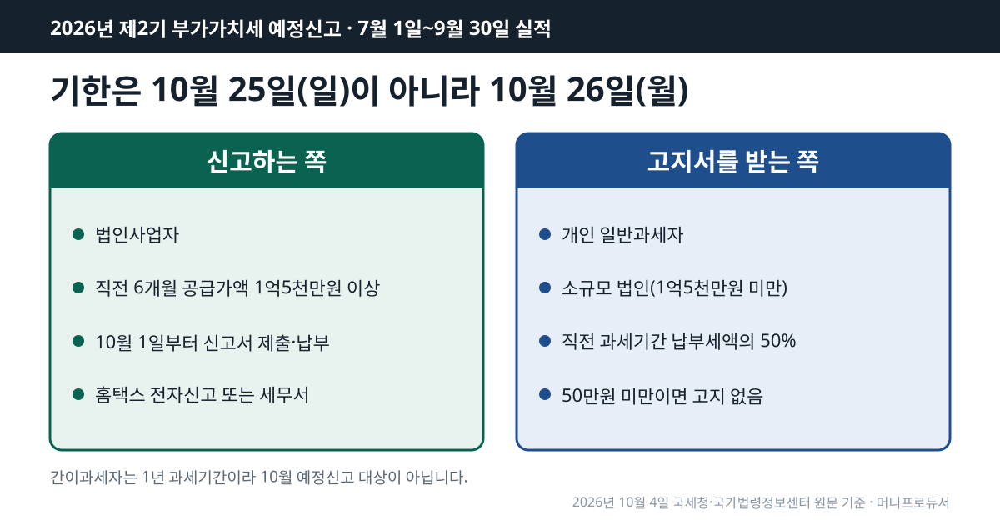
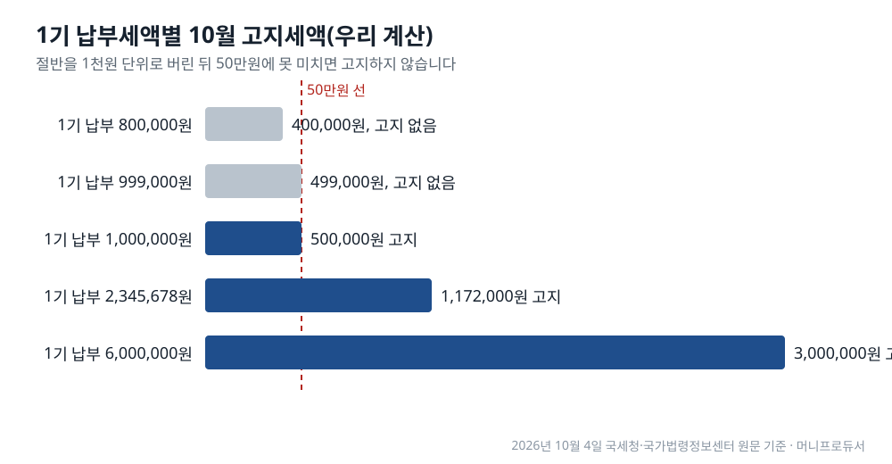

<!-- 제목: 부가세 예정신고 기간, 10월 26일까지 대상자와 제외 대상 -->
<!-- 디스커버 제목: 부가세 예정신고, 올해는 25일이 일요일이라 10월 26일 월요일이 마감입니다 -->
<!-- 게시일: 2026-10-10 -->
# 부가세 예정신고 기간, 10월 26일까지 대상자와 제외 대상

2026년 제2기 부가가치세 예정신고·납부 기한은 10월 26일(월)입니다. 신고서를 내는 쪽은 법인사업자이고, 개인 일반과세자는 1기 납부세액의 절반을 고지서로 냅니다. 이 글은 부가세 신고 일정과 조문을 국세청 세무일정·국가법령정보센터에서 2026년 10월 4일 원문 기준으로 읽었습니다.

법 조문만 보면 기한은 「예정신고기간이 끝난 후 25일 이내」, 곧 10월 25일입니다. 그런데 이날이 일요일이라 국세기본법의 기한 특례에 따라 다음 날로 넘어갑니다. 국세청 [2026년 10월 세무일정](https://www.nts.go.kr/nts/ad/taxSchdul/selectList.do?taxYear=2026&taxMonth=10&mi=135747)도 26일 칸에 「2026.2기 부가가치세 예정신고 납부」를 적어 두었습니다.

[[목차]]

## 부가세 예정신고 기간은 언제부터 언제까지인가요

이번에 신고하는 실적은 7월 1일부터 9월 30일까지 석 달 치입니다. [부가가치세법 제48조](https://www.law.go.kr/법령/부가가치세법/제48조) 제1항은 제2기 예정신고기간을 7월 1일~9월 30일로 정하고, 그 기간이 끝난 뒤 25일 이내에 신고하라고 적었습니다. 국세청 [부가가치세 신고납부기한](https://www.nts.go.kr/nts/cm/cntnts/cntntsView.do?mi=2273&cntntsId=7694) 안내의 표에는 신고납부기간이 10.1.~10.25.로 나옵니다.

여기서 25일이 일요일입니다. 국세청 세무일정 화면에는 기한일이 토요일·공휴일·근로자의 날이면 다음 날이 기한이라는 국세기본법 제5조 설명이 붙어 있고, 같은 달 표의 26일 칸에 부가세 예정신고가 들어 있습니다. 그래서 올해 실제 마감은 10월 26일 월요일입니다.

신규 사업자는 시작점이 다릅니다. 같은 조 제1항 단서에 따라 첫 예정신고기간은 사업 개시일(개시 전에 등록을 신청했다면 신청일)부터 9월 30일까지입니다.

## 신고서를 내야 하는 사람은 누구인가요

예정신고서를 내는 쪽은 원칙적으로 법인사업자입니다. 국세청 안내에 따르면 일반적인 경우 법인은 한 해 네 번, 개인사업자는 두 번 신고합니다.

다만 법인이라도 작은 곳은 개인처럼 고지서를 받습니다. [부가가치세법 시행령 제90조](https://www.law.go.kr/법령/부가가치세법시행령/제90조) 제4항은 고지 대상 법인을 직전 과세기간 공급가액 합계가 1억5천만원 미만인 법인으로 정했습니다. 2026년 1~6월 공급가액 합계가 1억5천만원 이상인 법인이라면 10월 26일까지 신고와 납부를 같이 합니다. 신고서는 국세정보통신망, 곧 홈택스 전자신고로 내도 되고 관할 세무서에 내도 됩니다(시행령 제90조 제2항).

간이과세자는 이번 일정에 없습니다. 국세청 안내에서 간이과세자의 과세기간은 1월 1일~12월 31일 1년이고, 예정부과기간은 1.1.~6.30.이라 10월 일정과 겹치지 않습니다.

## 개인사업자는 고지서만 내면 끝나나요

개인 일반과세자에게는 신고 의무가 없습니다. 제48조 제3항에 따라 관할 세무서장이 직전 과세기간 납부세액의 50퍼센트를 결정해 고지하고, 10월 26일까지 그 금액을 냅니다. 이때 1천원 미만은 버립니다. 이렇게 낸 금액은 내년 1월 확정신고 때 이미 낸 세액으로 빠집니다.

연 매출이 아니라 「직전 과세기간 납부세액」이 기준이라는 점이 핵심입니다. 이번 10월 고지의 직전 과세기간은 2026년 1~6월, 곧 7월 확정신고로 낸 세액입니다. 2026년 10월 4일 국가법령정보센터 원문 기준으로 계산하면, 1기 납부세액이 600만원이었다면 10월 고지서에는 300만원이 찍히고, 한 달 단위로 풀면 3개월 실적에 대해 매달 100만원씩을 미리 낸 셈입니다.

표: 1기 납부세액별 10월 예정고지세액(개인 일반과세자, 우리 계산)
| 2026년 1기(1~6월) 납부세액 | 절반(50%) | 1천원 미만 버림 | 10월 고지 여부 | 고지세액 |
|---|---|---|---|---|
| 800,000원 | 400,000원 | 400,000원 | 징수 안 함 | 0원 |
| 999,000원 | 499,500원 | 499,000원 | 징수 안 함 | 0원 |
| 1,000,000원 | 500,000원 | 500,000원 | 고지 | 500,000원 |
| 2,345,678원 | 1,172,839원 | 1,172,000원 | 고지 | 1,172,000원 |
| 6,000,000원 | 3,000,000원 | 3,000,000원 | 고지 | 3,000,000원 |

위 다섯 줄은 같은 공식(절반, 1천원 미만 버림, 50만원 비교)을 한 번에 돌린 결과입니다.

## 예정고지가 안 나오는 경우는 어떤 때인가요

제48조 제3항 단서는 세 경우에 징수하지 않는다고 적었습니다.

- 징수할 금액이 50만원 미만인 경우
- 간이과세자였다가 해당 과세기간 개시일(7월 1일) 현재 일반과세자로 바뀐 경우
- 국세징수법 제13조 제1항의 사유로 세무서장이 납부할 수 없다고 인정한 경우

첫째 기준을 거꾸로 세면, 1기 납부세액이 100만원 이상이어야 10월 고지서가 나옵니다. 위 표처럼 99만9천원이면 절반이 49만9,500원이고, 1천원 미만을 버린 49만9천원이 50만원에 못 미쳐 고지되지 않습니다. 이 경우 7~9월 몫은 내년 1월 확정신고 때 한꺼번에 계산됩니다.

## 매출이 줄었으면 개인도 예정신고를 할 수 있나요

할 수 있습니다. 제48조 제4항은 휴업이나 사업 부진으로 실적이 나빠진 사업자가 예정신고와 납부를 할 수 있게 했고, 그렇게 하면 그 고지 결정은 효력을 잃습니다. 법 문언으로는 「없었던 것으로 본다」입니다. 시행령 제90조 제6항이 그 사유를 정했습니다. 7~9월 공급가액이나 납부세액이 직전 과세기간의 3분의 1에 못 미치는 경우, 그리고 조기환급을 받으려는 경우입니다.

여기서 「3분의 1」은 석 달 실적을 여섯 달 실적과 견준 비율입니다. 기간 길이가 절반이므로 월평균으로 바꾸면 문턱은 직전 월평균의 3분의 2입니다. 매출이 3분의 1로 줄어야 하는 것이 아니라, 월평균이 약 33% 넘게 줄면 이 선 아래로 내려갑니다.

표: 직전 6개월 매출별 예정신고 선택 문턱(공급가액 3분의 1 기준, 우리 계산)
| 1~6월 공급가액 | 1~6월 월평균 | 7~9월 합계 문턱(1/3) | 문턱의 월평균 |
|---|---|---|---|
| 60,000,000원 | 10,000,000원 | 20,000,000원 | 6,666,666원 |
| 120,000,000원 | 20,000,000원 | 40,000,000원 | 13,333,333원 |
| 300,000,000원 | 50,000,000원 | 100,000,000원 | 33,333,333원 |

1~6월에 1억2천만원을 판 개인사업자라면 한 달 평균 2천만원입니다. 7~9월 합계가 4천만원에 못 미치면, 곧 월평균이 약 1,333만원 아래면 예정신고를 고를 수 있는 쪽에 들어갑니다. 공급가액 대신 납부세액으로도 같은 비교가 됩니다.

## 기한을 넘기면 가산세는 얼마나 붙나요

신고 의무가 있는 법인이 예정신고를 하지 않으면 무신고가산세가 붙습니다. [국세기본법 제47조의2](https://www.law.go.kr/법령/국세기본법/제47조의2) 제1항은 신고 대상에 「예정신고」를 넣어 두었고, 국세청 [부가가치세 가산세](https://www.nts.go.kr/nts/cm/cntnts/cntntsView.do?mi=2276&cntntsId=7697) 표는 일반 무신고를 무신고납부세액의 20%, 납부지연을 하루 22/100,000으로 적었습니다(2026년 10월 4일 국세청 원문 기준).

늦게라도 내는 경우의 감면은 [국세기본법 제48조](https://www.law.go.kr/법령/국세기본법/제48조) 제2항 제3호 라목에 있습니다. 예정신고기한까지 신고하지 않았어도 확정신고기한까지 기한 후 신고를 하면 그 기간의 무신고가산세를 100분의 50 감면합니다. 아래는 이 조문을 그대로 넣은 가정 계산입니다.

표: 법인이 예정신고를 놓치고 2027년 1월 25일에 기한 후 신고·납부한 경우(가정, 우리 계산)
| 항목 | 계산 | 금액 |
|---|---|---|
| 예정신고 납부세액(가정) | - | 10,000,000원 |
| 무신고가산세 | 10,000,000원 × 20% | 2,000,000원 |
| 확정신고기한 안 기한 후 신고 감면 | 2,000,000원 × 50% | -1,000,000원 |
| 납부지연가산세 | 10,000,000원 × 90일 × 22/100,000 | 198,000원 |
| 가산세 합계 | - | 1,198,000원 |

납부지연 일수는 기한 다음 날인 10월 27일부터 납부일 전날인 1월 24일까지 90일로 셌습니다. 하루로 풀면 1천만원당 2,200원씩 쌓이는 셈입니다. 부정행위가 있으면 무신고가산세 비율이 40%로 올라가므로 이 표에는 넣지 않았습니다.

개인 일반과세자가 고지서 금액을 기한까지 내지 않은 경우에도 국세기본법 제47조의4의 납부지연가산세 대상이 됩니다. 이쪽 금액 계산은 고지서에 적힌 기한과 납부일에 따라 달라지므로 예시는 싣지 않았습니다.

## 어느 원문을 언제 열어 셌나요

2026년 10월 4일에 국세청 세무일정(2026년 10월), 부가가치세 신고납부기한, 부가가치세 가산세 안내를 열었습니다. 같은 날 국가법령정보센터에서 부가가치세법 제48조(시행 2026. 1. 2.), 부가가치세법 시행령 제90조(시행 2026. 2. 27.), 국세기본법 제47조의2·제48조(시행 2026. 10. 2.)의 조문 본문을 열어 숫자를 옮겼습니다. 10월 25일이 일요일인지는 달력으로 셌고, 26일이 기한인지는 세무일정 원문으로 다시 확인했습니다. 세 표의 숫자는 같은 공식을 한 번 더 돌려 검산했습니다.

개인사업자는 다음 해 5월 종합소득세 신고 때 연금계좌 세액공제도 함께 계산하게 되는데, 공제 한도와 돌려받는 금액은 [연금저축 세액공제 계산 글](/18)에서 소득세법 원문으로 셈해 두었습니다. 사업소득이 있는 가구가 국세청에 신청하는 다른 일정은 [근로장려금 신청 시기를 정리한 글](/8)에 정기신청 기간과 함께 나와 있습니다.

이 글은 기준일의 공개 원문을 정리한 일반 정보이며, 개인의 사정에 따라 결과가 달라질 수 있습니다.

[[저자 박스]]

[집필 메모]
- 더한 것 ③: 예정신고 선택 사유의 「직전 과세기간의 3분의 1 미달」은 3개월 실적을 6개월 실적과 견주므로, 월평균으로 바꾸면 직전 월평균의 3분의 2(약 33% 넘게 감소)가 문턱이다 (h2 「매출이 줄었으면 개인도 예정신고를 할 수 있나요」 절)
- 설계도와 달라진 점: 설계도의 「제66조(예정고지)」는 간이과세자 예정부과 조문이라 쓰지 않았다. 일반과세자 예정고지는 제48조 제3항에 있다. 기한 10월 26일·제목은 원문과 같아 그대로 둠.
- 뺀 숫자: 시행령 제90조 제5항 고지서 발부 기간(10월 1일~10일)은 표가 조문 본문 글자에 없어 뺐다. 국세기본법 제47조의4 제1항 제3호(지정납부기한 미납 100분의 3)와 시행령 제27조의4 제2항(월 1만분의 67, 2026. 2. 27. 신설)은 예정고지 미납에 어떻게 겹치는지 원문만으로 단정하기 어려워 숫자를 싣지 않았다.
- 못 연 원문: 국세기본법 제47조의2 조문 주소(curl 연결 끊김 2회) — urllib로 다시 열어 본문 주소를 얻음. 홈택스 신고 화면은 열지 않음(스크립트 화면).
