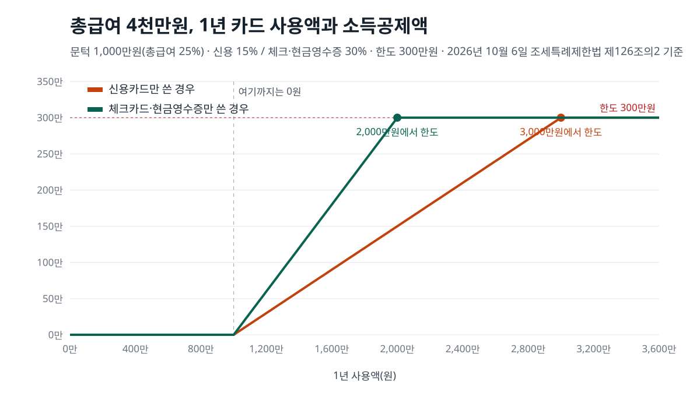
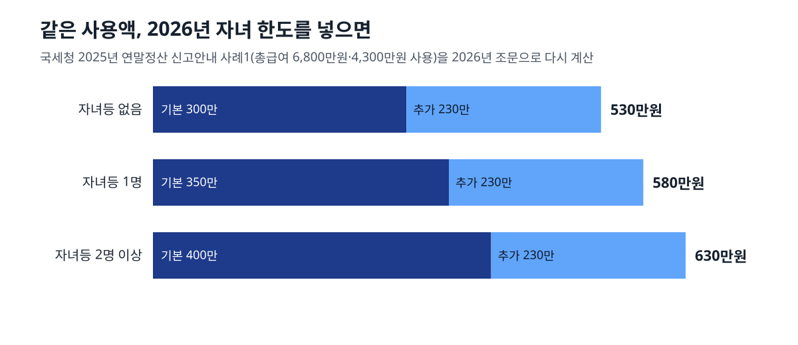

<!-- 제목: 연말정산 신용카드 공제, 총급여 25% 초과분부터 계산 -->
<!-- 디스커버 제목: 연봉 4천만원에 카드 2천만원·현금영수증 5백만원이면 소득공제 300만원 -->
<!-- 게시일: 2026-10-10 -->
# 연말정산 신용카드 공제, 총급여 25% 초과분부터 계산

총급여의 25%를 넘게 쓴 금액에만 15~40%를 곱해 근로소득금액에서 뺍니다. 한도는 총급여 7천만원 이하 300만원, 초과 250만원입니다(2026년 10월 6일 조세특례제한법 제126조의2 원문 기준).

총급여 4천만원이면 1년에 1천만원, 한 달로 약 83만원을 넘긴 뒤부터 공제가 붙습니다. 그 문턱을 넘은 돈이 신용카드면 15%, 체크카드·현금영수증이면 30%, 전통시장·대중교통이면 40%가 공제됩니다. 2026년 1월 1일 이후 쓴 돈부터는 20세 이하 자녀가 있으면 한도가 최대 400만원까지 올라갑니다.

아래 표는 모두 조문의 산식을 그대로 옮긴 파이썬 계산으로 다시 돌린 숫자입니다. 연봉 4천만원·6천만원 근로자의 실제 공제액, 신용카드와 체크카드 비율만 바꿨을 때의 차이, 국세청이 책자에 실은 사례를 2026년 한도로 다시 계산한 결과까지 차례로 보여 드립니다.

[[목차]]

## 연말정산 신용카드 공제는 얼마를 써야 시작되나요
기준선의 이름은 「최저사용금액」이고, 해당 과세연도 총급여액의 100분의 25입니다([조세특례제한법 제126조의2](https://www.law.go.kr/법령/조세특례제한법/제126조의2) 제1항). 총급여는 연봉에서 식대 같은 비과세 소득을 뺀 금액입니다. 해외에서 쓴 금액은 이 합계에 들어가지 않습니다.

표: 총급여별 최저사용금액(총급여 × 25%) — 이 금액을 넘게 쓴 부분부터 공제
| 총급여 | 최저사용금액 | 한 달로 나누면 |
|---|---|---|
| 3,000만원 | 750만원 | 약 62.5만원 |
| 4,000만원 | 1,000만원 | 약 83.3만원 |
| 5,000만원 | 1,250만원 | 약 104.2만원 |
| 6,000만원 | 1,500만원 | 약 125만원 |
| 7,000만원 | 1,750만원 | 약 145.8만원 |
| 8,000만원 | 2,000만원 | 약 166.7만원 |

1년 사용액이 이 금액에 못 미치면 공제액은 0원입니다. 이 공제는 소득공제라서 세금 자체를 깎는 것이 아니라, 세율을 곱하기 전의 금액(과세표준)을 줄입니다. 그래서 실제로 줄어드는 세금은 공제액에 자기 세율을 곱한 만큼입니다. 이 조문은 2028년 12월 31일까지 쓴 금액에 적용되도록 정해져 있습니다.

## 체크카드·현금영수증·전통시장 공제율은 각각 몇 %인가요
공제율은 결제 수단과 사용처로 정해집니다. 같은 조 제2항 제1호부터 제5호까지가 아래 다섯 칸입니다.

표: 어디에 쓴 돈인지에 따른 공제율(조세특례제한법 제126조의2 제2항, 2026년 사용분)
| 사용처·결제 수단 | 공제율 | 총급여 7천만원 초과일 때 |
|---|---|---|
| 전통시장(카드·현금영수증 모두) | 40% | 40% |
| 대중교통(카드·현금영수증 모두) | 40% | 40% |
| 도서·신문·공연·박물관·미술관·영화·수영장·체력단련장 | 30% | 따로 없음(결제 수단 칸으로) |
| 체크카드·현금영수증·기명식 선불 | 30% | 30% |
| 신용카드 | 15% | 15% |

전통시장과 대중교통은 신용카드로 냈든 체크카드로 냈든 40% 칸으로 갑니다. 도서·공연·영화·수영장 같은 문화체육 사용분은 총급여 7천만원 이하인 사람에게만 따로 30%가 붙고, 7천만원을 넘는 사람에게는 결제한 카드 종류의 칸(신용 15%·체크 30%)으로 들어갑니다.

수영장·체력단련장은 이용료만 들어갑니다. [조세특례제한법 시행령 제121조의2](https://www.law.go.kr/법령/조세특례제한법시행령/제121조의2) 제17항이 개인 강습비와 회원 입회금을 빼 두었습니다.

## 25% 문턱은 신용카드와 체크카드 중 무엇으로 채워지나요
같은 조 제2항 제6호가 답입니다. 문턱만큼의 금액은 공제율이 가장 낮은 신용카드 사용분부터 채운 것으로 보고 빼고, 신용카드가 모자랄 때만 30%짜리, 그다음 40%짜리 순서로 넘어갑니다. 연간 합계로 세기 때문에 1월에 무엇을 쓰고 12월에 무엇을 썼는지는 계산에 들어가지 않습니다.

표: 총급여 4,000만원 · 1년 1,800만원 사용 · 신용카드와 체크카드 비율만 바꾼 직접 계산
| 신용카드 | 체크카드·현금영수증 | 빼는 금액(문턱분) | 소득공제액 |
|---|---|---|---|
| 1,800만원 | 0원 | 150만원 | 120만원 |
| 1,000만원 | 800만원 | 150만원 | 240만원 |
| 500만원 | 1,300만원 | 225만원 | 240만원 |
| 0원 | 1,800만원 | 300만원 | 240만원 |

위 표의 아래 세 줄이 모두 240만원인 이유는 산식에 있습니다. 신용카드 사용액이 문턱(1,000만원) 이하이면 문턱 위로 넘친 800만원 전체가 30%로 계산됩니다. 신용카드만 1,800만원을 쓴 첫 줄은 270만원에서 문턱분 150만원을 빼 120만원이고, 체크카드만 쓴 마지막 줄은 540만원에서 300만원을 빼 240만원입니다.

같은 총급여에서 한도 300만원에 닿는 1년 사용액은 신용카드만 쓰면 3,000만원, 체크카드·현금영수증만 쓰면 2,000만원입니다. 그보다 더 쓴 금액은 기본 한도 안에서는 공제가 늘지 않고, 전통시장·대중교통 몫만 다음 절의 추가 한도로 넘어갑니다.

## 연봉 4천만원·6천만원이면 공제액과 줄어드는 세금은 얼마인가요
신용카드 2,000만원과 현금영수증 500만원, 합계 2,500만원을 쓴 근로자를 놓고 총급여만 바꿔 계산했습니다. 전통시장·대중교통 사용분과 자녀는 없다고 놓았습니다.

표: 신용카드 2,000만원 + 현금영수증 500만원을 쓴 근로자의 공제액 직접 계산(자녀등 없음, 세금은 15% 구간 가정)
| 총급여 | 최저사용금액 | 한도 전 공제 가능액 | 한도 | 소득공제액 | 줄어드는 소득세+지방소득세 |
|---|---|---|---|---|---|
| 4,000만원 | 1,000만원 | 300만원 | 300만원 | 300만원 | 495,000원(한 달 약 4.1만원) |
| 6,000만원 | 1,500만원 | 225만원 | 300만원 | 225만원 | 371,250원(한 달 약 3.1만원) |
| 8,000만원 | 2,000만원 | 150만원 | 250만원 | 150만원 | 구간 가정 안 함 |

총급여 4천만원이면 신용카드 2,000만원이 문턱 1,000만원을 넘으므로 문턱분은 1,000만원 × 15% = 150만원입니다. 공제 계산 전 금액은 2,000만원 × 15% + 500만원 × 30% = 450만원이고, 450만원에서 150만원을 빼면 300만원으로 한도와 같아집니다.

마지막 칸은 과세표준이 1,400만원 초과 5,000만원 이하라서 세율 15%를 받는다고 가정한 값입니다(국세청 [종합소득세 세율표](https://www.nts.go.kr/nts/cm/cntnts/cntntsView.do?mi=2227&cntntsId=7667)). 소득세가 300만원 × 15% = 45만원 줄고, 근로소득에 붙는 지방소득세는 소득세의 100분의 10이라([지방세법 제103조의13](https://www.law.go.kr/법령/지방세법/제103조의13) 제1항) 45,000원이 더 줄어 합계 495,000원입니다. 과세표준 구간은 가족 수와 다른 공제에 따라 달라지므로 총급여 8천만원 줄에는 세금을 넣지 않았습니다.

월급에서 떼는 4대보험이 총급여와 어떻게 다른지는 [월급 300만원 기준으로 국민연금·건강보험·고용보험을 나눠 계산한 글](/37)에 있습니다. 신용카드 공제가 한도에 닿은 뒤 연말정산에서 따로 받는 세액공제로는 연금계좌 납입액이 있어서, 그 공제율과 한도는 [연금저축 세액공제를 계산한 글](/18)에서 볼 수 있습니다.

## 2026년부터 자녀가 있으면 한도는 얼마나 늘어나나요
2025년 12월 23일 개정된 제10항 단서가 자녀 수에 따라 기본 한도를 올렸습니다. 부칙(법률 제21223호) 제1조는 시행일을 2026년 1월 1일로 정했고, 제47조는 그 전에 쓴 금액에는 종전 규정을 적용한다고 적었습니다. 그래서 2026년 1월 1일 이후 쓴 금액, 곧 2026년분을 정산하는 연말정산부터 바뀐 한도가 적용됩니다.

표: 2026년 사용분부터의 기본 한도와 추가 한도(제10항·제11항)
| 총급여 | 자녀등 없음 | 자녀등 1명 | 자녀등 2명 이상 | 전통시장·대중교통(·문화체육) 추가 한도 |
|---|---|---|---|---|
| 7천만원 이하 | 300만원 | 350만원 | 400만원 | 300만원 |
| 7천만원 초과 | 250만원 | 275만원 | 300만원 | 200만원 |

여기서 「자녀등」은 2026년 2월 27일 신설된 [시행령 제121조의2](https://www.law.go.kr/법령/조세특례제한법시행령/제121조의2) 제18항이 정합니다. 근로자의 직계비속(입양자·위탁아동 포함)으로서 소득금액 100만원 이하(근로소득만 있으면 총급여 500만원 이하)이고, 20세 이하이며, 다른 사람의 기본공제를 받지 않는 사람입니다. 장애인이면 나이 제한이 없습니다.

추가 한도는 기본 한도를 넘긴 금액이 있을 때만 씁니다. 넘긴 금액과 「전통시장 × 40% + 대중교통 × 40%(총급여 7천만원 이하면 문화체육 × 30%까지)」 중 작은 금액을, 300만원(7천만원 초과는 200만원)까지 더 얹습니다(제11항).

국세청 「2025년 원천징수의무자를 위한 연말정산 신고안내」 137쪽 사례1을 그대로 가져와 2026년 조문에 넣어 봤습니다. 총급여 6,800만원인 근로자가 신용카드 3,200만원(대중교통 200만원 포함), 현금영수증 800만원(전통시장 300만원 포함), 체크카드 300만원(문화체육 100만원 포함)을 쓴 경우입니다.

표: 국세청 2025년 책자 사례1(총급여 6,800만원·4,300만원 사용)을 2026년 한도로 다시 계산
| 자녀등 | 공제 가능액 | 기본 한도 | 추가 공제 | 소득공제액 |
|---|---|---|---|---|
| 없음 | 635만원 | 300만원 | 230만원 | 530만원 |
| 1명 | 635만원 | 350만원 | 230만원 | 580만원 |
| 2명 이상 | 635만원 | 400만원 | 230만원 | 630만원 |

자녀등이 없는 줄의 530만원은 책자가 낸 답과 같습니다. 같은 사용액이라도 20세 이하 자녀가 1명 있으면 공제액이 50만원 늘고, 15% 구간이라면 소득세와 지방소득세가 합쳐 82,500원 덜 나옵니다.

## 신용카드로 냈는데 공제가 안 되는 돈은 무엇인가요
법 제4항과 시행령 제121조의2 제6항이 사용액에서 빼는 항목을 나열합니다. 카드 명세서에는 찍혀도 아래 결제는 합계에 들어가지 않습니다.

- 건강보험·고용보험·국민연금 보험료와 보장성 보험료
- 유치원·학교·대학원 수업료와 어린이집 보육비용
- 국세·지방세, 전기·수도·가스·전화·인터넷 요금, 아파트관리비, TV 수신료, 도로통행료
- 상품권 같은 유가증권, 자동차 리스료·렌트비
- 취득세가 붙는 재산(집·새 차) 구입비. 중고차는 구입액의 10%만 들어갑니다(시행령 제121조의2 제15항)
- 대출 이자·증권거래 수수료 같은 금융 수수료, 가상자산사업자에게 낸 대가
- 세액공제를 받은 정치자금·고향사랑기부금·월세, 면세점 구입비, 회사 비용으로 처리된 결제

다른 공제와 겹칠 때는 항목마다 답이 다릅니다. 국세청 책자 136쪽이 정리한 표를 옮기면, 신용카드로 낸 의료비와 교복비는 세액공제와 카드 공제를 함께 받습니다. 취학 전 아동 학원비도 둘 다 됩니다. 반면 보장성 보험료와 기부금은 세액공제만 되고 카드 공제는 안 됩니다.

## 가족이 쓴 카드도 합칠 수 있나요
배우자와 생계를 같이 하는 직계존비속(배우자의 부모 포함)이 쓴 금액은 근로자 본인의 공제에 넣을 수 있습니다(법 제3항, 시행령 제121조의2 제3항). 조건은 그 가족의 연간 소득금액이 100만원 이하, 근로소득만 있으면 총급여 500만원 이하라는 것입니다.

형제자매가 쓴 금액은 기본공제대상자여도 넣지 못합니다. 소득이 이 기준을 넘는 맞벌이 배우자의 카드도 합칠 수 없고, 맞벌이 부부가 같은 자녀의 사용액을 둘 다 넣는 것도 안 됩니다. 가족카드는 결제한 사람이 아니라 실제로 쓴 사람의 사용액으로 셉니다(국세청 책자 「신용카드 과다공제」 항목).

## 사용액은 어디서 조회하고 무엇을 내나요
카드사·현금영수증 사용액은 홈택스 연말정산간소화 자료에 모입니다. 국세청 책자가 안내한 경로는 「장려금·연말정산·기부금 → 연말정산간소화 → 소득·세액공제 자료 조회」이고, 현금영수증 연간 합계는 「계산서·영수증·카드 → 현금영수증(근로자·소비자)」 메뉴에서도 봅니다. 휴대전화 번호 등으로 받은 현금영수증이 본인 이름으로 잡히려면 홈택스에 그 번호를 먼저 등록해 둬야 한다고 책자는 적고 있습니다.

회사에는 소득·세액공제신고서와 함께 신용카드 등 소득공제 신청서와 사용금액 확인서를 냅니다(시행령 제121조의2 제8항). 간소화 자료를 내면 확인서를 대신할 수 있습니다(같은 조 제12항). 확인서에 전통시장·대중교통·문화체육 몫이 빠졌다면 영수증·승차권·입장권을 내서 그 칸으로 신청할 수 있습니다(제8항 단서).

예상 공제액은 국세청 [편리한 연말정산 이용방법](https://www.nts.go.kr/nts/cm/cntnts/cntntsView.do?mi=2305&cntntsId=7706) 화면이 안내하는 「예상세액 계산하기」에서 간소화 자료를 불러와 미리 볼 수 있습니다. 회사 연말정산에서 빠뜨렸다면 다음 해 5월 종합소득세 확정신고([소득세법 제70조](https://www.law.go.kr/법령/소득세법/제70조))나 경정청구로 다시 넣을 수 있습니다.

## 이 숫자들은 어떤 원문과 맞춰 봤나요
2026년 10월 6일(한국 시각) 국가법령정보센터에서 조세특례제한법 제126조의2(2026년 9월 18일 시행판), 같은 법 시행령 제121조의2, 2025년 12월 23일 개정 법률(제21223호) 부칙 제1조·제47조, 지방세법 제103조의13 조문 본문을 하나씩 열어 공제율·한도·자녀 범위·적용 시기를 옮겼습니다.

제외 항목과 중복 공제 표, 홈택스 경로, 사례1은 국세청 연말정산 종합 안내 화면에 걸린 「2025년 원천징수의무자를 위한 연말정산 신고안내」 132~138쪽에서 가져왔습니다. 이 책자는 2025년분 기준이라 자녀 한도와 제11항 추가 공제 구조는 들어 있지 않고, 그 부분은 조문과 부칙으로만 확인했습니다.

표 여섯 개의 계산 숫자는 제2항 제6호 가·나·다목을 정수 계산으로 옮긴 스크립트에서 나왔습니다. 같은 스크립트로 책자 사례1을 넣어 530만원이 그대로 나오는지 먼저 맞춰 본 뒤 나머지 표를 만들었습니다.

이 글은 기준일의 공개 원문을 정리한 일반 정보이며, 개인의 사정에 따라 결과가 달라질 수 있습니다.

[[저자 박스]]

[집필 메모]
- 더한 것 ③: 국세청 「2025년 연말정산 신고안내」 137쪽 사례1(총급여 6,800만원·4,300만원 사용 → 530만원)을 2026년 조문(조특법 제126조의2 제10항 단서·제11항, 개정 2025. 12. 23., 부칙 제47조로 2026. 1. 1. 이후 사용분부터)에 넣으면 20세 이하 자녀등 1명 580만원·2명 이상 630만원이 된다. 자녀등 범위는 시행령 제121조의2 제18항(신설 2026. 2. 27. — 20세 이하·소득금액 100만원 이하·장애인 나이 제한 없음)(h2 「2026년부터 자녀가 있으면 한도는 얼마나 늘어나나요」 절). 보조: 신용카드 사용액이 문턱 이하이면 신용·체크 비율과 무관하게 공제액이 같다(제2항 제6호 나목 산식, 1,800만원 표).
- 설계도와 달라진 점: 기준일 문장은 사장 지시대로 2026년 10월 6일. 제목은 초안 「최저 사용 금액과 공제율 계산」 대신 답 단서(총급여 25% 초과분)를 넣어 「연말정산 신용카드 공제, 총급여 25% 초과분부터 계산」. 「카드 순서(신용 먼저 쓰는 이유)」는 조문(제6호)대로 「문턱은 신용카드 사용분부터 채운 것으로 본다 · 연간 합계라 시간 순서는 무관」으로 썼고, 쓰는 순서를 권하는 문장은 쓰지 않았다. 월세·의료비 편과 겹치는 경정청구 설명은 한 문장으로 줄였다.
- 못 연 원문: 국세청 원천세 › 근로소득 화면(mi=6592) 연결 끊김. 국세청 누리집 특별세액공제 화면 curl 연결 끊김(WebFetch로 메뉴만 봄). 국세청 「2026년 개정세법 요약」은 열지 않음(앞 편에서 연결 끊김 기록).
- 뺀 숫자: 2026년분 연말정산 일정(간소화 서비스 개통일·회사 제출일) — 2026년 귀속 안내가 아직 없어 뺐다. 종전(2025년분) 추가 한도 구조와 2026년 제11항의 차이는 책자 문구(「연간 300만원 한도, 7천만원 초과자는 200만원」)와 현행 제11항 숫자가 같아 「바뀐 것」으로 쓰지 않았다. 체육시설 이용료가 강습비와 구분되지 않을 때 50%로 보는 규칙(책자, 재정경제부령)은 시행규칙을 열지 않아 뺐다.
- 국세청 책자는 zip(application/octet-stream) 안의 PDF라 calc_check가 글자로 대조하지 못한다 — 수치대장 원문URL 칸에 「PDF:」를 붙여 「확인 못 함」으로 넘겼다(쪽 번호는 조항또는쪽 칸).
