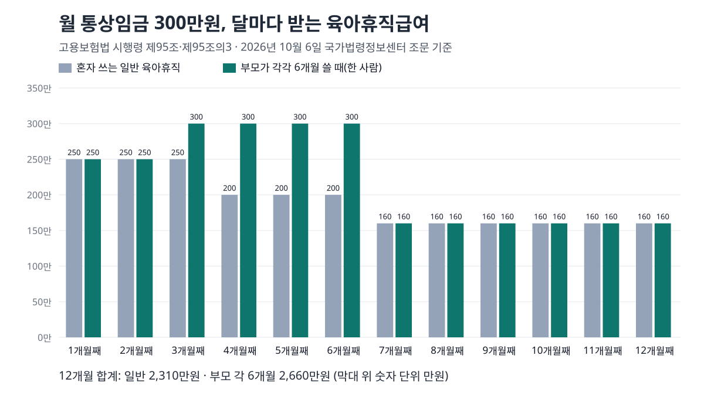

<!-- 제목: 육아휴직급여 계산, 통상임금 300만원이면 1년 2,310만원 -->
<!-- 디스커버 제목: 월 통상임금 300만원 직장인의 육아휴직 1년, 부부가 같이 쓰면 달라지는 금액 -->
<!-- 게시일: 2026-10-10 -->
# 육아휴직급여 계산, 통상임금 300만원이면 1년 2,310만원

육아휴직급여는 첫 3개월 월 통상임금 전액(상한 250만원), 4~6개월째 전액(상한 200만원), 7개월째부터 80%(상한 160만원)이고 하한은 월 70만원입니다(2026년 10월 6일 국가법령정보센터 원문 기준).

월 통상임금 300만원인 사람이 혼자 1년을 쓰면 12개월 합계가 2,310만원, 한 달 평균으로 약 192만원입니다. 부모가 아이 생후 18개월 안에 둘 다 쉬면 첫 6개월 상한이 달마다 올라가고, 2026년 2월 개정으로 방학·휴원 때 1~2주만 쓰는 육아휴직도 생겼습니다. 금액은 모두 조문 공식을 옮긴 계산으로 다시 돌린 값입니다.

[[목차]]

## 육아휴직급여는 통상임금의 몇 퍼센트를 받나요
[고용보험법 시행령 제95조](https://www.law.go.kr/법령/고용보험법시행령/제95조) 제1항이 휴직 기간을 세 구간으로 나눕니다. 1~3개월째와 4~6개월째는 통상임금의 100%이고 상한만 250만원과 200만원으로 다릅니다. 7개월째부터는 80%로 내려가고 상한이 160만원입니다. 어느 구간이든 계산값이 70만원보다 적으면 70만원을 줍니다.

받을 수 있는 사람의 조건은 [고용보험법 제70조](https://www.law.go.kr/법령/고용보험법/제70조) 제1항에 있습니다. 육아휴직을 30일 이상 부여받았고, 휴직 시작일 전까지 피보험 단위기간을 모두 더해 180일을 넘겨 채운 사람이 대상입니다. 이 단위기간은 고용보험에 가입해 보수를 받은 날을 센 것으로, [실업급여 180일 조건을 정리한 글](/34)에서 세는 법을 날짜 예시로 따로 풀어 두었습니다.

표: 월 통상임금별 육아휴직급여 — 혼자 쓰는 일반 육아휴직, 2026년 10월 시행 기준
| 월 통상임금 | 1~3개월째 월액 | 4~6개월째 월액 | 7개월째부터 월액 | 6개월 합계 | 12개월 합계 |
|---|---|---|---|---|---|
| 150만원 | 150만원 | 150만원 | 120만원 | 900만원 | 1,620만원 |
| 200만원 | 200만원 | 200만원 | 160만원 | 1,200만원 | 2,160만원 |
| 300만원 | 250만원 | 200만원 | 160만원 | 1,350만원 | 2,310만원 |
| 500만원 | 250만원 | 200만원 | 160만원 | 1,350만원 | 2,310만원 |

위 표는 한 달을 꽉 채워 쉰 달만 셌고, 회사에서 휴직 중 따로 받는 돈은 없다고 가정했습니다. 통상임금이 250만원을 넘으면 1~3개월째부터, 200만원을 넘으면 4~6개월째부터 상한에 걸립니다. 그래서 300만원과 500만원은 1년 합계가 2,310만원으로 똑같습니다. 월급이 높을수록 휴직 전 소득과 급여의 간격이 커지는 구조입니다.

## 월 통상임금은 무엇을 넣어 계산하나요
기준은 연봉을 12로 나눈 값이 아니라 휴직 시작일을 기준으로 한 월 통상임금입니다. 통상임금은 [근로기준법 시행령 제6조](https://www.law.go.kr/법령/근로기준법시행령/제6조) 제1항의 말로 「정기적이고 일률적으로」 소정근로에 대해 주기로 정한 금액입니다. 달마다 들쭉날쭉한 성과급까지 더한 명세서 총액과는 다를 수 있습니다.

[고용보험법 시행규칙 제116조](https://www.law.go.kr/법령/고용보험법시행규칙/제116조) 제1항은 신청서에 통상임금을 확인할 증명자료로 임금대장이나 근로계약서 사본을 붙이게 합니다. 회사가 내주는 육아휴직 확인서는 처음 한 번만 냅니다. 그래서 계산에 넣을 숫자는 명세서 총액보다 이 서류에 적힌 통상임금으로 잡는 편이 결과와 가깝습니다.

받은 급여는 세금이 붙지 않습니다. [소득세법 제12조](https://www.law.go.kr/법령/소득세법/제12조) 제3호 마목이 고용보험법에 따른 육아휴직 급여와 육아기 근로시간 단축 급여를 비과세 소득으로 적고 있어, 연말정산 총급여에도 더하지 않습니다. 휴직 전 월급에서 빠지던 보험료가 어떻게 계산되는지는 [직장인 4대보험 요율 계산 글](/37)에 있습니다.

## 부모가 둘 다 쓰면 얼마나 더 받나요
[시행령 제95조의3](https://www.law.go.kr/법령/고용보험법시행령/제95조의3) 제1항은 같은 자녀를 두고 생후 18개월이 될 때까지 부모가 모두 육아휴직을 하면 첫 6개월의 상한을 달마다 올립니다. 1·2개월째 250만원, 3개월째 300만원, 4개월째 350만원, 5개월째 400만원, 6개월째 450만원입니다. 두 사람이 같은 기간에 쉬든 따로 쉬든 적용되고, 7개월째부터는 일반과 같은 80%·상한 160만원입니다.

표: 부모가 각각 6개월 쓸 때 한 사람의 달별 금액 — 일반 육아휴직과 비교
| 월 통상임금 | 1·2개월째 | 3개월째 | 4개월째 | 5개월째 | 6개월째 | 6개월 합계 | 일반 6개월 합계 | 차이 |
|---|---|---|---|---|---|---|---|---|
| 200만원 | 200만원 | 200만원 | 200만원 | 200만원 | 200만원 | 1,200만원 | 1,200만원 | 0만원 |
| 300만원 | 250만원 | 300만원 | 300만원 | 300만원 | 300만원 | 1,700만원 | 1,350만원 | 350만원 |
| 500만원 | 250만원 | 300만원 | 350만원 | 400만원 | 450만원 | 2,000만원 | 1,350만원 | 650만원 |

조문은 상한을 「부모가 사용한 기간이 각각 n개월인 경우」로 적고 있어, 위 표는 두 사람이 같은 개월 수를 쓴 경우만 계산했습니다. 기간이 서로 다를 때 어느 상한을 쓰는지는 조문 글자만으로는 확인되지 않았습니다.

통상임금 300만원인 부부가 각각 6개월을 쉬면 한 사람이 받는 첫 6개월이 1,700만원으로 일반보다 350만원 많고, 이어서 6개월을 더 쉬면 그 사람의 1년 합계는 2,660만원입니다. 통상임금 500만원인 부부라면 두 사람의 6개월 합계가 4,000만원입니다.

통상임금이 200만원 이하이면 특례를 써도 금액이 그대로입니다. 원래 상한(250만원·200만원)에 이미 닿지 않기 때문입니다. 특례의 차이는 통상임금이 200만원을 넘는 몫에서만 생깁니다.

## 1년 6개월까지 쓸 수 있는 조건과 그 기간 급여는
휴직 기간 자체는 [남녀고용평등법 제19조](https://www.law.go.kr/법령/남녀고용평등과일ㆍ가정양립지원에관한법률/제19조) 제2항이 정합니다. 기본은 1년 이내이고, 같은 자녀로 부모가 각각 3개월 이상 쓴 경우의 부 또는 모, 한부모, 장애아동의 부모는 6개월을 더 쓸 수 있습니다. 대상 자녀는 만 8세 이하 또는 초등학교 2학년 이하입니다.

늘어난 6개월에도 급여가 나옵니다. 시행령 제95조 제1항 제3호가 「7개월째부터 종료일까지」로 적혀 있어, 13~18개월째도 80%·상한 160만원 구간에 들어갑니다.

표: 통상임금 300만원 가정 — 18개월 연장·회사 지급·한부모 경우 직접 계산
| 경우 | 계산 | 결과 |
|---|---|---|
| 부모가 각각 3개월 이상 써서 13~18개월째를 더 쓸 때 | 160만원 × 6개월 | 960만원 추가, 18개월 합계 3,270만원 |
| 1개월째에 회사가 휴직을 이유로 100만원을 줄 때 | 100만원 + 250만원 − 300만원 = 50만원 초과 | 급여 200만원 |
| 한부모가 1~3개월째를 쓸 때 | 상한 300만원 × 3개월 | 일반보다 150만원 많음, 12개월 합계 2,460만원 |

한부모의 1~3개월째 상한 300만원은 시행령 제95조의3 제3항에 따로 있고, 4개월째부터는 일반과 같습니다. 위 표의 둘째 줄은 아래 절의 감액 규정을 그대로 적용한 결과입니다.

## 휴직 중 회사에서 돈을 받거나 일하면 줄어드나요
줄어듭니다. [시행령 제98조](https://www.law.go.kr/법령/고용보험법시행령/제98조)는 한 달 단위로 회사가 휴직을 이유로 준 금품과 육아휴직급여를 더해, 휴직 시작일 기준 월 통상임금을 넘으면 넘는 만큼 급여에서 뺍니다. 통상임금 300만원인 사람이 첫 달에 회사에서 100만원을 받으면 합계 350만원이 50만원 넘으므로 급여는 200만원이 됩니다.

다른 곳에서 일한 기간은 아예 급여가 없습니다. 고용보험법 제73조 제2항이 그렇게 정하고, 시행규칙 제116조 제3항은 그 기준을 주 소정근로시간 15시간 이상 또는 근로·자영업으로 받은 돈이 월 150만원 이상인 경우로 둡니다. 휴직 중 회사를 그만두면 그때부터 지급이 멈춥니다(같은 조 제1항).

## 육아휴직급여는 언제, 어디에 신청하나요
고용보험법 제70조 제2항에 따라 휴직을 시작한 날 이후 1개월부터 휴직이 끝난 날 이후 12개월 안에 신청합니다. 본인이나 배우자의 질병·부상, 천재지변 같은 사유로 그 기간에 못 했다면 사유가 끝난 뒤 30일 안에 신청할 수 있습니다(시행령 제94조).

시행규칙 제116조는 절차를 이렇게 적습니다. 서식 제100호 급여 신청서에 회사가 발급한 확인서와 통상임금 증명자료를 붙여 거주지나 사업장 관할 고용센터(직업안정기관)에 냅니다. 급여는 매월 단위로 신청하고, 그 달에 쉰 몫은 다음 달 말일까지 신청하게 되어 있습니다. 지급 여부는 결정 통지서로 알려 주고, 돈은 본인이 지정한 계좌로 들어옵니다(시행규칙 제117조).

예전에는 급여 일부를 복직 뒤에 몰아서 주었는데, 그 근거였던 시행령 제95조 제4항이 2024년 12월 24일 삭제됐습니다. 2025년 1월 1일 전에 쉰 기간은 개정 부칙 제7조에 따라 지급 시기를 포함해 종전 규정을 따릅니다.

## 방학 때 1~2주만 쓰는 육아휴직도 급여가 나오나요
나옵니다. 2026년 2월 19일 개정된 남녀고용평등법 제19조 제6항·제7항은 자녀가 다니는 기관의 휴원·휴교·방학이나 자녀의 질병 같은 사유가 있으면 1년에 한 번, 1주 또는 2주 단위로 육아휴직을 쓰게 했습니다. 같은 날 개정된 고용보험법 제70조 제1항은 이 휴직을 7일 이상 부여받으면 급여 대상에 넣었습니다. 고용보험법 개정분은 부칙대로 공포 후 6개월이 지난 날부터 시행됐고, 2026년 9월 18일 시행판 남녀고용평등법 조문에도 두 항이 들어 있습니다.

이 짧은 휴직은 전체 육아휴직 기간에 들어가지만, [남녀고용평등법 제19조의4](https://www.law.go.kr/법령/남녀고용평등과일ㆍ가정양립지원에관한법률/제19조의4) 제1항이 정한 나눠 쓰기 3회에는 세지 않습니다. 한 달이 안 되는 기간의 급여는 시행령 제95조 제3항에 따라 그 달 월액을 쉰 날수에 비례해 줍니다.

## 육아기 근로시간 단축급여와는 무엇이 다른가요
휴직은 일을 쉬는 것이고, 단축은 일하면서 소정근로시간을 줄이는 것입니다. [고용보험법 제73조의2](https://www.law.go.kr/법령/고용보험법/제73조의2)는 단축을 30일 이상 실시하고 피보험 단위기간 180일을 채운 사람에게 단축급여를 주며, 신청 기한은 휴직급여와 같은 틀(시작 1개월 뒤부터 끝난 뒤 12개월 안)입니다.

금액은 통상임금 전체가 아니라 줄인 시간에 비례합니다. [시행령 제104조의2](https://www.law.go.kr/법령/고용보험법시행령/제104조의2)가 매주 처음 줄인 시간분과 나머지 시간분을 나눠 서로 다른 비율과 상한을 쓰는 계산식을 두고 있습니다. 이 계산식은 조문 화면에 수식 그림으로만 실려 있어, 이 글의 표에는 휴직급여만 넣었습니다. 단축은 1회 1개월 이상이면 여러 번 나눠 쓸 수 있습니다(남녀고용평등법 제19조의4 제2항).

## 숫자를 옮겨 온 조문과 계산 방법
조문은 모두 국가법령정보센터의 조문 본문 화면을 10월 6일에 하나씩 열어 확인했습니다. 고용보험법은 2026년 9월 18일 시행판의 제70조·제73조·제73조의2와 부칙을, 시행령은 대통령령 제36588호 판의 제94조·제95조·제95조의3·제98조·제104조의2와 2024년 12월 개정 부칙을 봤습니다. 시행규칙 제116조·제117조, 남녀고용평등법 제19조·제19조의4, 근로기준법 시행령 제6조, 소득세법 제12조도 같은 날 열었습니다.

세 표의 금액은 비율·상한·하한을 원 단위 정수 계산식으로 짠 스크립트를 돌려 나온 값이고, 표마다 손으로 한 줄씩 검산했습니다. 실제로 들어오는 돈은 휴직 시작일, 한 달을 못 채운 달의 날수, 회사가 준 금품에 따라 이 표와 어긋날 수 있습니다.

이 글은 기준일의 공개 원문을 정리한 일반 정보이며, 개인의 사정에 따라 결과가 달라질 수 있습니다.

[[저자 박스]]

[집필 메모]
- 더한 것 ③: 2026년 2월 19일 개정 남녀고용평등법 제19조 ⑥⑦로 휴원·휴교·방학·자녀 질병 때 연 1회 1주 또는 2주 단위 육아휴직이 생겼고, 같은 날 개정 고용보험법 제70조 ①이 이 휴직을 7일 이상 부여받으면 급여 대상에 넣었으며(법률 제21372호, 공포 후 6개월 시행), 이 휴직은 분할 3회에 세지 않는다(제19조의4 ①) — h2 「방학 때 1~2주만 쓰는 육아휴직도 급여가 나오나요」 절. 보조: 통상임금 200만원 이하이면 부모 특례(제95조의3)를 써도 첫 6개월 금액이 일반과 같다(표 2, h2 「부모가 둘 다 쓰면 얼마나 더 받나요」).
- 설계도와 달라진 점: 제목에 답 단서(통상임금 300만원 → 1년 2,310만원)를 넣어 「육아휴직급여 계산, 통상임금 300만원이면 1년 2,310만원」으로 바꿨다. 단축급여 금액(상한·하한·비율)은 조문 본문 주소에서 수식 그림의 대체 글(LaTeX)로만 실려 대조 스크립트가 글자로 맞출 수 없어 숫자를 쓰지 않고 구조만 썼다(대체 글에는 10시간분 상한 250만원·나머지 80% 상한 160만원·하한 50만원으로 보임).
- 못 연 원문: 고용24·고용노동부 누리집 육아휴직 안내(ei.go.kr는 work24 게이트웨이로 넘어가고, moel.go.kr은 연결 끊김) — 온라인 신청 메뉴 경로는 쓰지 않고 시행규칙 제116조의 서식·제출처까지만 썼다. 법령 사이트는 여러 번 연결 끊김 뒤 열림.
- 뺀 숫자: 한 달이 안 되는 달 일할 계산의 예시 금액(분모가 그 달 달력 일수인지 원문에서 확인 못 함) · 두 사람 기간이 다를 때 부모 특례 상한.
- 2026년 8월 18일 시행령 개정(제95조의3 ②)으로 남성 근로자가 위험 임신 배우자를 돌보는 육아휴직도 태아를 자녀로 보아 부모 특례에 들어간다 — 이번 글에는 넣지 않음(다음 편 후보).
