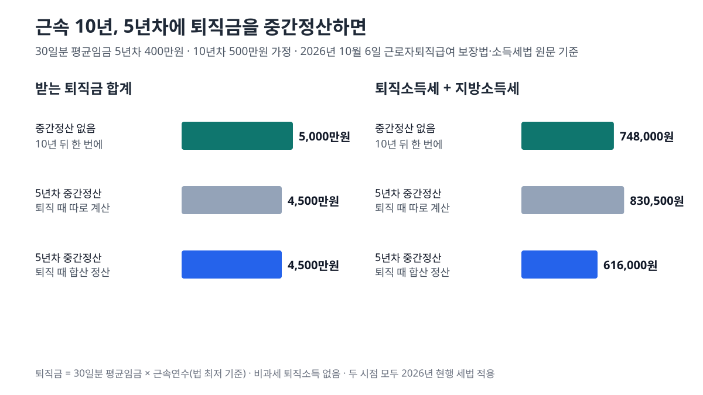

<!-- 제목: 퇴직금 중간정산, 가능한 사유 9가지와 세금 정산 -->
<!-- 디스커버 제목: 퇴직금 중간정산이 되는 9가지 경우, 퇴직 때 세금을 합쳐 다시 계산하면 달라지는 금액 -->
<!-- 게시일: 2026-10-10 -->
# 퇴직금 중간정산, 가능한 사유 9가지와 세금 정산

퇴직금 중간정산은 무주택자의 주택 구입·전세금, 6개월 이상 요양 의료비, 파산·개인회생, 임금피크제, 근로시간 단축, 재난 등 시행령이 정한 9가지 경우에만 받을 수 있습니다(2026년 10월 6일 국가법령정보센터 원문 기준).

사유가 있어도 회사가 반드시 줘야 하는 돈은 아닙니다. 법은 근로자가 요구하면 사용자가 미리 정산해 「지급할 수 있다」고 적었습니다. 받은 돈에는 그날 퇴직한 것처럼 퇴직소득세가 붙고, 나중에 퇴직할 때 중간정산분과 합쳐 세금을 다시 계산할 수 있습니다.

아래에서는 사유 9가지를 조문 번호 그대로 옮기고, 근속 10년인 사람이 5년차에 중간정산할 때 퇴직금과 세금이 어떻게 갈리는지 직접 계산했습니다.

[[목차]]

## 퇴직금 중간정산은 어떤 경우에 받을 수 있나요
[근로자퇴직급여 보장법 제8조](https://www.law.go.kr/법령/근로자퇴직급여보장법/제8조) 제1항은 계속근로기간 1년에 30일분 이상의 평균임금을 퇴직금으로 주도록 정합니다. 같은 조 제2항이 예외를 둡니다. 「주택구입 등 대통령령으로 정하는 사유」로 근로자가 요구하면 퇴직 전에 그때까지의 퇴직금을 미리 정산해 줄 수 있습니다.

그 사유는 [근로자퇴직급여 보장법 시행령 제3조](https://www.law.go.kr/법령/근로자퇴직급여보장법시행령/제3조) 제1항에 호 번호로 나열돼 있습니다. 2026년 10월 6일 국가법령정보센터에서 연 판은 대통령령 제36220호(시행 2026. 3. 24.)이고, 제3조의 마지막 개정은 2022년 4월 13일입니다. 호는 1·2·3·4·5·6·6의2·6의3·7, 모두 9개입니다.

표: 퇴직금 중간정산 사유 9가지(시행령 제3조 제1항)와 퇴직연금(DC) 중도인출에도 있는지
| 호 | 사유 | 조건 | DC 중도인출 |
|---|---|---|---|
| 1 | 주택 구입 | 무주택자, 본인 명의 | 있음 |
| 2 | 전세금·임차보증금 | 무주택자, 주거 목적, 한 사업에서 1회 | 있음 |
| 3 | 요양 의료비 | 6개월 이상 요양, 연간 임금총액의 1천분의 125 초과 부담 | 있음 |
| 4 | 파산선고 | 신청일부터 거꾸로 5년 안 | 있음 |
| 5 | 개인회생절차 개시 결정 | 신청일부터 거꾸로 5년 안 | 있음 |
| 6 | 임금피크제 | 정년 연장·보장 조건으로 임금을 줄이는 제도 시행 | 없음 |
| 6의2 | 소정근로시간 단축 | 1일 1시간 또는 1주 5시간 이상 단축, 3개월 이상 계속 근로 | 없음 |
| 6의3 | 법정 근로시간 단축 | 근로기준법 개정(법률 제15513호) 시행으로 퇴직금이 줄어드는 경우 | 없음 |
| 7 | 재난 피해 | 고용노동부장관 고시 사유 | 있음 |

DC 칸은 확정기여형 퇴직연금 가입자에게 적용되는 [같은 시행령 제14조](https://www.law.go.kr/법령/근로자퇴직급여보장법시행령/제14조)와 대조한 결과입니다. 회사가 퇴직금제도가 아니라 확정기여형(DC) 퇴직연금을 두고 있다면 「중간정산」이 아니라 [법 제22조](https://www.law.go.kr/법령/근로자퇴직급여보장법/제22조)의 「중도인출」을 쓰고, 이때는 임금피크제·근로시간 단축 사유가 목록에 없습니다. 대신 퇴직연금 담보대출 원리금 상환(고시 사유)이 들어 있습니다.

## 무주택자 주택 구입과 전세금 사유는 조건이 어떻게 다른가요
두 사유 모두 「무주택자인 근로자」가 출발점입니다. 주택 구입(제1호)은 본인 명의로 사는 경우만 들어갑니다. 배우자 명의로 사는 집은 문언상 이 호에 맞지 않습니다.

전세금·보증금(제2호)은 주거 목적이어야 하고, 민법 제303조의 전세금 또는 주택임대차보호법 제3조의2의 보증금을 근로자가 부담하는 경우입니다. 여기에는 횟수 제한이 붙습니다. 「하나의 사업에 근로하는 동안 1회로 한정」한다는 문장입니다. 같은 회사에 다니는 동안 전세 사유로는 한 번만 받을 수 있고, 주택 구입 사유에는 이런 횟수 문장이 없습니다.

무주택 여부를 어느 날 기준으로, 세대 전체로 볼지 본인만 볼지는 시행령 제3조 본문에서 확인되지 않았습니다. 이 부분은 회사가 받는 증명 서류와 고용노동부 해석에 따릅니다.

## 의료비 사유는 연봉의 얼마를 넘어야 하나요
제3호는 세 가지가 모두 맞아야 합니다. 요양 기간이 6개월 이상이어야 하고, 대상은 근로자 본인·배우자·근로자나 배우자의 부양가족이며, 근로자가 낸 의료비가 본인 연간 임금총액의 1천분의 125, 곧 12.5%를 넘어야 합니다.

표: 연간 임금총액별 의료비 사유 문턱(1천분의 125 · 계산 예시)
| 본인 연간 임금총액 | 이 금액을 넘게 의료비를 부담해야 사유 | 한 달로 나누면 |
|---|---|---|
| 3,000만원 | 375만원 | 약 31.2만원 |
| 4,000만원 | 500만원 | 약 41.7만원 |
| 5,000만원 | 625만원 | 약 52.1만원 |
| 6,000만원 | 750만원 | 약 62.5만원 |
| 8,000만원 | 1,000만원 | 약 83.3만원 |

연간 임금총액이 5천만원이라면 그해 의료비로 625만원을 넘게 써야 사유가 됩니다. 한 달 평균 52만원 남짓을 넘는 부담입니다. 금액은 원 미만이 생기지 않는 예시만 골랐습니다. 연간 임금총액에 어떤 항목을 넣는지는 시행령 제3조 본문에 따로 정의돼 있지 않습니다.

## 임금피크제나 근로시간 단축도 중간정산 사유인가요
사유입니다. 퇴직금은 퇴직 직전 평균임금으로 계산하므로, 임금이 줄어든 뒤에 퇴직하면 그 전 근속기간까지 낮아진 임금으로 계산됩니다. 그래서 임금이 줄기 전에 그때까지의 몫을 정산할 길을 열어 둔 것이 제6호·제6호의2·제6호의3입니다.

제6호는 사용자가 정년을 연장하거나 보장하는 조건으로 단체협약·취업규칙을 통해 일정 나이·근속 시점·임금액을 기준으로 임금을 줄이는 제도를 시행하는 경우입니다. 흔히 말하는 임금피크제가 여기에 해당합니다.

제6호의2는 근로자와 합의해 소정근로시간을 1일 1시간 또는 1주 5시간 이상 줄이고, 줄어든 시간으로 3개월 이상 계속 일하기로 한 경우입니다. 제6호의3은 법률 제15513호 근로기준법 일부개정법률의 시행으로 근로시간이 줄어 퇴직금이 감소하는 경우입니다.

## 회사가 거절할 수 있나요, 신청은 어떻게 하나요
법 제8조 제2항의 술어는 「지급할 수 있다」입니다. 사유가 있어도 회사에 지급 의무가 생긴다는 문장은 아닙니다. 순서는 근로자가 사유를 들어 요구하고, 사용자가 사유를 확인해 미리 정산하는 방식입니다.

제출 서류의 목록은 법과 시행령에 없습니다. 시행령 제3조 제2항은 사용자 쪽 의무만 정합니다. 중간정산을 해 준 사용자는 근로자가 퇴직한 뒤 5년이 되는 날까지 관련 증명 서류를 보존해야 합니다. 그래서 어떤 서류를 내는지는 회사가 정한 양식을 따르게 되고, 근로자는 9가지 가운데 어느 사유에 해당하는지를 보여 주는 서류를 회사에 내는 구조입니다.

받은 금액이 맞는지는 [고용노동부 퇴직금 계산기](https://www.moel.go.kr/retirementpayCal.do)에 입사일·정산일과 3개월 임금을 넣어 대조할 수 있습니다. 회사는 지급하면서 퇴직소득세를 원천징수하고 원천징수영수증을 줍니다. 이 영수증은 퇴직할 때의 세액정산에서 다시 쓰이는 문서입니다.

## 중간정산하면 퇴직금 계산은 언제부터 다시 하나요
정산한 시점부터 새로 셉니다. 법 제8조 제2항 후단은 「미리 정산하여 지급한 후의 퇴직금 산정을 위한 계속근로기간은 정산시점부터 새로 계산한다」고 적었습니다.

이 문장 때문에 임금이 오르는 사람은 퇴직금 합계가 달라집니다. 중간정산하지 않으면 10년 전체가 퇴직 직전 평균임금으로 계산되지만, 5년차에 정산하면 앞의 5년은 그때 평균임금으로 굳습니다. 반대로 임금이 줄어드는 사람에게는 앞 기간을 높은 임금으로 굳히는 효과가 있고, 임금피크제 사유가 그 경우입니다.

표: 근속 10년, 5년차 중간정산 여부별 퇴직금과 세금(30일분 평균임금 5년차 400만원·10년차 500만원 가정, 지방소득세 포함 · 계산 예시)
| 경우 | 받는 퇴직금 합계 | 세금 계산 | 세금 합계 | 세금 뺀 금액 |
|---|---|---|---|---|
| 중간정산 없이 10년 뒤 한 번에 | 5,000만원 | 10년·5,000만원 한 번에 계산 | 748,000원 | 49,252,000원 |
| 5년차 중간정산, 퇴직 때 따로 | 4,500만원 | 5년·2,000만원 308,000원 + 5년·2,500만원 522,500원 | 830,500원 | 44,169,500원 |
| 5년차 중간정산, 퇴직 때 합산 정산 | 4,500만원 | 10년·4,500만원 합쳐 다시 계산 616,000원 − 이미 낸 308,000원 | 616,000원 | 44,384,000원 |

위 표의 퇴직금은 법이 정한 최저 기준(1년에 30일분 평균임금)으로 계산했고, 비과세 퇴직소득은 없다고 보았습니다. 두 시점 모두 2026년 현행 세법을 적용한 가정입니다. 이 가정에서는 중간정산을 하면 퇴직금 합계가 500만원 적습니다. 정산 시점에 돈을 먼저 받는다는 점은 표에 넣지 않았습니다.

## 중간정산 받은 퇴직금에도 세금이 붙나요
붙습니다. [소득세법 시행령 제43조](https://www.law.go.kr/법령/소득세법시행령/제43조) 제2항은 시행령 제3조 제1항의 사유로 퇴직급여를 미리 받으면 「그 지급받은 날에 퇴직한 것으로」 봅니다. 그래서 회사는 근로소득세가 아니라 퇴직소득세를 떼고, 근속연수는 입사일부터 중간정산일까지로 셉니다.

그다음 근속연수는 [소득세법 시행령 제105조](https://www.law.go.kr/법령/소득세법시행령/제105조) 제1항대로 「퇴직소득중간지급일의 다음 날부터」 셉니다. 퇴직소득중간지급일은 중간정산으로 퇴직급여를 미리 받은 날을 뜻합니다. 근속연수공제와 환산급여공제가 근속연수에 따라 커지기 때문에, 근속이 둘로 나뉘면 공제도 둘로 나뉩니다. 공제 표와 세율 표는 앞서 정리한 [퇴직소득세 계산 순서와 근속연수별 세금](/35)에 있어 여기서는 다시 옮기지 않았습니다.

예시의 5년·2,000만원을 그 순서대로 넣으면 근속연수공제 500만원, 환산급여 3,600만원, 과세표준 1,120만원이고 퇴직소득세는 28만원, 지방소득세를 더해 30만8,000원입니다. 계산은 정수와 분수로 하고 원 미만은 버렸습니다.

## 퇴직할 때 중간정산분과 합쳐 다시 정산할 수 있나요
할 수 있습니다. [소득세법 제148조](https://www.law.go.kr/법령/소득세법/제148조) 제1항은 퇴직자가 퇴직소득을 받을 때 이미 받은 퇴직소득의 원천징수영수증을 내면, 원천징수의무자가 두 금액을 합계한 금액으로 정산한 소득세를 「원천징수하여야 한다」고 정합니다. 대상은 같은 과세기간에 이미 받은 퇴직소득과, 같은 근로계약에서 이미 받은 퇴직소득입니다.

계산 방법은 [소득세법 시행령 제203조](https://www.law.go.kr/법령/소득세법시행령/제203조)에 있습니다. 퇴직소득누계액, 곧 중간정산분과 최종분을 합친 금액에 대해 세액을 계산한 뒤 이미 낸 세액을 뺍니다(제1항). 근속연수는 두 근속 월수를 합하고 겹치는 월수를 뺍니다(제3항). [국세청 퇴직소득 세액정산 안내](https://www.nts.go.kr/nts/cm/cntnts/cntntsView.do?mi=6445&cntntsId=7881)의 사례는 60개월과 63개월을 더하고 중복 60개월을 빼 63개월, 곧 6년으로 셉니다.

예시에 적용하면 4,500만원을 근속 10년으로 다시 계산한 세금이 61만6,000원이고, 중간정산 때 낸 30만8,000원을 빼면 퇴직 때 낼 몫은 30만8,000원입니다. 따로 계산하면 퇴직 때 52만2,500원이므로 21만4,500원 차이가 납니다. 퇴직금 2,500만원 가운데 손에 쥐는 금액이 2,447만7,500원에서 2,469만2,000원으로 바뀝니다.

정산은 퇴직자가 영수증을 내는 것에서 시작합니다. 영수증이 없으면 회사는 최종분만 따로 계산합니다. 이미 받은 퇴직소득 가운데 IRP로 옮겨 세금이 미뤄진 몫이 있으면 환급 계산(제203조 제2항)이 따로 붙고, 연금 수령 때의 세금은 [퇴직연금을 일시금과 연금으로 받을 때의 세금 차이](/36)에서 따로 계산했습니다.

이 글은 기준일의 공개 원문을 정리한 일반 정보이며, 개인의 사정에 따라 결과가 달라질 수 있습니다.

[[저자 박스]]

[집필 메모]
- 더한 것 ③: 중간정산을 받은 근로자가 퇴직할 때 중간정산분 원천징수영수증을 내면 회사는 두 금액을 합쳐 근속연수를 이어 붙여 다시 계산해야 하고(소득세법 제148조①, 시행령 제203조①③), 근속 10년·5년차 중간정산 예시(2,000만원+2,500만원)에서 퇴직 때 세금이 52만2,500원 → 30만8,000원으로 21만4,500원 줄어든다(h2 「퇴직할 때 중간정산분과 합쳐 다시 정산할 수 있나요」 절). 보조: DC 중도인출(시행령 제14조)에는 임금피크제·근로시간 단축 사유가 없다(첫 h2 표).
- 설계도와 달라진 점: 설계도 제목의 「다섯 가지」는 원문과 다르다. 시행령 제3조 제1항의 호는 1·2·3·4·5·6·6의2·6의3·7, 9개다 → 제목 「퇴직금 중간정산, 가능한 사유 9가지와 세금 정산」. 기준일은 사장 지시대로 2026년 10월 6일(한국 시각 10월 6일에 원문을 열었다).
- 못 연 원문: 근로자퇴직급여 보장법 시행규칙 본문(lsInfoP 화면이 글자를 주지 않음) — 제출 서류 목록은 「법과 시행령에 없다」까지만 썼다. 고용노동부 퇴직금 계산기는 첫 시도 연결 끊김, 다시 열어 200(2026-10-06). 찾기쉬운 생활법령 중간정산 화면은 주소를 찾지 못해 안 씀.
- 뺀 숫자: 제출 서류 목록·무주택 판단 기준일(원문 없음) · 재난 고시의 세부 사유.
- 다음편_반영 적용: 세법 용어 한 줄 풀이(퇴직소득누계액·퇴직소득중간지급), 표에 전제(평균임금 가정·현행 세법 가정·비과세 없음)를 caption과 표 아래 문단에, 계산은 정수·분수와 원 미만 버림 한 줄, 근거 조문 링크를 사실 문장 옆에, 조문이 몰린 문단은 나눔.
- 자기 검사: calc.py 종료 0 · 변환 종료 0 · calc_check 종료 0(표 숫자 47개 불일치 0, 수치대장 46줄 중 원문 있음 17·원문에 없음 0·법령 「확인 못 함」 0, 확인 못 함 29 = 모두 계산 줄) · gate_search 치명 0·경고 2(기준일 문구 1회, 본문 4,474자 참고) · overlap21 겹침 0.
- 자료집에 더한 줄: 원문 7줄 · 계산 함수 1줄.
