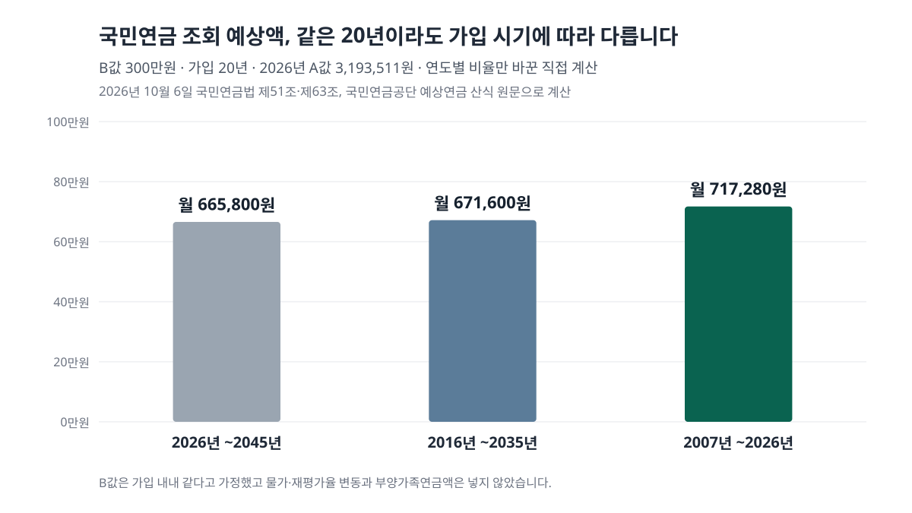
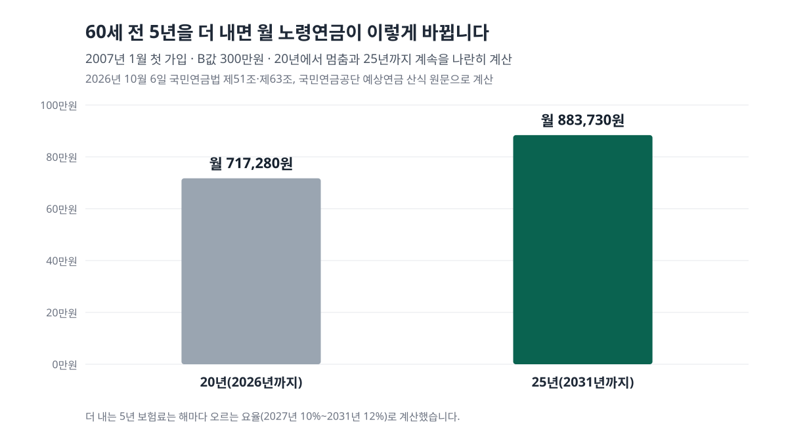

<!-- 제목: 국민연금 조회, 예상연금액·가입기간 보는 곳과 읽는 법 -->
<!-- 디스커버 제목: 국민연금 예상연금액, 같은 월급 20년인데 왜 내 숫자는 표보다 클까 -->
<!-- 게시일: 2026-10-11 -->
# 국민연금 조회, 예상연금액·가입기간 보는 곳과 읽는 법

국민연금 예상연금액과 가입·납부내역은 국민연금공단 누리집 「국민연금 알아보기」나 「내 곁에 국민연금」 앱에서 본인 인증 뒤 조회합니다. 인증 없이 소득과 기간만 넣는 모의계산도 있습니다(2026년 10월 6일 국민연금공단 원문 기준).

조회 화면에 뜨는 금액은 지금 받는 돈이 아니라 몇 가지 가정을 깔고 계산한 앞날의 숫자입니다. 그래서 이 글은 어디서 보는지에서 멈추지 않고, 그 숫자가 어떤 산식에서 나오는지 [국민연금법 제51조](https://www.law.go.kr/법령/국민연금법/제51조)와 공단 산식으로 다시 계산해 봤습니다.

계산에 쓴 말 두 개를 먼저 풉니다. A값은 전체 가입자의 최근 3년 평균소득월액을 다시 평균 낸 값이고, 2026년에 쓰는 값은 3,193,511원입니다. B값은 내가 가입한 기간 동안의 기준소득월액(보험료를 매기는 월 소득) 평균입니다.

[[목차]]

## 국민연금 조회는 어디서, 어떤 인증으로 하나요
공단 누리집 [국민연금 알아보기](https://www.nps.or.kr/comm/quick/getOHAH0011M0.do) 화면은 두 칸으로 나뉩니다. 위 칸은 로그인 없이 쓰는 「예상연금 모의계산」과 「예상연금 간단계산」, 아래 칸은 인증 뒤 쓰는 「노령 예상연금액 조회」·「장애·유족 예상연금액조회」·「가입·납부내역 조회」입니다.

인증 뒤 화면은 공단의 중앙노후준비지원센터 누리집으로 넘어갑니다. 그 쪽 로그인 안내는 민간인증서 간편인증, 그리고 주민등록번호를 넣는 공동인증서·금융인증서·브라우저인증서를 받는다고 적고 있습니다.

표: 국민연금 조회 경로와 각 숫자의 가정(2026년 10월 6일 공단 화면 기준, 로그인 뒤 화면은 열지 않음)
| 경로 | 로그인 | 보이는 것 | 숫자의 가정 |
|---|---|---|---|
| 공단 누리집 「국민연금 알아보기」 노령 예상연금액 조회 | 필요(간편·공동·금융·브라우저 인증서) | 만 60세 이후 받을 예상연금액 | 실제 가입이력 기준 |
| 같은 쪽 「가입·납부내역 조회」 | 필요 | 가입기간·납부 내역 | 납부 기록 그대로 |
| 「내 곁에 국민연금」 앱 | 필요(인증서·간편인증) | 예상노령연금·가입내역 등 개인 조회 32종(전체 119종) | 누리집 조회와 같은 종류 |
| 예상연금 모의계산 | 없음 | 내가 넣은 소득·기간의 예상액 | 최장 만 60세까지 납부, 예상소득상승률 0~20% |
| 예상연금 간단계산 | 없음 | 10·15·20…40년 가입 예상액 | 조회하는 해 1월 1일 첫 가입 |
| 고객센터 1355 | 전화 상담 | 5년 단위 사이(예: 11년)의 예상액 상담 | 본인 확인 뒤 상담 |

앱에서 되는 일의 범위는 공단 [자주찾는 질문](https://www.nps.or.kr/pnsinfo/ntpsklg/getOHAF0095M0.do?menuId=MN24001131)에 2025년 12월 말 기준 목록으로 올라 있습니다. 예상노령연금, 가입내역, 연금보험료 미납내역, 추납보험료 납부현황이 모두 개인 조회 32종 안에 들어 있습니다.

전화는 국번 없이 1355(유료, 평일 9시~18시)입니다. [예상연금 간단계산](https://www.nps.or.kr/comm/quick/getOHAH0011P0.do) 화면은 10년·15년처럼 5년 단위로만 금액을 보여 주고, 11년 가입 같은 그 사이 금액은 이 번호로 상담받을 수 있다고 적어 두었습니다.

## 가입·납부내역에서는 어떤 숫자를 먼저 보나요
가입기간입니다. [국민연금법 제61조](https://www.law.go.kr/법령/국민연금법/제61조) 제1항은 가입기간이 10년 이상인 사람에게 노령연금을 준다고 정합니다. 10년에 못 미치면 노령연금 대신 다른 길을 따져야 하므로, 내역 화면의 합계 개월 수가 120개월을 넘는지가 첫 갈림길입니다.

두 번째는 앞으로 더 쌓일 수 있는 기간입니다. [제6조](https://www.law.go.kr/법령/국민연금법/제6조)에 따르면 국내에 사는 국민은 18세부터 60세가 되기 전까지 가입 대상입니다. 지금 나이에서 60세까지 남은 햇수가 조회 화면 예상액에 들어가 있는 미래 기간입니다.

내역을 서류로 받아야 하면 앱과 누리집의 증명발급 메뉴에 가입증명서와 「연금산정용 가입내역서」가 있습니다. 소득공제용 납부확인서도 같은 메뉴에 들어 있습니다.

## 예상연금액은 어떤 산식으로 계산되나요
공단 간단계산 유의사항의 노령연금 산식은 (1.29 × (A + B) × P21/P) × (1 + 0.05n/12) × 지급률입니다. P는 전체 가입월수, P21은 2026년 이후 가입월수, n은 20년을 넘는 가입월수입니다.

1.29는 제51조 제1항의 「1천분의 1천290」이고, 가입 20년 초과분에 1년당 1천분의 50씩 얹는 규정도 같은 항 단서에 있습니다. 지급률은 [제63조](https://www.law.go.kr/법령/국민연금법/제63조) 제1항대로 20년 이상이면 100%, 10년이면 50%에서 1년마다 5%씩 올라갑니다.

B값 300만원으로 2026년 1월부터 20년을 낸다고 놓고 계산하면 이렇습니다. 1.29 × (3,193,511 + 3,000,000) = 연 7,989,629원이고, 12로 나눠 10원 미만을 버리면 월 665,800원입니다. 공단 [노령연금](https://www.nps.or.kr/pnsinfo/ntpsklg/getOHAF0056M0.do?menuId=MN24001118) 쪽 예상연금월액표의 B값 300만원·20년 칸과 같은 금액입니다.

같은 계산 스크립트로 월액표의 다른 칸 네 개(B값 100만원 20년 450,800원, 300만원 10년 332,900원, 41만원 25년 410,000원, 400만원 30년 1,159,950원)도 다시 돌려 모두 같은 숫자를 얻었습니다.

## 내 조회 금액이 공단 월액표와 다른 이유는 무엇인가요
가장 큰 이유는 가입 시기입니다. 공단 월액표와 간단계산은 「2026년 1월 최초 가입」을 가정합니다. 그런데 같은 화면의 [유족연금 유의사항 산식](https://www.nps.or.kr/comm/quick/getOHAH0011P0.do)에는 해마다 다른 비율이 들어 있습니다. 2007년 가입월은 1.8, 2008년은 1.5, 2025년은 1.245, 2026년부터는 1.29입니다.

기본연금액을 정하는 이 부분은 노령연금과 유족연금이 같으므로, 그 비율을 넣어 B값 300만원·20년을 세 시기로 나눠 계산했습니다.

표: 같은 B값 300만원·20년, 가입 시기만 다를 때의 월 노령연금(A값은 2026년 값 고정 · 직접 계산 · B값 불변 · 물가·재평가 변동과 부양가족연금 제외)
| 가입 시기(20년) | 평균 비율 | 월 노령연금 | 공단 월액표 대비 |
|---|---|---|---|
| 2026년 1월~2045년 12월 | 1.29000 | 665,800원 | 같음(기준) |
| 2016년 1월~2035년 12월 | 1.30125 | 671,600원 | +5,800원 |
| 2007년 1월~2026년 12월 | 1.38975 | 717,280원 | +51,480원 |

2007년부터 20년을 채운 사람은 월액표보다 한 달 51,480원, 1년이면 617,760원이 많게 나옵니다. 2007~2021년 가입월의 비율이 1.29보다 높았기 때문입니다(2022년은 같고 2023~2025년은 더 낮습니다). 그래서 이미 가입기간이 긴 사람에게는 간단계산 표보다 인증 뒤 조회 금액이 실제 이력에 가깝게 계산된 숫자입니다.

가입 시기 말고도 숫자가 달라지는 이유가 세 가지 더 있습니다.

- A값과 재평가율: 공단 유의사항 4는 실제 연금이 받기 시작할 때의 A값과 재평가율(과거 소득을 현재 가치로 바꾸는 비율)로 다시 산정된다고 적고 있습니다.
- 부양가족연금: 배우자는 월 25,550원, 자녀·부모는 1명당 월 17,030원이 더해집니다(연 306,630원·204,360원).
- 상한: 월 지급액은 최종 5년 평균소득과 전체 기간 평균소득의 재평가액 가운데 큰 쪽을 넘지 못합니다. 월액표에서 B값 41만원·25년이 산식 값보다 낮은 410,000원으로 멈춘 이유가 이것입니다.

## 60세 전에 납부를 멈추면 예상액은 얼마나 달라지나요
[예상연금 모의계산](https://csa.nps.or.kr/ohkd/ntpsidnty/anpnctng/UHKD7701M0.do) 화면은 「최장 만 60세까지 납부한다는 가정」으로 계산한다고 밝힙니다. 예상소득상승률 칸에는 0~20%를 넣을 수 있고, 지금 내는 금액 그대로 낸다면 0%를 넣으라고 안내합니다.

60세까지 아직 몇 년이 남은 사람이라면 그 기간이 실제로 채워지는지에 따라 금액이 달라집니다. 2007년 1월에 처음 가입해 B값 300만원으로 2026년 12월까지 20년을 낸 사람을 놓고, 60세가 되기 전 5년(2027~2031년)을 더 낼 때와 그러지 않을 때를 계산했습니다.

표: 2007년 첫 가입·B값 300만원, 20년에서 멈출 때와 25년까지 낼 때(직접 계산 · 2026년 A값 고정 · 요율 2027년 10%~2031년 12%)
| 경우 | 가입기간 | 월 노령연금 | 더 내는 보험료(5년 합계) |
|---|---|---|---|
| 2026년 12월에 멈춤 | 20년 | 717,280원 | 0원 |
| 2031년 12월까지 계속 | 25년 | 883,730원 | 전체 19,800,000원(사업장가입자 본인 몫 9,900,000원) |

25년이 되면 20년을 넘는 60개월에 1 + 0.05 × 60/12 = 1.25배가 붙고, 2027년 이후 가입월에는 1.29가 적용됩니다. 그 결과 월 166,450원, 1년에 1,997,400원 차이가 납니다.

보험료는 [공단 연금보험료 안내](https://www.nps.or.kr/pnsinfo/ntpsklg/getOHAF0038M0.do?menuId=MN24001113)대로 2026년 9.5%에서 해마다 0.5%p 올라 2033년 13%가 됩니다. 그래서 B값 300만원의 월 보험료는 2027년 300,000원에서 2031년 360,000원이 됩니다. 사업장가입자는 이 금액을 본인과 사용자가 절반씩 냅니다.

이 표는 같은 사람의 두 경우를 나란히 놓은 산수입니다. 소득이 끊겨 납부예외가 되는지, 직장을 계속 다니는지는 사람마다 다르고, 모의계산의 예상액은 그 5년이 채워진다는 가정이 깔린 숫자라는 점만 짚어 둡니다.

## 가입기간이 10년에 못 미치면 무엇을 조회해야 하나요
10년 미만인 채로 60세가 되면 노령연금 대신 [제77조](https://www.law.go.kr/법령/국민연금법/제77조)의 반환일시금을 청구할 수 있습니다. 낸 보험료에 이자를 더해 한 번에 돌려받는 돈입니다.

기간을 채우는 길은 법에 두 가지가 있습니다. 하나는 60세 이후에도 65세까지 신청해 이어 내는 [제13조](https://www.law.go.kr/법령/국민연금법/제13조)의 임의계속가입입니다. 같은 조 제1항 제1호 다목은 60세에 반환일시금을 이미 받은 사람을 여기서 뺍니다. 다른 하나는 납부예외 등으로 비어 있던 기간의 보험료를 나중에 내는 [제92조](https://www.law.go.kr/법령/국민연금법/제92조)의 추후납부입니다. 비어 있는 기간은 가입내역에서, 이미 신청한 추납의 진행은 앱의 「추납보험료 납부현황」에서 볼 수 있습니다.

[[같은 묶음: B1008-2/1 · 가입내역에서 비어 있는 기간을 찾았다면 그 기간의 보험료를 지금 낼 때 금액과 늘어나는 연금은 추납 편에서 계산했습니다]]

[[같은 묶음: B1008-2/2 · 소득이 없어 가입 대상이 아닌 기간을 스스로 채우는 조건과 최저 보험료는 임의가입 편에 있습니다]]

## 조회한 예상액은 몇 살부터, 월급에서 얼마를 내고 받는 돈인가요
조회 화면은 「만 60세 이후」라고 적지만, 실제로 받기 시작하는 나이는 출생연도에 따라 다릅니다. 공단 노령연금 안내는 1969년 이후 출생자부터 65세에 지급한다고 적고 있습니다.

받는 나이를 앞당기면 금액이 깎이고 늦추면 늘어나는데, 그 비율과 몇 살까지 받아야 같아지는지는 [조기수령과 연기연금을 나란히 계산한 글](/20)에서 따로 다뤘습니다. 조회 금액을 기준값으로 넣어 보면 이어서 읽힙니다.

반대로 지금 월급에서 국민연금 보험료가 얼마 빠지는지가 궁금했다면, 건강보험·고용보험과 함께 본인 부담분을 계산한 [4대보험 본인 부담 계산 글](/37)이 같은 기준소득월액에서 출발합니다.

## 이 글의 산식과 비율은 어디에서 옮겼나요
2026년 10월 6일(한국 시각) 국민연금공단 누리집의 국민연금 알아보기, 예상연금 간단계산 팝업, 노령연금, 연금보험료, 자주찾는 질문, 전자민원 조회 목록 화면과 중앙노후준비지원센터의 예상연금 모의계산 화면을 열어 문구와 숫자를 옮겼습니다.

법 조문은 국가법령정보센터에서 국민연금법 제6조·제51조·제61조·제63조·제77조의 2026년 1월 1일 시행판(법률 제21203호) 본문을 열어 봤습니다. 2025년 이전 연도별 비율은 법 본문이 아니라 공단 유족연금 유의사항의 산식에서 가져왔고, 2008년 1.5에서 2025년 1.245까지 해마다 0.015씩 내려간다는 점은 산식 양 끝 값으로 맞춰 봤습니다.

표의 금액은 이 산식을 정수와 분수로 옮긴 파이썬 계산으로 냈고, 공단 월액표 다섯 칸과 같은 숫자가 나오는지 먼저 대조했습니다. 로그인 뒤 조회 화면은 열지 않았으므로 그 화면의 칸 이름과 배치는 이 글에 옮기지 않았습니다.

이 글은 기준일의 공개 원문을 정리한 일반 정보이며, 개인의 사정에 따라 결과가 달라질 수 있습니다.

[[저자 박스]]

[집필 메모]
- 더한 것 ③: 공단 예상연금월액표·간단계산은 모든 가입월이 2026년 이후라는 가정이라, 공단 유족연금 유의사항 산식의 연도별 비율('07 1.8 · '08 1.5 · '25 1.245 · '26~ 1.29)을 넣으면 2007년부터 B값 300만원으로 20년 낸 사람의 월 노령연금은 717,280원으로 월액표(665,800원)보다 51,480원 많다(h2 「내 조회 금액이 공단 월액표와 다른 이유는 무엇인가요」 절, 원문 링크 같은 문단).
- 보조: 모의계산은 「최장 만 60세까지 납부」 가정 — 2007년 가입·B값 300만원이 60세 전 5년을 더 내면 월 166,450원 차이(h2 「60세 전에 납부를 멈추면…」).
- 못 연 원문: 로그인 뒤 노령 예상연금액 조회·가입·납부내역 조회 화면(인증 필요 — 열지 않음). 국가법령정보센터 조문 본문 주소는 스크립트에서 연결 끊김(제51조), WebFetch로 제51조·제61조·제63조·제6조·제77조 열림. nps.or.kr은 curl SSL 끊김, 표준 라이브러리 fetch로 열림.
- 뺀 숫자: 2007년 이전(1988~2006) 가입월 비율 — 간단계산 산식에 '07년부터만 실려 있어 계산에 넣지 않았다. 「가입기간 중 기준소득월액 평균액」 상한 조항의 법 조문 번호 — 공단 유의사항 5로만 확인.
- 설계도와 달라진 점: 제목에 「보는 법」 대신 「보는 곳과 숫자 읽는 법」. 설계도의 직접 계산 예시(20년·300만원)는 공단 월액표와 같은 값이라 검산으로 쓰고, 고유 계산은 가입 시기별 비율 비교와 60세 전 5년 계속 납부 비교로 했다. 기준일은 사장 지시대로 10월 6일(한국 시각, 실제로 연 시각도 10월 6일 새벽 KST).
- 다음편_반영 적용: A값·B값·재평가율·기준소득월액 한 줄 풀이, 표 caption에 가정·유보, 조회 경로·인증까지 답, 숫자 몰린 문단 나눔, 10원 미만 버림 문장, ③ 옆 원문 링크.
