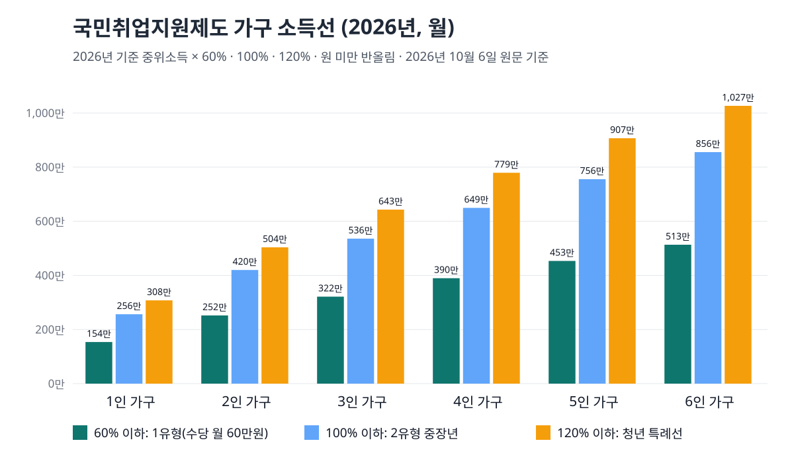

<!-- 제목: 국민취업지원제도 조건, 1유형 소득선과 수당 360만원 -->
<!-- 디스커버 제목: 구직촉진수당 월 60만원, 우리 집 소득이 1유형 선 안에 드는지 가구원 수별로 계산했습니다 -->
<!-- 게시일: 2026-10-11 -->
# 국민취업지원제도 조건, 1유형 소득선과 수당 360만원

가구 소득이 기준 중위소득 60% 이하(4인 가구 월 3,896,843원), 재산 4억원 이하, 최근 2년 취업경험 100일 이상이면 1유형으로 월 60만원씩 6개월, 합계 360만원을 받습니다(2026년 10월 6일 고용24·국가법령정보센터 원문 기준).

이 선을 넘더라도 끝이 아닙니다. 34세 이하는 소득과 재산을 따지지 않는 2유형으로, 35~69세는 중위소득 100% 이하이면 2유형으로 들어가 상담·훈련·취업알선과 취업활동비용을 받습니다. 1유형과 2유형의 차이는 결국 「월 60만원의 구직촉진수당을 받느냐」입니다.

기준 중위소득은 보건복지부가 해마다 고시하는 가구원 수별 중간 소득입니다. 아래에서 2026년 값으로 가구원 수별 선을 원 단위까지 계산했고, 부양가족에 따라 수당이 얼마까지 늘어나는지, 실업급여와는 어떻게 겹치는지, 2027년 1월에 선이 얼마나 오르는지를 차례로 정리했습니다.

[[목차]]

## 국민취업지원제도 1유형과 2유형은 무엇으로 나뉘나요
갈림길은 소득·재산·취업경험 세 가지입니다. [구직자취업촉진법 제7조](https://www.law.go.kr/법령/구직자취업촉진및생활안정지원에관한법률/제7조) 제1항은 구직촉진수당을 받을 사람의 요건으로 가구 소득(중위소득 60% 이내에서 시행령이 정함), 재산(6억원 이내에서 시행령이 정함), 신청일 이전 2년 안의 취업 사실을 모두 갖출 것을 적고 있습니다. 숫자는 [시행령 제3조](https://www.law.go.kr/법령/구직자취업촉진및생활안정지원에관한법률시행령/제3조)가 채웁니다. 소득은 중위소득의 100분의 60, 재산은 4억원, 취업경험은 모두 더해 100일 또는 800시간입니다.

세 요건을 다 갖추면 「요건심사형」이라 예산과 상관없이 수급자격이 인정됩니다. 소득·재산은 맞는데 취업경험이 100일에 못 미치면 「선발형」이고, 이때는 법 제7조 제2항에 따라 예산 범위에서 고릅니다. 15~34세는 가구 소득이 중위소득 120% 이하이고 재산이 5억원 이하이면 취업경험과 상관없이 선발형(청년특례)에 들 수 있습니다.

나이는 [법 제6조](https://www.law.go.kr/법령/구직자취업촉진및생활안정지원에관한법률/제6조) 본문이 15세 이상 64세 이하로 적고 있고, [국민취업지원제도 운영규정](https://www.law.go.kr/행정규칙/국민취업지원제도운영규정) 제2조가 취업취약계층에 한해 69세까지 넓힙니다. [고용24 국민취업지원제도 안내](https://www.work24.go.kr/ua/z/z/1300/selectEmssRqutIntro.do)는 1유형 나이를 15~69세로 적고 있습니다.

## 가구원 수별 소득 기준은 한 달에 얼마인가요
가구는 주민등록표에 함께 오른 신청인, 배우자, 1촌 직계혈족(부모·자녀)으로 셉니다(시행령 제2조 제1항). 따로 사는 부모는 주민등록표가 다르면 들어가지 않고, 같은 주소에 사는 형제자매는 원칙적으로 빠집니다. 소득은 이 가구원들의 근로·사업·이자·배당소득과 공적연금을 월 단위로 바꿔 더한 금액입니다.

표: 2026년 가구원 수별 소득선(월 금액, 원 미만 반올림 — 기준 중위소득은 보건복지부 2025년 7월 31일 발표값)
| 가구원 수 | 60% (1유형) | 100% (2유형 중장년) | 120% (청년) |
|---|---|---|---|
| 1인 | 1,538,543원 | 2,564,238원 | 3,077,086원 |
| 2인 | 2,519,575원 | 4,199,292원 | 5,039,150원 |
| 3인 | 3,215,422원 | 5,359,036원 | 6,430,843원 |
| 4인 | 3,896,843원 | 6,494,738원 | 7,793,686원 |
| 5인 | 4,534,031원 | 7,556,719원 | 9,068,063원 |
| 6인 | 5,133,571원 | 8,555,952원 | 10,267,142원 |

1인 가구라면 월 153만원 남짓, 4인 가구라면 월 390만원 남짓이 1유형의 선입니다. 맞벌이 부부와 자녀 둘인 4인 가구는 두 사람 월급을 더해 이 선과 맞대므로, 한 사람이 월 200만원씩만 벌어도 넘습니다. 기준 중위소득 금액은 [보건복지부 2026년도 기준 중위소득 발표](https://www.mohw.go.kr/board.es?mid=a10503010100&bid=0027&act=view&list_no=1487098)에서 옮겼습니다.

## 재산 4억원과 취업경험 100일은 무엇을 세나요
재산은 가구원 전원의 토지·건물·주택, 전월세 임차보증금, 조합원입주권·분양권, 승용차를 더한 금액입니다(시행령 제3조 제2항). 전세보증금도 재산에 들어간다는 점이 자주 놓치는 부분입니다. 토지·건물은 지방세 시가표준액을 쓰고 지역별 공제액을 뺍니다(운영규정 제4조).

자동차는 모두 세지 않습니다. 운영규정 제5조는 사용연수 9년 이상이거나 차량 가액이 4천만원 이하인 차, 장애인·국가유공자 상이등급자가 가진 차, 영업용 차를 재산 산정에서 뺍니다. 15~34세의 재산선은 운영규정 제5조의2가 5억원으로 올려 둡니다.

취업경험은 신청일 이전 2년 안에 일한 기간을 모두 더해 100일 또는 800시간입니다(시행령 제3조 제4항). 한 직장일 필요는 없고, 아르바이트를 여러 곳에서 했어도 합칩니다. 기간을 확인하기 어려우면 그 2년 동안 생긴 근로·사업소득을 기간으로 바꿔 셉니다(운영규정 제7조).

## 구직촉진수당은 얼마를 몇 달 받나요
기본은 월 60만원, 6개월입니다. 고용24 안내에 따르면 부양가족 가운데 18세 이하, 70세 이상, 중증장애인이 있으면 1명당 월 10만원이 붙고, 더하는 금액은 월 40만원까지입니다. 미성년자나 고령자가 중증장애인이기도 하면 그 1명에게 20만원이 붙습니다.

표: 구직촉진수당 합계 직접 계산(부양가족 1인당 월 10만원, 월 40만원 한도 · 오른쪽 칸은 12개월로 늘려 똑같이 나눈다고 가정)
| 부양가족 | 한 달 | 6개월 합계 | 1년으로 나누면 한 달 |
|---|---|---|---|
| 0명 | 600,000원 | 3,600,000원 | 300,000원 |
| 1명 | 700,000원 | 4,200,000원 | 350,000원 |
| 2명 | 800,000원 | 4,800,000원 | 400,000원 |
| 3명 | 900,000원 | 5,400,000원 | 450,000원 |
| 4명 이상 | 1,000,000원 | 6,000,000원 | 500,000원 |

위 표의 오른쪽 칸은 [법 제20조](https://www.law.go.kr/법령/구직자취업촉진및생활안정지원에관한법률/제20조) 제2항 때문에 생깁니다. 따로 신청하면 지급기간을 최대 1년까지 늘릴 수 있지만 총지급액은 6개월분을 넘지 못하므로, 기간을 늘리면 한 달 금액이 줄어듭니다.

취업하면 따로 받는 돈도 있습니다. 1유형 요건심사형·선발형(비경제활동)과 중위소득 60% 이하 참여자는 6개월 계속 근무하면 50만원, 이어서 6개월을 더 다니면 100만원, 모두 150만원의 취업성공수당을 받습니다. 부양가족이 없는 1유형 참여자가 수당 6개월을 받고 취업해 1년을 다니면 합계 510만원입니다.

2유형은 현금 수당 대신 취업활동계획을 세운 뒤 참여수당(기본 15만원에 참여 프로그램에 따라 3~10만원 추가)을 받습니다.

## 실업급여를 받고 있으면 신청할 수 없나요
1유형 수당은 막힐 수 있습니다. 법 제7조 제3항 제3호는 고용보험 구직급여를 받고 있거나, 마지막으로 받은 다음 날부터 6개월이 지나지 않은 사람에게 구직촉진수당 수급자격을 인정하지 않을 수 있다고 적고 있습니다. 실업급여가 끝나고 6개월이 지나야 1유형 수당 쪽 문이 열린다는 뜻입니다. 실업급여를 받을 수 있는지부터 따져야 하는 분은 [180일 피보험 단위기간과 이직 사유를 다룬 글](/34)이, 하루 얼마를 받는지 궁금한 분은 [평균임금 60%와 상한·하한을 계산한 글](/33)이 다음 순서입니다.

같은 조항은 다른 수당과의 겹침도 막습니다. 운영규정 제9조는 국가나 지방자치단체가 구직활동비로 주는 수당 가운데 월평균 50만원 이상이거나 총액 300만원 이상인 것을 받고 있거나 끝난 지 6개월이 안 되었으면 1유형 수당을 인정하지 않을 수 있다고 정합니다. 지역 청년수당을 받은 적이 있다면 그 금액부터 맞대 볼 대목입니다.

신청인 본인의 소득도 따로 봅니다. [시행령 제5조](https://www.law.go.kr/법령/구직자취업촉진및생활안정지원에관한법률시행령/제5조) 제4항은 본인의 월평균 소득이 1인 가구 기준 중위소득의 60%, 곧 2026년 월 1,538,543원 이상이면 수당을 인정하지 않을 수 있는 선으로 둡니다. 연으로 바꾸면 약 1,846만원입니다.

## 우리 집은 어느 유형인지 직접 대입하면
세 가구를 가정해 위 선에 맞대 봤습니다. 가구 월소득은 운영규정 제3조 방식(근로소득은 별표 2 기준)으로 이미 계산된 값이라고 두었고, 구직급여·생계급여 같은 제외 사유는 없다고 가정했습니다.

표: 유형 판정 직접 대입(나이·가구 소득·재산·취업경험만 본 결과 — 제외 사유와 선발형 예산은 반영하지 않음)
| 가정 | 가구 월소득 | 맞대는 선 | 결과 |
|---|---|---|---|
| 28세, 부모와 3인 가구, 취업경험 0일, 재산 3억원 | 4,500,000원 | 6,430,843원 | 1유형 선발형(청년특례) 후보 · 아니면 2유형 청년 |
| 45세, 4인 가구, 최근 2년 200일 근무, 재산 2억원 | 3,500,000원 | 3,896,843원 | 1유형 요건심사형 |
| 52세, 부부 2인 가구, 최근 2년 300일 근무, 재산 3억원 | 4,000,000원 | 4,199,292원 | 2유형 중장년 |

첫 번째 가구는 3인 60% 선(3,215,422원)은 넘지만 120% 선 안에 있어 청년특례 선발형 후보입니다. 고용24는 청년 가운데 중위소득 60% 초과~120% 이하 가구는 예산 상황에 따라 1유형으로 뽑히지 않을 수 있다고 적고 있어, 뽑히지 않으면 2유형 청년으로 이어집니다. 세 번째 가구는 2인 60% 선(2,519,575원)을 넘고 100% 선 안이라 2유형입니다.

## 2027년 1월에는 소득 기준이 얼마나 오르나요
보건복지부는 2026년 7월 28일 [2027년 기준 중위소득을 6.70% 올린다고 발표](https://www.mohw.go.kr/board.es?mid=a10503010100&bid=0027&act=view&list_no=1491453)했습니다. 1유형 선은 기준 중위소득의 60%라서 이 값이 바뀌면 선도 함께 움직입니다.

표: 1유형 60% 소득선 2026년과 2027년 비교(월 금액, 원 미만 반올림 — 2027년 값은 보건복지부 2026년 7월 28일 발표 기준 중위소득)
| 가구원 수 | 2026년 | 2027년 | 오르는 폭 |
|---|---|---|---|
| 1인 | 1,538,543원 | 1,641,625원 | 103,082원 |
| 2인 | 2,519,575원 | 2,688,387원 | 168,812원 |
| 3인 | 3,215,422원 | 3,430,855원 | 215,433원 |
| 4인 | 3,896,843원 | 4,157,931원 | 261,088원 |
| 5인 | 4,534,031원 | 4,837,811원 | 303,780원 |
| 6인 | 5,133,571원 | 5,477,521원 | 343,950원 |

4인 가구 월소득이 400만원이면 2026년 선(3,896,843원)은 넘고 2027년 값(4,157,931원)으로는 안에 듭니다. 다만 2027년 신청분에 새 값이 언제부터 쓰이는지는 고용24 안내에 아직 적혀 있지 않아, 원문에서 확인되지 않았습니다.

## 신청은 어디서 하고 받는 동안 무엇을 지켜야 하나요
고용24에 가입해 구직등록을 먼저 한 뒤 온라인으로 취업지원 신청서를 내거나, 서식을 작성해 주소지 관할 고용센터에 냅니다. 가구원 전원의 개인정보 제공 동의서가 함께 들어가므로 부모와 같은 주민등록표에 있다면 부모의 동의도 필요합니다.

수급자격이 인정되면 상담사와 취업활동계획을 세우고, 첫 수당은 계획 수립을 마친 날 나옵니다. 그 뒤에는 1개월마다 정해진 날(지정일)에 계획을 이행한 내용을 내고 수당을 신청합니다(법 제20조 제4항·제5항). 면접이나 가족 간호 같은 사유가 있으면 지정일을 7일 안에서 미룰 수 있습니다.

지급주기 중에 일을 하거나 창업해 소득이 생기면 신고해야 합니다. [법 제21조](https://www.law.go.kr/법령/구직자취업촉진및생활안정지원에관한법률/제21조)에 따라 신고한 소득이 월 지급액을 넘으면 그 달 수당이 줄거나 멈추고, 지급정지가 3회가 되면 수급자격 인정이 철회되고 취업지원이 끝납니다.

## 이 글의 숫자는 어느 원문에서 열었나요
2026년 10월 6일(한국 시각)에 국가법령정보센터에서 구직자취업촉진법 제6조·제7조·제18조~제21조와 시행령 제2조~제5조의 조문 본문을 하나씩 열어 소득 비율·재산 금액·취업경험 일수를 옮겼고, 같은 곳의 국민취업지원제도 운영규정(고용노동부고시 제2026-35호, 2026년 5월 28일 시행) 본문에서 청년 재산 5억원과 자동차 제외 기준, 다른 수당 50만원·300만원 기준을 옮겼습니다. 수당 금액(월 60만원·부양가족 10만원·취업성공수당)은 고용24 국민취업지원제도 안내 화면, 기준 중위소득은 보건복지부 보도자료 두 건에서 가져왔습니다. 표의 소득선과 합계는 이 숫자들로 직접 계산했습니다.

이 글은 기준일의 공개 원문을 정리한 일반 정보이며, 개인의 사정에 따라 결과가 달라질 수 있습니다.

[[저자 박스]]

[집필 메모]
- 더한 것 ③: 2027년 기준 중위소득(보건복지부 2026-07-28 발표, 6.70% 인상)을 넣으면 1유형 60% 소득선이 4인 가구 월 3,896,843원 → 4,157,931원으로 261,088원 오른다 — 월 400만원 4인 가구는 2026년 선 밖, 2027년 값으로는 안(h2 「2027년 1월에는 소득 기준이 얼마나 오르나요」 절, 보도자료 링크를 같은 문단에 둠). 보조: 운영규정 제9조 다른 구직수당 월 50만원·총 300만원 제외선, 제5조 자동차 제외(9년·4천만원).
- 설계도와 달라진 점: 제목 초안 「국민취업지원제도 조건, 1유형과 2유형 소득 기준」 → 답 단서(수당 360만원)를 넣어 「국민취업지원제도 조건, 1유형 소득선과 수당 360만원」. 기준일 문장은 사장 지시대로 「2026년 10월 6일」.
- 나이: 법 제6조 본문 15~64세, 운영규정 제2조 취업취약계층 69세 이하, 고용24 안내는 1유형 15~69세 — 셋을 그대로 나란히 썼다.
- 고용24 화면 안 「구직촉진수당 수급액(50만원)」 문구(본인 소득 설명 줄)는 같은 화면의 「60만원x6개월」·「매월 60만원」과 다르다. 지급 금액은 60만원으로 썼고 50만원 문구는 쓰지 않았다.
- 못 연 원문: 고용노동부 정책 안내 화면(moel.go.kr policyinfo — 「기술적인 문제로 접속되지 않음」), 고용노동부 보도자료 검색(검색어가 걸러지지 않음 — 60만원 인상 시점 보도자료를 찾지 못해 인상 시점은 쓰지 않음). 법령 사이트는 연결 끊김이 잦아 시행령 제3조는 WebFetch로 읽었다.
- 자기 검사: calc.py 종료 0 · 변환 종료 0 · calc_check 종료 0(법령 「확인 못 함」 0, 확인 못 함 10 = 계산 줄) · gate_search 치명 0·경고 2(기준일 문구 2회, 본문 4,862자 참고) · overlap21 겹침 0. 보건복지부 2026년 표는 「256만4,238원」 꼴이라 수치대장 숫자를 그 꼴로 적었다.
- 자료집에 더한 줄: 원문 13줄 · 계산 함수 1줄.
- 그림: 01_대표.svg(1,200×700, draw.py — calc.line 값으로 그림, 표준 라이브러리 SVG). matplotlib 없음.
- 뺀 숫자: 구직촉진수당이 60만원으로 오른 시점, 2027년 기준 중위소득이 국민취업지원제도에 적용되는 날짜, 별표 3 선발형 기준 점수 — 원문에서 확인하지 못했다.
