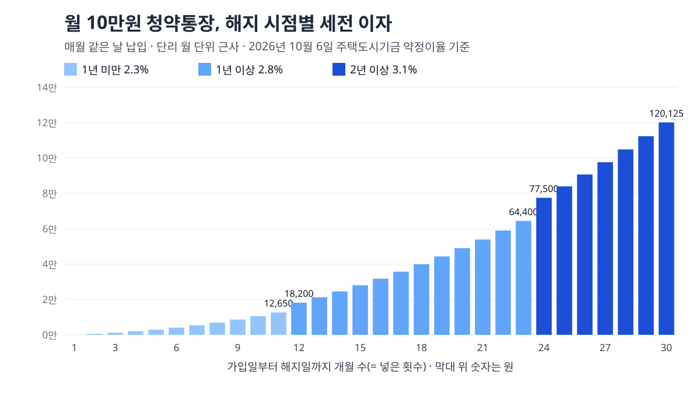

<!-- 제목: 주택청약종합저축 금리, 2년 넘기면 연 3.1% 이자표 -->
<!-- 디스커버 제목: 청약통장 23개월째 해지와 24개월째 해지, 같은 돈인데 이자가 1만2천원 넘게 갈리는 이유 -->
<!-- 게시일: 2026-10-11 -->
# 주택청약종합저축 금리, 2년 넘기면 연 3.1% 이자표

주택청약종합저축 금리는 가입일부터 해지일까지의 기간으로 정해집니다. 1개월 이내는 무이자, 1년 미만 연 2.3%, 2년 미만 2.8%, 2년 이상 3.1%입니다(2026년 10월 6일 주택도시기금 상품안내 원문 기준).

이 이율은 세금을 떼기 전 숫자이고 단리입니다. 단리는 넣은 원금에만 이자가 붙고, 붙은 이자에 다시 이자가 붙지 않는다는 뜻입니다. 은행마다 다르게 정하는 금리가 아니라 국토교통부 고시로 정하는 이율이라, 어느 취급은행에서 만든 통장이든 같은 표를 씁니다.

아래에서 월 10만원을 넣는 경우를 해지 시점별로 직접 계산했고, 세금 15.4%를 뗀 금액, 월 25만원을 넘겨 넣을 때 달라지는 점, 청년 주택드림 청약통장과의 차이를 차례로 맞춰 봤습니다.

[[목차]]

## 주택청약종합저축 금리는 지금 몇 퍼센트인가요
[주택도시기금 주택청약종합저축상품 안내](https://nhuf.molit.go.kr/FP/FP07/FP0701/FP07010101.jsp)는 약정이율을 네 칸으로 나눕니다. 약정이율은 통장을 만들 때 정해 둔 이율이라는 말이고, 이 상품에서는 가입일부터 해지일까지 몇 달을 유지했는지에 따라 칸이 정해집니다.

표: 저축기간별 약정이율과 100만원을 1년 두었을 때의 이자(세전, 단리)
| 가입일부터 해지일까지 | 약정이율(연) | 100만원 1년치 이자(세전) | 한 달로 나누면 |
|---|---|---|---|
| 1개월 이내 | 무이자 | 0원 | 0원 |
| 1개월 초과 1년 미만 | 2.3% | 23,000원 | 약 1,917원 |
| 1년 이상 2년 미만 | 2.8% | 28,000원 | 약 2,333원 |
| 2년 이상(10년 넘어도 같음) | 3.1% | 31,000원 | 약 2,583원 |

3.1% 칸이 10년을 넘어도 그대로라는 점은 [청년 주택드림 청약통장 상품안내](https://nhuf.molit.go.kr/FP/FP07/FP0701/FP07010301.jsp)의 두 통장 비교표에서 확인했습니다. 그 표에는 주택청약종합저축 이자율이 「2년 이상 ∼ 10년 이내」와 「10년 초과 시부터」 모두 연 3.1%로 적혀 있습니다.

위 표의 오른쪽 두 칸은 원금 100만원을 1년 내내 넣어 둔 경우를 가정한 값입니다. 매달 나눠 넣는 통장은 돈이 머무는 기간이 회차마다 달라서, 실제 이자는 아래 계산표처럼 따로 셉니다.

## 23개월에 해지하는 것과 24개월에 해지하는 것은 얼마나 다른가요
이 상품의 이율은 회차마다 따로 정해지지 않습니다. 같은 기금의 [주택청약종합저축 자주하는질문](https://nhuf.molit.go.kr/FP/FP07/FP0701/FP07010102.jsp)은 당첨되지 않은 통장을 해지할 때 「가입일로부터 해지일까지의 기간」에 따른 이자율로 산정한다고 답합니다. 해지하는 날 통장 나이가 2년을 넘기면, 지난달에 넣은 돈에도 3.1%가 붙는다는 뜻입니다.

그래서 해지 날짜 한 달이 이자를 크게 바꿉니다. 월 10만원을 23번 넣고 23개월째에 해지하면 세전 이자는 64,400원입니다. 같은 23번을 넣고 돈을 더 넣지 않은 채 24개월째까지 두었다가 해지하면 77,241원이 됩니다. 넣은 돈은 230만원으로 같은데 12,841원이 늘어납니다.

2년 문턱 바로 앞에서 해지를 생각하고 있다면, 통장을 만든 날짜를 먼저 확인할 만한 이유가 이것입니다. 1년 문턱도 같은 구조라서 11개월째 해지(2.3%)와 12개월째 해지(2.8%) 사이에도 칸이 바뀝니다.

1개월 이내에 해지하면 이자는 0원입니다. 통장을 만들고 곧바로 해지하는 경우에는 넣은 원금만 돌려받습니다.

## 월 10만원씩 넣으면 이자는 얼마인가요
계산 방식은 이렇습니다. 첫 회차 돈은 해지일까지 n개월, 마지막 회차 돈은 1개월 머무르므로, 이자는 「월 납입액 × 이율 × (1 + 2 + … + n) ÷ 12」입니다. 은행은 날짜 단위로 셈하기 때문에 실제 금액은 몇십 원 다를 수 있고, 아래 표는 원 미만을 버렸습니다.

표: 월 10만원씩 넣고 해지할 때 이자 직접 계산(매월 같은 날 납입, 단리 월 단위 근사, 이자소득세 15.4%)
| 해지 시점(넣은 돈) | 적용 이율 | 세전 이자 | 세금 15.4% | 세후 이자 |
|---|---|---|---|---|
| 11개월(1,100,000원) | 2.3% | 12,650원 | 1,948원 | 10,702원 |
| 12개월(1,200,000원) | 2.8% | 18,200원 | 2,802원 | 15,398원 |
| 23개월(2,300,000원) | 2.8% | 64,400원 | 9,917원 | 54,483원 |
| 24개월(2,400,000원) | 3.1% | 77,500원 | 11,935원 | 65,565원 |
| 36개월(3,600,000원) | 3.1% | 172,050원 | 26,495원 | 145,555원 |
| 60개월(6,000,000원) | 3.1% | 472,750원 | 72,803원 | 399,947원 |

2년을 채우면 240만원을 넣고 세후 65,565원을 받습니다. 24개월로 나누면 한 달에 약 2,731원입니다. 5년을 채우면 600만원에 세후 399,947원이 붙습니다.

이 표는 이율이 계산 기간 내내 지금과 같다고 가정한 값입니다. 이율이 바뀌면 바뀐 날부터 새 이율로 다시 셉니다.

## 이자에서 세금은 얼마나 떼나요
일반 과세 기준으로 15.4%입니다. [소득세법 제129조](https://www.law.go.kr/법령/소득세법/제129조) 제1항 제1호 라목이 이자소득의 원천징수세율을 100분의 14로 정합니다. 원천징수는 은행이 이자를 줄 때 세금을 먼저 떼어 대신 내는 방식입니다.

여기에 [지방세법 제103조의13](https://www.law.go.kr/법령/지방세법/제103조의13) 제1항에 따라 그 소득세의 100분의 10이 지방소득세로 붙습니다. 14%의 10%는 1.4%라서 합이 15.4%가 됩니다.

상품안내의 「세금우대 내용」 칸에는 비과세종합저축으로 가입할 수 있다고 적혀 있습니다. [조세특례제한법 제88조의2](https://www.law.go.kr/법령/조세특례제한법/제88조의2)가 정한 대상(65세 이상 기초연금 수급자, 등록 장애인, 국민기초생활보장 수급자 등)이 원금 5천만원 이하로 가입하면 이자에 소득세가 붙지 않습니다.

## 금리가 바뀌면 예전에 가입한 통장도 바뀌나요
바뀝니다. 자주하는질문은 국토교통부 고시로 이율이 바뀌면 기존 가입 계좌도 변경일 기준으로 변경된 이율이 적용된다고 답합니다. 상품안내에도 「변동금리로서 정부의 고시에 의하여 변동」될 수 있다는 문구가 있습니다.

다만 변경일 앞의 기간까지 새 이율로 다시 계산해 주지는 않습니다. 오래전에 가입한 통장이라면 변경일 전 기간에는 그때의 이율이, 변경일 뒤 기간에는 지금 이율이 붙습니다. 지금 이율이 언제부터 적용됐는지는 이번에 연 기금 화면에 날짜로 나와 있지 않아 이 글에 쓰지 않았습니다.

내 통장의 가입일, 납입 횟수, 연체 일수는 자주하는질문 안내대로 가입한 은행에서 확인합니다. 해지 문턱이 언제인지 알려면 이 가입일이 기준입니다.

## 월 25만원보다 많이 넣으면 이자도 더 받나요
이자는 넣은 돈 전부에 붙습니다. 상품안내는 매월 2만원 이상 50만원 이하를 자유롭게 넣을 수 있고, 잔액이 1,500만원 미만이면 50만원을 넘겨 1,500만원까지 한 번에 넣을 수 있다고 정합니다.

청약에서 인정되는 금액은 다릅니다. [주택공급에 관한 규칙 제10조](https://www.law.go.kr/법령/주택공급에관한규칙/제10조) 제5항 제1호는 월납입금이 25만원을 넘으면 그 달 금액을 25만원으로 셉니다. 국민주택 청약에서 쓰는 저축총액 이야기이고, 민영주택은 지역별 예치금액을 채웠는지를 봅니다.

표: 월 납입액별 24개월 이자와 국민주택 청약에 인정되는 저축총액(매월 같은 날 납입, 단리 월 단위 근사, 세금 떼기 전)
| 월 납입액 | 넣은 돈 | 세전 이자(연 3.1%) | 국민주택 청약 인정 저축총액 |
|---|---|---|---|
| 20,000원 | 480,000원 | 15,500원 | 480,000원 |
| 100,000원 | 2,400,000원 | 77,500원 | 2,400,000원 |
| 250,000원 | 6,000,000원 | 193,750원 | 6,000,000원 |
| 500,000원 | 12,000,000원 | 387,500원 | 6,000,000원 |

월 50만원을 넣으면 이자는 25만원일 때의 두 배이지만, 국민주택 청약에 잡히는 저축총액은 600만원으로 같습니다. 1,500만원을 넣어 두고 2년을 넘긴 통장이라면 1년치 세전 이자는 465,000원, 세후 393,390원이고 한 달로 나누면 약 32,782원입니다.

## 청년 주택드림 청약통장은 금리가 얼마나 다른가요
청년 통장은 2년을 넘기면 연 4.5%가 붙습니다. 기금 화면에 걸린 이 상품의 기준일은 2026년 6월 30일입니다. 이 이율은 가입일부터 10년 이내, 무주택인 기간에만 붙고 원금 5,000만원까지입니다. 가입 대상은 만 19세 이상 34세 이하, 연소득 5천만원 이하 무주택자입니다.

비과세는 이자 500만원, 원금 연 600만원 한도이며 별도 요건이 붙습니다. 직전 과세기간 총급여 3천6백만원 이하 근로자 같은 소득 요건과 무주택 세대주(또는 배우자) 요건을 가입 때 갖춰야 합니다.

표: 월 10만원 24개월 — 통장 종류와 과세 여부에 따른 이자 비교(단리 월 단위 근사)
| 경우 | 적용 이율 | 세전 이자 | 세후 이자 |
|---|---|---|---|
| 주택청약종합저축(일반 과세) | 3.1% | 77,500원 | 65,565원 |
| 주택청약종합저축을 비과세종합저축으로(대상자만) | 3.1% | 77,500원 | 77,500원 |
| 청년 주택드림 청약통장(비과세 요건 충족) | 4.5% | 112,500원 | 112,500원 |
| 청년 주택드림 청약통장(비과세 요건 미충족) | 4.5% | 112,500원 | 95,175원 |

같은 월 10만원, 2년이라도 일반 과세 통장의 세후 이자와 비과세 요건을 갖춘 청년 통장의 이자는 46,935원 차이가 납니다. 위 표의 청년 통장 두 줄은 2년 동안 무주택이 이어졌다는 전제입니다.

이자 말고 청약통장에 붙는 혜택으로는 연말정산 소득공제가 있습니다. 총급여 7천만원 이하인 무주택 세대의 세대주(또는 그 배우자)가 대상이고, [조세특례제한법 제87조](https://www.law.go.kr/법령/조세특례제한법/제87조)는 연 300만원까지 넣은 금액의 40%를 근로소득에서 빼 준다고 정합니다. 같은 연말정산에서 세액공제로 돌려받는 연금계좌는 공제 방식이 달라서 [연금저축 세액공제 계산 글](/18)에서 따로 셈해 두었습니다.

[[같은 묶음: B1006-1/2 · 해지하면 소득공제를 받은 금액이 추징되는지는 해지 글에서 따로 다룹니다]]

## 이율과 계산은 어떤 원문으로 맞춰 봤나요
2026년 10월 6일(한국 시각) 주택도시기금 누리집에서 주택청약종합저축 상품안내, 같은 상품의 자주하는질문 네 쪽(32문항), 청년 주택드림 청약통장 상품안내를 열어 이율 칸과 문구를 옮겼습니다. 기금 공지사항(2024년 6월~2025년 12월 글)에서는 청약통장 이율 변경 공지를 찾지 못했습니다.

세율과 청약 인정 금액은 국가법령정보센터에서 소득세법 제129조(2026년 1월 1일 시행판), 지방세법 제103조의13, 조세특례제한법 제87조·제88조의2, 주택공급에 관한 규칙 제10조의 조문 본문을 열어 확인했습니다. 표 네 개의 금액은 이 공식을 분수로 옮긴 파이썬 계산을 다시 돌려 같은 숫자인지 봤습니다.

이 글은 기준일의 공개 원문을 정리한 일반 정보이며, 개인의 사정에 따라 결과가 달라질 수 있습니다.

[[저자 박스]]

[집필 메모]
- 더한 것 ③: 이율은 회차별이 아니라 「가입일부터 해지일까지」 통장 전체 기간으로 정해지므로(주택도시기금 자주하는질문 https://nhuf.molit.go.kr/FP/FP07/FP0701/FP07010102.jsp), 월 10만원 23회 납입 통장을 추가 납입 없이 24개월째까지 두었다가 해지하면 세전 이자가 64,400원 → 77,241원으로 12,841원 늘어난다 — h2 「23개월에 해지하는 것과 24개월에 해지하는 것은 얼마나 다른가요」 절. 보조: 일반 통장 3.1%는 10년 초과에도 같다(청년 주택드림 상품안내 비교표).
- 설계도와 달라진 점: 기준일은 사장 지시대로 「2026년 10월 6일」(원문을 연 시각이 한국 10월 6일 새벽). 제목은 「주택청약종합저축 금리, 2년 넘기면 연 3.1% 이자표」로 바꿨다(답 단서 3.1%). 5년 계산은 설계도대로 넣고 11·12·23·36개월을 더했다.
- 못 연 원문·뺀 숫자: 지금 이율(2.3~3.1%)이 시작된 날짜와 그 전 이율 — 기금 공지사항(articleId 1252~1299)에 청약 이율 변경 공지가 없고, 국토교통부 보도자료 목록은 리디렉션 반복으로 열리지 않아 뺐다. 정책브리핑 검색 화면은 검색어가 걸러지지 않아 쓰지 않았다. 「국토교통부장관이 정하여 고시하는 이자율」의 고시 이름은 확인하지 못했다.
- 원천징수 끝수: 세금은 원 미만 버림으로 셌다. 은행·국고 처리에서 10원 미만이 달라질 수 있다(본문에 「몇십 원 다를 수 있다」).
- 소득공제·추징은 B1006-1/2 해지 글에 맡기고 한 문단(제87조 링크)만 뒀다.
- 자기 검사: calc.py 종료 0 · 변환 종료 0 · calc_check 종료 0(법령 「확인 못 함」 0 — 첫 회 소득세법 제129조 본문 주소가 연결 끊김, 다시 돌려 열림 · 확인 못 함 38 = 모두 「계산」 줄) · gate_search 치명 0·경고 2(기준일 문구 1회, 라이브 글 링크 1개 참고) · overlap21 겹침 0(1차에 청년 통장 상품기준일 문장이 B1006-1/2 대기 글과 27자 겹쳐 문장을 바꿈, 제목은 33자 → 31자로 줄임).
- 자료집에 더한 줄: 원문 6줄 · 계산 함수 1줄.
