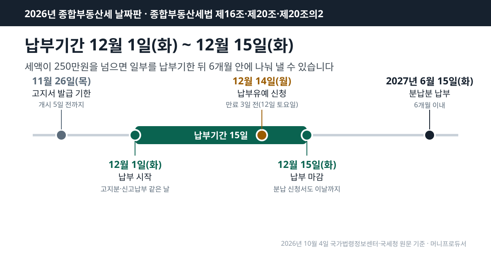
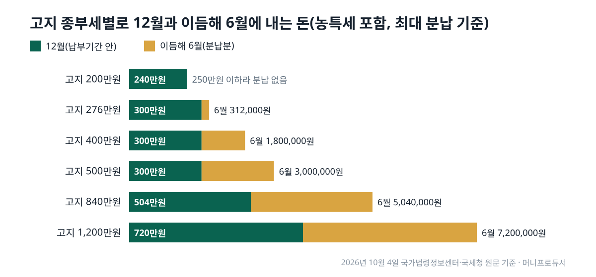

<!-- 제목: 종부세 납부기간 12월 1~15일, 250만원 넘으면 분납 -->
<!-- 디스커버 제목: 종부세 고지서가 400만원이면 12월에 300만원, 이듬해 6월에 180만원 -->
<!-- 게시일: 2026-10-14 -->
# 종부세 납부기간 12월 1~15일, 250만원 넘으면 분납

2026년 종부세 납부기간은 12월 1일(화)부터 12월 15일(화)까지이고, 고지된 세액이 250만원을 넘으면 일부를 납부기한 뒤 6개월 안에 나눠 낼 수 있습니다(2026년 10월 4일 국가법령정보센터·국세청 원문 기준).

이 날짜는 종합부동산세법이 「해당 연도 12월 1일부터 12월 15일」로 박아 두어 해마다 같습니다. 올해는 15일이 화요일이라 주말 때문에 밀리는 날도 없습니다.

날짜만으로는 「그래서 12월에 얼마를 내야 하나」가 풀리지 않습니다. 그래서 고지 세액별로 12월에 내는 돈과 이듬해 6월로 넘길 수 있는 돈을 농어촌특별세까지 넣어 직접 계산했고, 공시가격 합계에서 세액이 나오는 순서도 원문 공식 그대로 따라가 보였습니다.

[[목차]]

## 종부세 납부기간은 2026년 언제부터 언제까지인가요
[종합부동산세법 제16조](https://www.law.go.kr/법령/종합부동산세법/제16조) 제1항은 관할세무서장이 세액을 결정해 해당 연도 12월 1일부터 12월 15일까지 부과·징수한다고 정하고, 이 기간을 「납부기간」이라 부릅니다. 국세청 [종합부동산세 납부기한 안내](https://www.nts.go.kr/nts/cm/cntnts/cntntsView.do?mi=2352&cntntsId=7734)도 같은 기간을 적고, 기한이 토요일·공휴일이면 그다음 첫 평일로 넘긴다고 덧붙입니다. 국세청 [2026년 12월 세무일정](https://www.nts.go.kr/nts/ad/taxSchdul/selectList.do?taxYear=2026&taxMonth=12&mi=135747)에도 12월 15일이 「종합부동산세 납부기한」으로 올라 있습니다.

고지서를 받아 내는 방식이 기본이지만, 스스로 세액을 계산해 신고하고 내는 길도 있습니다. 같은 조 제3항은 신고납부를 고른 사람도 같은 12월 1일~15일 사이에 신고하게 하고, 그렇게 신고하면 세무서가 정한 세액은 없었던 것으로 봅니다. 어느 쪽을 골라도 마감일은 같습니다.

표: 2026년 종합부동산세 날짜(원문 조문으로 센 날)
| 할 일 | 날짜 | 근거 |
|---|---|---|
| 고지서 발급 기한 | 2026년 11월 26일(목)까지 | 납부기간 개시 5일 전 |
| 납부(고지분) | 2026년 12월 1일(화) ~ 2026년 12월 15일(화) | 해당 연도 12월 1일~15일 |
| 신고납부를 고른 경우 신고·납부 | 2026년 12월 1일(화) ~ 2026년 12월 15일(화) | 같은 기간 |
| 납부유예 신청 | 만료 3일 전 = 2026년 12월 12일(토) → 기한 특례로 2026년 12월 14일(월) | 토요일이면 다음 날 |
| 분납분 납부 | 2027년 6월 15일(화)까지(수정 고지서 날짜) | 납부기한이 지난 날부터 6개월 이내 |

## 종부세 고지서는 언제 오나요
제16조 제2항은 세무서가 주택과 토지를 나눈 과세표준과 세액을 적은 납부고지서를 「납부기간 개시 5일 전까지」 발급하도록 합니다. 12월 1일에서 닷새를 거꾸로 세면 2026년 11월 26일(목)입니다. 「종부세 고지서는 11월 말에 온다」는 말의 출처가 이 한 줄입니다. 법이 정한 것은 발급 기한이므로, 우편이나 전자고지가 실제로 도착하는 날은 이보다 며칠 늦을 수 있습니다.

고지서에는 종부세만 있지 않습니다. 국세청 납부기한 안내는 농어촌특별세를 「납부할 종합부동산세액의 20%」로 적고 있어, 종부세 200만원이 고지되면 농특세 40만원이 함께 붙어 240만원을 내게 됩니다.

## 종부세 분납은 얼마부터, 얼마까지 나눌 수 있나요
[종합부동산세법 제20조](https://www.law.go.kr/법령/종합부동산세법/제20조)는 납부할 세액이 250만원을 넘으면 그 일부를 납부기한이 지난 날부터 6개월 이내에 나눠 내게 할 수 있다고 정합니다. 얼마까지 미룰 수 있는지는 [종합부동산세법 시행령 제16조](https://www.law.go.kr/법령/종합부동산세법시행령/제16조) 제1항이 두 칸으로 나눕니다. 세액이 250만원 초과 500만원 이하이면 250만원을 넘는 부분을, 500만원을 넘으면 세액의 100분의 50 이하를 미룰 수 있습니다.

정리하면 12월에 최소한 내야 하는 종부세는 세액 500만원까지는 250만원으로 같고, 그 위로는 세액의 절반입니다. 농특세는 국세청 안내대로 종부세 분납 비율에 따라 함께 나뉩니다. 고지서에 종부세 400만원이 찍혔다면 150만원을 미룰 수 있고, 농특세 80만원 가운데 30만원도 따라 넘어가 12월에 300만원, 이듬해 6월에 180만원을 내는 셈입니다.

신청은 시행령 제16조 제2항대로 납부기한까지 신청서를 관할세무서에 냅니다. 세무서는 제3항에 따라 이미 보낸 고지서를 12월분과 분납분 두 장으로 나눠 다시 고지합니다. 6개월을 날로 세면 분납분 기한은 2027년 6월 15일(화)이지만, 정확한 날짜는 다시 받는 고지서에 적힌 날이 기준입니다.

표: 고지 세액별 12월과 이듬해 6월에 나눠 내는 금액(농어촌특별세 포함)
| 고지 종부세 | 분납 가능 최대 | 12월 종부세 | 농특세(20%) | 농특세 중 분납 | 12월 합계 | 6월 합계 |
|---|---|---|---|---|---|---|
| 2,000,000원 | 0원 | 2,000,000원 | 400,000원 | 0원 | 2,400,000원 | 0원 |
| 2,760,000원 | 260,000원 | 2,500,000원 | 552,000원 | 52,000원 | 3,000,000원 | 312,000원 |
| 4,000,000원 | 1,500,000원 | 2,500,000원 | 800,000원 | 300,000원 | 3,000,000원 | 1,800,000원 |
| 5,000,000원 | 2,500,000원 | 2,500,000원 | 1,000,000원 | 500,000원 | 3,000,000원 | 3,000,000원 |
| 8,400,000원 | 4,200,000원 | 4,200,000원 | 1,680,000원 | 840,000원 | 5,040,000원 | 5,040,000원 |
| 12,000,000원 | 6,000,000원 | 6,000,000원 | 2,400,000원 | 1,200,000원 | 7,200,000원 | 7,200,000원 |

표에서 눈여겨볼 줄은 250만원에서 500만원 사이입니다. 이 구간에서는 고지 세액이 커져도 12월 합계가 농특세를 더해 300만원으로 같고, 늘어난 몫이 모두 6월로 갑니다. 500만원을 넘으면 그때부터는 12월과 6월이 똑같이 반씩 나뉩니다.

## 종부세 계산은 어떤 순서로 하나요
국세청 [종합부동산세 세액계산 흐름도](https://www.nts.go.kr/nts/cm/cntnts/cntntsView.do?mi=2353&cntntsId=7735)를 주택분만 떼어 보면 순서는 이렇습니다. 먼저 주택 공시가격 합계에서 공제금액을 뺍니다. [종합부동산세법 제8조](https://www.law.go.kr/법령/종합부동산세법/제8조) 제1항의 공제는 9억원, 1세대 1주택자는 12억원입니다. 남은 금액에 공정시장가액비율 60%를 곱한 것이 과세표준입니다.

과세표준에는 2주택 이하 기준으로 0.5%(3억원 이하)부터 2.7%(94억원 초과)까지 일곱 구간 세율을 곱하고 누진공제를 뺍니다. 여기서 재산세로 이미 낸 몫을 빼고, 1세대 1주택자는 세액공제를 더 뺍니다. 세액공제는 보유 5년 20%, 10년 40%, 15년 50%와 나이 60세 20%, 65세 30%, 70세 40%를 합쳐 80%까지입니다. 마지막으로 직전 연도 재산세와 종부세를 합한 세액의 150%를 넘는 부분은 걷지 않습니다(세부담상한).

아래 표는 공시가격 합계만 바꾸고, 재산세 상당액·세액공제·세부담상한은 빼지 않은 가정입니다. 이 셋은 집과 사람마다 달라 고지서 금액은 표보다 작아집니다.

표: 공시가격 합계별 주택분 과세표준과 세율 적용 세액(재산세 공제·세액공제·세부담상한 전)
| 구분 | 공시가격 합계 | 공제 | 과세표준(60%) | 세율 | 누진공제 | 세율 적용 세액 | 분납 가능 최대 |
|---|---|---|---|---|---|---|---|
| 1세대 1주택 | 15억원 | 12억원 | 1억 8,000만원 | 0.5% | 없음 | 90만원 | 없음(250만원 이하) |
| 1세대 1주택 | 20억원 | 12억원 | 4억 8,000만원 | 0.7% | 60만원 | 276만원 | 26만원 |
| 1세대 1주택 | 30억원 | 12억원 | 10억 8,000만원 | 1.0% | 240만원 | 840만원 | 420만원 |
| 2주택(합계) | 15억원 | 9억원 | 3억 6,000만원 | 0.7% | 60만원 | 192만원 | 없음(250만원 이하) |
| 2주택(합계) | 20억원 | 9억원 | 6억 6,000만원 | 1.0% | 240만원 | 420만원 | 170만원 |

1세대 1주택 공시가격 20억원이라면 과세표준 4억 8,000만원에 0.7%를 곱하고 누진공제 60만원을 빼 276만원이 나옵니다. 열두 달로 나누면 한 달에 약 23만원 꼴입니다. 이 금액은 250만원을 26만원 넘어 그대로 고지되면 분납 대상이지만, 재산세 상당액과 세액공제를 뺀 뒤 250만원 아래로 내려가면 분납 대상이 아닙니다. 분납 여부는 표의 세율 적용 세액이 아니라 고지서의 최종 세액으로 갈립니다.

## 종부세 납부유예는 분납과 무엇이 다른가요
분납은 세액만 보지만, [종합부동산세법 제20조의2](https://www.law.go.kr/법령/종합부동산세법/제20조의2)의 납부유예는 사람을 봅니다. 과세기준일 현재 1세대 1주택자이고, 만 60세 이상이거나 그 주택을 5년 이상 보유했고, 직전 과세기간 총급여 7천만원 이하 또는 종합소득금액 6천만원 이하이며, 주택분 세액이 100만원을 넘어야 합니다. 네 가지를 모두 갖춰야 하고 유예할 세액만큼 담보를 내야 합니다.

표: 분납과 납부유예 조건 나란히(종합부동산세법 제20조·제20조의2)
| 항목 | 분납 | 납부유예 |
|---|---|---|
| 세액 조건 | 250만원 초과 | 주택분 100만원 초과 |
| 사람 조건 | 없음 | 1세대 1주택자 |
| 나이·보유 | 없음 | 만 60세 이상 또는 5년 이상 보유 |
| 소득 | 없음 | 총급여 7,000만원 이하 또는 종합소득금액 6,000만원 이하 |
| 담보 | 없음 | 유예 세액 상당 담보 제공 |
| 신청 기한 | 납부기한까지 신청서 | 납부기한 만료 3일 전까지 |
| 미루는 기간 | 납부기한 뒤 6개월 이내 | 양도·증여·상속 등 취소 사유가 생길 때까지 |

유예는 기간이 정해져 있지 않은 대신 끝나는 사유가 정해져 있습니다. 같은 조 제3항은 주택을 팔거나 증여할 때, 상속이 시작될 때, 1세대 1주택 요건이 깨질 때, 스스로 내겠다고 할 때 허가를 취소하게 합니다. 취소되면 미룬 세액에 이자상당가산액을 더해 걷고(제5항), 유예 기간 동안에는 납부지연가산세를 매기지 않습니다(제6항). 세금이 사라지는 제도가 아니라 집을 처분하는 시점까지 미뤄 두는 제도입니다.

## 납부유예 신청 마감이 토요일이면 언제까지인가요
2026년에는 이 질문이 실제로 생깁니다. 납부기한 12월 15일에서 3일 전은 12월 12일인데, 이날이 토요일입니다. [국세기본법 제5조](https://www.law.go.kr/법령/국세기본법/제5조) 제1항은 세법에서 정한 신고·신청·납부 기한이 토요일·일요일·공휴일이면 그 다음 날을 기한으로 합니다. 토요일 다음 날인 일요일도 같은 항에 들어 있으므로 날로 세면 12월 14일(월)이 됩니다.

다만 「만료 3일 전까지」처럼 거꾸로 세는 기한에 이 특례가 어떻게 걸리는지를 따로 적은 문장은 이번에 연 조문들에서 확인되지 않았습니다. 12월 11일(금)까지라면 어느 쪽으로 읽어도 기한 안입니다. 분납 신청서는 이와 달리 납부기한인 12월 15일까지 냅니다.

## 종부세는 어디서 내고, 기한을 넘기면 얼마가 붙나요
국세청 [국세 전자납부 안내](https://www.nts.go.kr/nts/cm/cntnts/cntntsView.do?mi=2364&cntntsId=7741)를 보면 홈택스의 [납부·고지·환급] 메뉴에서 세금납부를 고른 뒤 「납부할 세액 조회납부」로 고지된 세액을 불러와 낼 수 있고, 은행 인터넷뱅킹의 국세납부 메뉴나 은행 자동화기기로도 낼 수 있습니다.

12월 15일까지 내지 않으면 [국세기본법 제47조의4](https://www.law.go.kr/법령/국세기본법/제47조의4) 제1항 제3호에 따라 지정납부기한까지 내지 않은 세액의 100분의 3이 납부지연가산세로 붙고, 기간에 따라 더해지는 몫은 같은 조의 다른 호가 따로 정합니다. 앞의 276만원을 기한까지 내지 못했다면 3%만으로 82,800원입니다. 분납을 신청해 둔 경우에는 12월분과 6월분 고지서가 따로 나오므로, 각 고지서의 기한이 따로 계산됩니다.

## 이 날짜와 금액은 어느 원문에서 셌나요
납부기간·고지서 발급 기한·분납·납부유예·공제금액은 2026년 10월 4일 국가법령정보센터에서 종합부동산세법(법률 제21224호, 2026년 1월 1일 시행)과 같은 법 시행령(2026년 10월 1일 시행)의 조문 본문을 하나씩 열어 옮겼습니다. 세율표는 법 제9조에 그림으로만 실려 있어 국세청 세액계산 흐름도의 글자 표를 썼고, 12월 세무일정과 납부기한 안내도 같은 날 국세청 누리집에서 열었습니다. 요일은 달력으로 맞췄고, 금액 표 세 개는 조문 공식을 그대로 옮긴 파이썬 계산으로 한 번 더 돌려 숫자가 같은지 봤습니다.

같은 12월에 날짜가 걸린 다른 세금 일정이 궁금하다면, 주식 양도세 대주주를 가르는 날을 원문으로 정리한 [2026년 대주주 기준일 글](/28)이 이 달력에 함께 놓일 내용입니다. 연말까지 넣은 금액으로 이듬해 돌려받는 세액이 정해지는 [연금저축 세액공제 글](/18)도 12월 31일이 기준이라 나란히 볼 만합니다.

이 글은 기준일의 공개 원문을 정리한 일반 정보이며, 개인의 사정에 따라 결과가 달라질 수 있습니다.

[[저자 박스]]

[집필 메모]
- 더한 것 ③: 2026년에는 종부세 납부유예 신청 기한(납부기한 만료 3일 전)이 12월 12일 토요일에 걸려, 국세기본법 제5조①(신청 기한이 토·일요일이면 그 다음 날)으로 세면 12월 14일(월)이 된다(h2 「납부유예 신청 마감이 토요일이면 언제까지인가요」 절). 보조: 250만~500만원 구간에서는 고지 세액이 늘어도 12월 합계가 농특세 포함 300만원으로 같다(표 2).
- 날짜 확인: 설계도 초안의 「12월 15일까지·250만원 초과 분납」은 제16조①·제20조·시행령 제16조① 원문과 같아 제목 날짜·금액을 그대로 두고 꼴만 바꿨다(「종부세 납부기간 12월 1~15일, 250만원 넘으면 분납」).
- 못 연 원문: 국세청 「궁금해요 종합부동산 세법」(mi=2357) 연결 끊김 — 쓰지 않음. 국세청 전자납부 안내(mi=2364)는 스크립트·curl 연결 끊김, WebFetch로만 열림 — 시간대(이용 시각) 숫자는 글자 대조를 못 해 뺐다.
- 뺀 숫자: 재산세 상당액 공제·세액공제·세부담상한을 넣은 실제 고지액(사람마다 다름) · 3주택 이상 세율 · 납부지연가산세 기간분 이자율(2026. 10. 2. 시행 국세기본법 제47조의4가 1호의2 「경과한 개월 수」로 바뀌어 시행령 이자율을 확인하지 못함).
- 설계도와 달라진 점: 1세대 1주택 세액공제 금액 예시는 재산세 공제 전 세액에 곱하면 실제와 달라 퍼센트만 적었다.
- 자기 검사: calc.py 종료 0 · 변환 종료 0 · calc_check 종료 0(법령 「확인 못 함」 0, 국세청 세무일정 1줄 대조 때 연결 끊김) · gate_search 치명 0·경고 2(기준일 문구 2회, 본문 길이 참고) · overlap21 겹침 0(1차에 정년연장 글과 30자 겹침 → 확인 과정 문장 고침).
- gate_frame(참고 실행): 「쌍둥이 글」 실패 1 — 상대가 이 편 자신의 원장 줄64(가제 「종부세 납부기간, 12월 15일까지 분납 기준과 계산」, 작업폴더 칸 빈칸)이다. 원장에 작업폴더를 적으면 풀린다(사장 몫).
- 자료집에 더한 줄: 원문 14줄 · 계산 함수 1줄.
